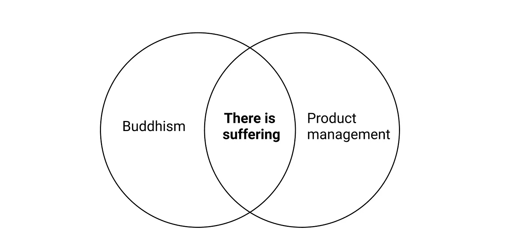

# 佛教教给我的产品管理

> 原文：<https://medium.com/swlh/what-buddhism-taught-me-about-product-management-f05c7486649c>

Taken at one of my [all-time favorite Airbnb’s](https://www.airbnb.com/rooms/1114991) in Joshua Tree

佛陀本可以成为一名优秀的产品经理。他痴迷于解决人们的问题，他将自己的想法总结成 T2 的便捷清单，并为实现自己的愿景开发了简单的 T4 框架。他也是第一原理最早的[实践者之一，著名的是为了“看清事物的本来面目”而在菩提树下连续坐了 49 天🧘‍♂️](https://jamesclear.com/first-principles)

虽然看起来最近科技领域的每个人都在谈论正念和冥想(偶尔太多了)，但这是有原因的:[有效](https://en.wikipedia.org/wiki/Research_on_meditation)。在过去的一年里，随着我自己对这种做法的深入研究(也就是刚刚开始触及皮毛)，这些简单的教导已经被证明在我的日常生活中有着惊人的价值。**下面我来看看** [**佛教中的三大核心教义**](https://www.lionsroar.com/what-are-the-three-marks-of-existence/) **，以及我是如何将它们应用到我的产品经理工作中的。如果以下任何一条引起了你的共鸣，我鼓励你自己去探索这些想法(见本文末尾的建议阅读)。**

> 这些真理在佛教教义中并不是作为要求盲目信仰的教条提出的。佛教徒认为，这些真理是普遍的，对任何关心以适当方式调查的人来说都是不言而喻的。
> 
> Bhante Gunaratana

# 1.有苦难😨

佛陀对人性最初的核心洞见是，我们永远不会满足。我们在经历的任何事情中都找不到持久的快乐或满足，因此我们痛苦。我们认为当我们最终得到我们想要的东西(例如，头衔、加薪、房子)时，我们会很高兴，但我们很快就会感到不满足，并渴望下一件事。这被称为[苦乐](https://en.wikipedia.org/wiki/Dukkha)。

> 任何对佛教教义有过哪怕是最简短介绍的人都熟悉它的出发点:存在必然带来痛苦这一不可回避的事实。
> 
> — [杰克·康菲尔德](https://jackkornfield.com/)

这是为什么呢？根据[罗伯特·赖特](https://robertwright.com/about/)在他最近[关于佛教的书](https://www.amazon.com/dp/B01MPZNG63/ref=dp-kindle-redirect?_encoding=UTF8&btkr=1)中所说，不满根植于我们的进化。**自然选择高度优化我们是为了传播我们的基因，而不是为了快乐。寻求更高的地位、更多的财富和更多的财产有助于我们找到更多、更好的伴侣。我们的直觉让我们相信，当我们得到这些东西的时候，我们会很开心，有一段时间，我们会很开心，但是这种感觉很快(并且总是)消失。我们忘记了多少次因为短暂的满足而失望，因此继续寻找。这是一种非常有害的幻觉。这是有道理的——如果我们对那一餐、那一件工具、那一次旅行完全满意，我们就死定了。**

当谈到领导团队和为人们开发产品时，我们也有类似的错觉。我们认为我们可以达到一个让所有人——我们的同事、我们的直接下属、我们的用户——都满意的地方。“我会解决那个问题，一切又会好起来的”。事实上，这种情况很少发生，即使发生了，也不会持续太久。总会有更多的问题，更多的挑战，更多的“苦难”。

对你和你的团队来说，减少(和结束)痛苦的关键是接受你永远不会完全解决你所有的问题。火会燃烧。人们会不高兴的。事情会出错。这是事物的自然规律。认识到这一点，解决问题，继续前进。在解决问题中找到满足感，而不是永远阻止问题出现。如果您想进一步探索该教学，请从这里的[开始](https://www.lionsroar.com/what-is-suffering-10-buddhist-teachers-weigh-in/)和这里的[开始](https://www.lionsroar.com/the-buddha-taught-one-thing-only/)。

> 痛苦通常与希望事情有所不同有关。艾伦·洛克斯

# 2.万物皆无常❄️

那么痛苦的来源是什么呢？根据佛教，**我们的不快乐源于对世界的一个非常简单的误解——相信事物会持续**。这叫做[阿尼卡](https://en.wikipedia.org/wiki/Impermanence)。这种误解导致我们执着于感觉良好的事物(例如，一顿大餐、一个可爱的新玩意儿、一次晋升)。我们希望它们能够持久。当它们一成不变地改变或消失时，我们会感到悲伤。无论我们多么努力地坚持，一切(字面意思，一切)都会改变，并最终消失。佛陀的遗言直接表达了这一点:

> 无常是无法逃避的。一切都消失了。
> 
> —佛陀

解决方案出奇的简单(尽管并不容易)。放手吧。放下渴望、依恋和欲望。认识到所有的事情都是无常的，执着是没有用的。当美好时光持续的时候，充分欣赏它们，活在当下，但是当它们改变或者消失的时候，就让它们过去吧。下面这首诗很好地表达了这种感情:

> 把快乐束缚在自己身上的人，有翅膀的生命会毁灭他吗？当快乐飞翔时亲吻它的人，生活在永恒的日出之中
> 
> — [威廉·布莱克](https://en.wikipedia.org/wiki/William_Blake)

对我来说，这种教学对我的工作和生活都有很大的改变。在 Airbnb，就像所有高速增长的公司一样，变化无时不在。通过定期重组、改变优先事项、轮换团队成员等。，你总是处于不断变化的状态。有两种方法来应对这些变化。第一，你可以试着抓住你所拥有的，与之抗争。通常这是非常必要和重要的。然而，在很多情况下，你战斗只是为了战斗，或者因为你害怕改变。看看下次有什么事情要改变时，你是否能注意到这一点。根据我的经验，更好的方法是学会适应变化。认识到变化是生活(和商业)的一部分。任何事情，不管它运行得多好，都不会长久。欢迎改变。预见变化。利用这种变化。珍惜美好时光，但不要执着于任何东西。

> 一旦我们看到一切都是无常和不可理解的，如果我们执着于一成不变的事物，我们会制造巨大的痛苦，我们就会意识到放松和放手是更明智的生活方式。放手不代表不在乎事情。这意味着以灵活和明智的方式关心他们。
> 
> — [杰克·康菲尔德](https://jackkornfield.com/)

这种教导适用于来自外部的变化，也适用于来自内部的变化。通常最难放下的东西是我们自己的想法/产品/战略。我们认同他们，我们依恋他们。这正是问题所在。在我项目管理职业生涯的早期，我觉得当我拥有一个产品时，我的工作就是确保它存活下来，无论发生什么。我花了很长时间才明白这是完全错误的——你的工作是帮助加速好想法，扼杀坏想法。你让一个坏主意存在的时间越长，即使你的任务是让它发挥作用，它对你和公司都越不利。 [Eric Ries](https://medium.com/u/d2f31bf094c6?source=post_page-----f05c7486649c--------------------------------) 在 [James Beshara](https://medium.com/u/7c2f3607e5fa?source=post_page-----f05c7486649c--------------------------------) 的[最近的播客](https://player.fm/series/below-the-line-with-james-beshara)中对此做了很好的解释，大约在 31:00 的时候。你可以在这里和这里了解更多无常[的教导。](https://www.insightmeditationcenter.org/books-articles/articles/impermanence/)

> 人类所有的不快乐都来自于没有正视现实，事实就是如此。—佛陀

# 3.没有持久的自我⛄️

佛教的第三个基本教义是没有持久的“自我”。这被称为 [Anatta](https://en.wikipedia.org/wiki/Anatta) 。根据这个教学，实际上是由最近的科学研究支持的，从出生到死亡，我们的身体里有一个不变的和持久的“我”，这是一个错觉。你的身份和自我是你大脑的构造。你对自己行为的控制感同样也是一种建构。我们视自己为生活的首席执行官，而实际上我们只是旁观者。这些概念对我们的生活很有帮助，它们帮助我们在这个世界上更有生产力，但这并不意味着它们是真实的。

> 要了解非我，你必须冥想。如果你只理智化，你的脑袋会爆炸。
> 
> — [Ajahn Chah](https://en.wikipedia.org/wiki/Ajahn_Chah)

正如上面引用的那样，这是一个很难完全掌握的教学。高级冥想者从经验上感受到这种教导，我在自己的冥想实践中也感受到了它的微光，但即使你没有亲身感受到，这个想法本身也是强大的。

对我来说，这个教导是一个有价值的提醒，让我时刻保持自我。作为一名项目经理，你通常是展示团队工作的默认选择，也是事情进展顺利时第一个得到表扬的人。以我的经验来看，每当我把这些机会给了其他团队成员，或者把功劳转移了，这个团队和它的效率就变得更强了。**尽管我们都知道最有效的领导者将团队置于自身之上，但我们在实践中却忘记了这一点，尤其是当我们的自我有机会展现时。**

同样的想法在有史以来最重要的商业书籍之一《T4:从优秀到卓越》(T5)中得到了呼应，该书观察了一千多家公司，以了解所谓的“优秀”公司与“卓越”公司的区别。[数据显示](https://www.jimcollins.com/concepts/level-five-leadership.html)的是，最成功的公司都是由这样的领导者领导的，他们的“野心首先是为了事业，为了组织和它的目的，而不是他们自己。”这就是吉姆·科林斯所说的第五级领导者。冒着你脑袋爆炸的危险🤯，如果你想了解更多关于这个佛教教义的内容，请查看[这个](https://www.accesstoinsight.org/lib/authors/various/wheel202.html)和[这个](https://samharris.org/the-illusion-of-the-self2/)。

> 根据佛陀的教导，自我的观念是一种想象的、虚假的信仰，没有相应的现实。从个人冲突到国家间的战争，它是世界上所有麻烦的根源。简而言之，这个错误的观点可以追溯到世界上所有的邪恶。
> 
> — [瓦尔波拉·拉胡拉](https://en.wikipedia.org/wiki/Walpola_Rahula_Thero)

# **附加资源🤗**

作为一个初学者，关于这些教导以及如何将它们应用到生活和工作中，我还有很多要学习的。如果你有什么故事要分享，或者对我应该进一步探索的主题有什么建议，我很乐意听听你的意见。如果你想自己了解更多，我鼓励你探索这些资源:

## 书

*   [为什么佛教是真实的](https://www.amazon.com/dp/B01MPZNG63/ref=dp-kindle-redirect?_encoding=UTF8&btkr=1)，作者罗伯特·莱特(不要被标题搞得心烦意乱)
*   [海那波拉·瓜那瑞塔著《简明英语中的正念》](https://www.amazon.com/Mindfulness-Plain-English-20th-Anniversary-ebook/dp/B003XF1LKW/ref=sr_1_1?crid=9VZP2RN8YKUE&keywords=mindfulness+in+plain+english&qid=1555804524&s=digital-text&sprefix=mindful%2Cdigital-text%2C195&sr=1-1)
*   由山姆·哈里斯创作的《醒来》

## 在线阅读/听力

*   [初学佛法——狮子吼](https://www.lionsroar.com/beginning-with-buddhism-and-meditation/)
*   [佛教入门——灵岩禅修中心](https://www.spiritrock.org/intro-to-buddhism)
*   [快乐 10%播客](https://www.10percenthappier.com/podcast)

如果你有任何问题，建议，或者只是想打个招呼，不要犹豫，发微博给我。

*非常感谢* [*肖恩*](https://twitter.com/sean_lynch?lang=en) *，* [*庞雅文*](https://twitter.com/yelenart?lang=en) *，* [*本*](https://twitter.com/byosko) *，以及* [*高瑞*](https://twitter.com/gauri?lang=en) *对本帖初稿的索取或审阅。🙏*

真诚地

[莱尼](https://twitter.com/lennysan)