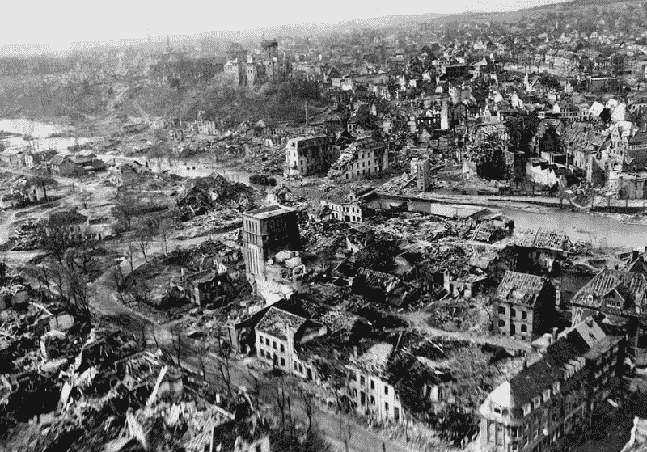

# 资本主义能实现什么？让我们从西德的例子中找出答案

> 原文：<https://medium.com/swlh/what-can-capitalism-achieve-lets-find-out-from-the-example-of-west-germany-b0a4eecbb984>

Post-WWII Germany

大多数读者都会对二战期间德国的毁灭程度有所了解。但是即使“一张图片胜过千言万语”，我认为即使是图片也没有做到恰如其分。随着他们的工业和基础设施被摧毁，大部分成年工人被杀害，一个典型的德国人的未来会是怎样的？路德维希·艾哈德在 1948 年是这样说的: