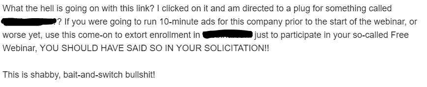

# 我们能从有史以来最糟糕的客户体验中学到什么？

> 原文：<https://medium.com/swlh/what-can-we-learn-from-our-worst-customer-experience-ever-2b17de0f5ad6>

image source: shutterstock

有时候，你面临的客户体验糟糕得令人难以置信，你唯一能做的就是把它变成一次学习的经历，确保你自己的客户有一个很好的体验。

这是背景。在 ProWritingAid，我们参加了几个有几千人参加的大型网络研讨会。这是我们和作家杰瑞·詹金斯一起做的一个。我们与客户直接互动很有趣，他们也很喜欢。

这些网络研讨会非常成功，以至于我们决定和我们最喜欢的自助出版平台之一——book baby 的总裁一起组织一次。在对各种托管平台做了一些研究后，我们选定了一个(我不会说出它的名字)。

我们发出电子邮件让我们的用户注册，将近 3000 人注册了。我们进行了一次练习，解决了一些问题。然后我们开始直播。数字上升了——200、300、400、500——然后一切都错了。突然，软件说我们已经达到了 500 个用户的上限。没问题吧？只需点击链接升级我们的帐户，问题已解决。不对。没有联系。也没有明显的方法来提高限制。所以我们已经达到了 500 人。不是一个好的开始！

学习点 1:如果你的客户达到了套餐的极限，给他们一个简单的方法来立即升级。增加他们的支出是你的目标，对吗？所以简单点。

学习点 2:试着预见你的客户什么时候会达到他们套餐的极限，并预先警告他们。如果有 3000 人注册参加网上研讨会，而你客户的套餐限制为 500 份，那么这就很明显地表明你的客户将会遇到问题。你可以很容易地给他们发一封电子邮件，建议他们升级他们的帐户。

不管怎样，我们和 500 人一起继续，虽然我们有点被抛到脑后，但我们坚持到了最后。那些设法加入的人向我们提出了一些很好的问题，总的来说，这似乎是一次积极的经历。无法参加网上研讨会的人仍会收到一封电子邮件，其中包含观看链接。没问题吧？不对。

我们联系客户支持并投诉该问题。我们要求他们停止我们的每月定期付款。他们是做什么的？他们退还了我们所有的付款(也许是出于慷慨)，然后取消了我们的整个账户。收到带有视频回放链接的电子邮件的用户点击该链接时，会被带到网上研讨会软件的主页。

结果:许多愤怒的客户询问这是否是推广网上研讨会软件的垃圾邮件伎俩。见下文:

学习点 3:退款给不满意的客户并不总是正确的做法，特别是如果它自动取消了他们的帐户。在这种情况下，向客户退款使情况变得更糟。相反，考虑客户的问题是什么，以确定最佳行动方案。

在与该平台的支持团队进行了长时间的沟通后，他们最终同意恢复该视频——但只有 48 小时。干得好，伙计们。谢谢！

老实说，如果他们表现出更好的支持，他们可能会挽救这段关系。在 ProWritingAid，我们很高兴能提供更多免费的在线培训和网络研讨会内容，我们需要一个平台来做到这一点。至少他们应该给我们最初付费的完整期限，这将给人们额外的两周时间来观看重播。相反，这感觉就像他们持有我们的内容赎金，直到我们再次支付给他们，尽管事实上，我们从来没有要求退款摆在首位，这是他们的错误。

学习点 4:如果你已经完全彻底地搞砸了，以至于你已经失去了任何挽救你与客户关系的机会，不要三心二意。人们喜欢分享糟糕的客户体验，并不是每个人都会羞于说出罪魁祸首。

还有一个作为客户的学习经验:千万不要相信没有明码标价的网站。我在这里要大胆的声明，但是没有明确定价的唯一原因是因为你想欺骗你的客户。这可能是因为有隐藏的限制，或者想在演示中强行推销它们。一个好的产品应该自己卖。它的价值主张应该很明显。如果不是，那就把钱花在 UX 专家身上，而不是销售人员身上。Atlassian 已经表明，销售企业产品甚至不需要销售团队。

我们最终花了几个小时单独回应不高兴的客户，并为他们的沮丧道歉。对于他们中的大多数人来说，这是他们第一次接触我们的公司，他们很可能会永远失去对我们品牌的信心。

学习点 5:如果你在犯错时承担责任并道歉，人们会出人意料地原谅你。

我们不希望任何人带着不好的体验离开，所以我们向注册参加网上研讨会的所有人发送了以下电子邮件:

image source: canva

> 大家好，
> 
> 我们只是想为昨天的网上研讨会道歉。这是我们第一次涉足在线研讨会的世界，但并不像我们希望的那样顺利。我们遇到了一些技术问题，这意味着许多人被关在网上研讨会的房间之外，许多设法进入的人有视频和音频问题。正因为如此，我和史蒂文都有点慌乱，感觉不到自己在最佳状态。
> 
> 我们非常感谢你能抽出时间来加入我们。为了感谢你，我们想让你免费使用我们的**写作资源库**中的所有书籍(价值超过 50 美元)。
> 
> 如果你没有收到后续邮件，我们承诺的折扣代码是 XXXX 6 折 **ProWritingAid Premium** ，XXXX 节省 **BookBaby 的复印或编辑服务**。
> 
> 如果你还在寻找一些很棒的自我编辑训练，看看我们和畅销书作家杰瑞·詹金斯做的这个视频: [**积极的自我编辑:如何对你写的每一个字都感到快乐**](https://www.youtube.com/watch?v=7pA4jBmtWMU&feature=youtu.be)
> 
> 我们仍然对免费在线培训的前景感到兴奋。我们将从这次经历中吸取教训，并带来更多优秀的嘉宾和话题。
> 
> 再次感谢您的耐心，希望很快再次见到您，
> 
> 克里斯·班克斯
> prowriting aid 的创始人

我们的收件箱再次被填满，但令我们惊讶的是，这一次人们充满了积极和支持。

> 谈论“过度交付”和以如此美妙的方式“纠正”。我期待着阅读你所有的书(当然，也尝试 ProWritingAid)。

和

> 你对技术故障不负任何责任。我相信你做了一场精彩的演讲。结果今天早上就报名了终身计划！万岁！

和

> 谢谢你的邮件和你的慷慨！当然，几乎没有人第一次就能把事情做得完美。我很抱歉当你有观众的时候发生在你身上。但是，事情往往不是因为我们自己的过错而出错，我们有时不得不付出艰难、痛苦的代价。我相信下次一切都会变得更好。

最终，我们将一个潜在的问题变成了一个在个人层面上与新的用户群体建立联系的机会。

然而，如果公司预见到我们的需求，并在问题出现时采取符合我们最大利益的行动，所有这些都是可以避免的。这是一个很好的教训，我们将传递给我们自己的客户服务团队。

## 这篇文章发表在 [The Startup](https://medium.com/swlh) 上，这是 Medium 最大的创业刊物，拥有+439，678 名读者。

## 在此订阅接收[我们的头条新闻](https://growthsupply.com/the-startup-newsletter/)。

