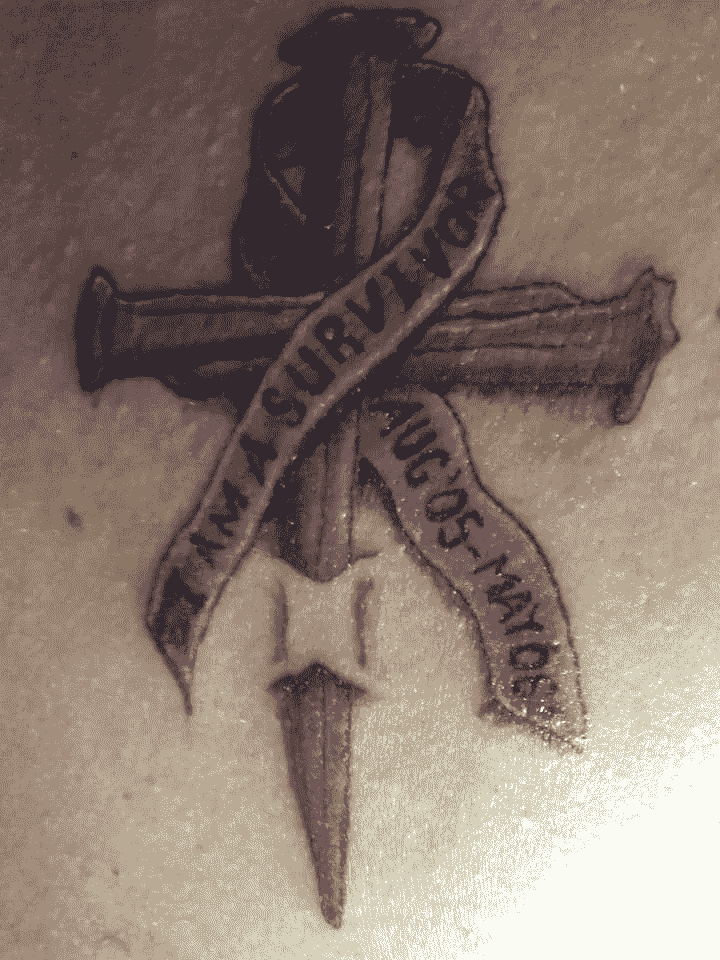

# 癌症教会了我什么是自由写作

> 原文：<https://medium.com/swlh/what-cancer-taught-me-about-freelance-writing-2ff4ce49894a>

[Michael Stover](https://www.michaeldstover.com)

我是癌症幸存者。这篇文章的标题照片是我的癌症幸存者纹身，上面有我的诊断和无癌日期，以及“我是幸存者”的字样。

> 我是癌症幸存者。

你可能想知道癌症和自由写作有什么关系。对我来说，在癌症和治疗使我失去动力后，写作成了我的解脱…