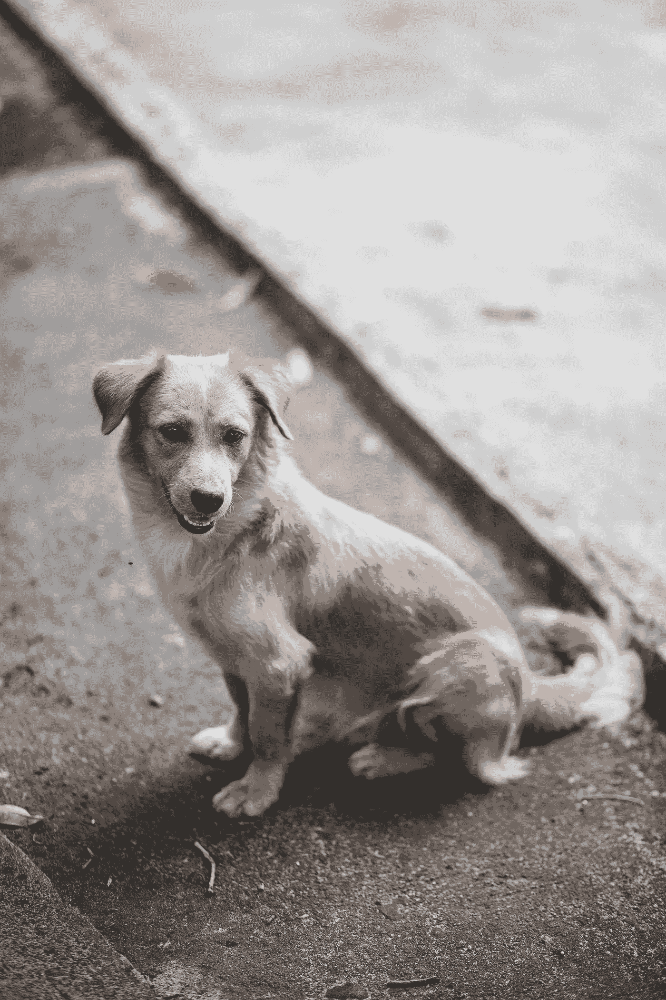

# 契诃夫的狗教会我什么是有目的的创造力

> 原文：<https://medium.com/swlh/what-chekovs-dog-taught-me-about-living-a-purposeful-creative-life-fcd17850fc9>

安东·契诃夫的短篇小说《卡什坦卡》讲述了一只有两个主人的狗，这是一个关于创造性生活难题的寓言。

Photo by [Denniz Futalan](https://www.pexels.com/@denniz-futalan-339724?utm_content=attributionCopyText&utm_medium=referral&utm_source=pexels) from [Pexels](https://www.pexels.com/photo/short-coated-brown-dog-sitting-on-floor-1317111/?utm_content=attributionCopyText&utm_medium=referral&utm_source=pexels)

没有一个专心研究文学的学生会忽视俄罗斯作家安东·契诃夫。他的长篇小说、短篇小说和戏剧深刻地探索了从爱和遗憾到家庭、政治、教育和改革的一切，以及他作为一个小说家的天才…