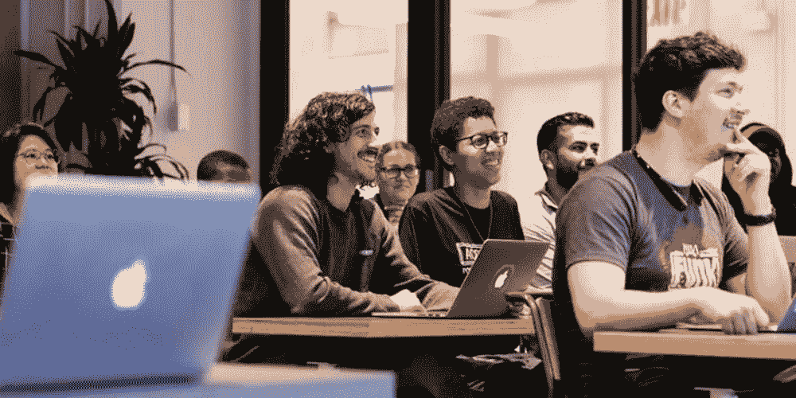

# 编码训练营的学生每天都做些什么

> 原文：<https://medium.com/swlh/what-coding-bootcamp-students-do-in-a-typical-day-ea7fa1cf0a8a>

Photo courtesy of Flatiron School.

像大多数人一样，我喜欢例行公事。我喜欢计划、组织和控制我的生活，这样我就可以尽可能优雅地期待意外。我的全职工作是注册护士，有精心策划的预算，冰箱上还挂着一张来自 Pinterest 的清洁时间表(有点尴尬)。我把它放下了。相比之下，我也欣赏新鲜感。虽然我喜欢护理，但我已经准备好…