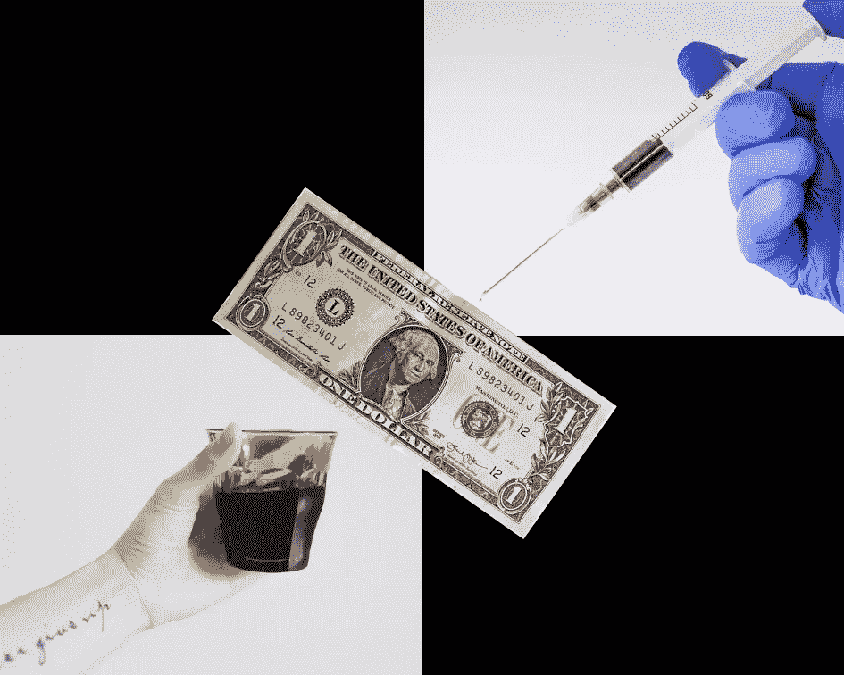
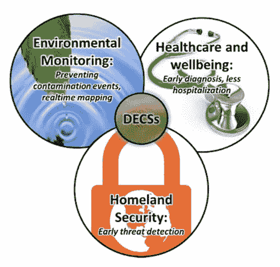

# 咖啡、钱和验血有什么共同点？

> 原文：<https://medium.com/swlh/what-do-coffee-money-blood-tests-have-in-common-49a67ad8495>

## (提示:这是“D”字)

在二十世纪，浓缩咖啡只能在市中心的咖啡馆里找到。
今天，你可以在许多家庭/工作场所找到一台浓缩咖啡机(即使它是一台装有胶囊的 n espresso 咖啡机)。

**₿**2009 年之前，货币由中央银行发行、验证和分配。
如今，₿itcoin 的硬通货由《₿itcoin 议定书》发行、验证和分配。
(好吧，它还没有被广泛采用——但别担心，未来已经到来，只是不是很同质)。

在 20 世纪 60 年代，血糖测试只能由训练有素的专业人员在相距遥远的实验室里用昂贵的仪器进行。今天，血糖仪出现在数百万糖尿病患者的家中，使他们能够更好地管理自己的健康。

**那么咖啡、钱、&验血有什么共同点呢？
他们都变得分散了！**

**但是等等，还有更多……我们已经可以看到变化了:**

*   信息:从城市图书馆到万维网(现在简称为“网络”)
*   **研究:**从付费学术期刊到叛离者，在 [SCI-HUB](https://sci-hub.tw/) 获取免费知识
*   电信:从主要街角的付费电话，到每个口袋里的手机
*   工作场所和团队:从小房间的办公室到分散的团队和分散的组织

**我们可以看到:**的开端

*   **共享经济:**从 Airbnb 和优步这样的 1.0s 版本，到那些将真正从真正的点对点商务等式中移除中间商的产品，如 [Beenest](https://www.beenest.com) 和 [Arcade City](https://arcade.city/)
*   计算能力:从向几个主要玩家租用服务器，到把他们的爪子拿出来，在分散的网络上分配计算能力，这些网络按使用量收费和支付参与者，而不是按支付计划。这是与 [SONM](https://sonm.com/) 一起出现的
*   **服务器空间:**同样的现象正在出现——第三方的信任正在被区块链协议取代，如 [STORJ](https://storj.io/)
*   **VPN 网络:**当我们可以连接到一个全球对等网络时，我们为什么需要一个中央公司来托管世界各地的节点，这些对等网络可以为我们提供本地带宽。忘年是这方面的一个领先项目
*   **社交媒体:**我们已经看到我们的[数据被窃取并出售](https://hackernoon.com/the-era-of-data-sovereignty-is-upon-us-7b9f447cf211)，而在最坏的情况下，我们的内容被审查，我们的账户被删除。幸运的是，在社交媒体领域，像 STEEM 和 SOMEE 这样的项目也提供了替代方案，不仅我们的内容质量得到了回报，而且还可以不受审查地在区块链托管

# 但是这仅仅是电脑的事情吗？

幸好没有！以我熟悉的化学传感为例，以及我已经提到的用于糖尿病患者的血糖仪，还有一整套其他传感器正在研发中…

第 1 代**已经部署完毕——它们是嵌入你的手机、FitBit 和 Apple Watch 的*物理传感器*。通过加速度计、陀螺仪和 GPS 单元，它们可以感知物理现象，从而估算出诸如你的心率、你走过的步数以及你的优步还有多长时间到达等参数。**

第二代仍处于研发阶段，很少有商业应用——它们是化学传感器，当以分散的方式广泛部署时，将改变我们的生活。血糖仪是迄今为止我们能找到的为数不多的商业化化学传感器之一，但是还有很多正在研发中…

Applications of decentralised chemical sensors (DECSs) range from environmental monitoring to healthcare to homeland security and beyond

> 想象一下。与其将你的钾和胰岛素水平与全球正常范围进行比较，不如让医生将你目前的水平与你的正常范围进行比较？这将是真正的个性化药物。

**医生怎么可能知道*你的*化学正常？人们只在绝对必要的时候才进行血液测试，然后只在医生认为绝对必要的情况下进行测试，我们目前根本无法收集足够的数据点。**

我们缺乏数据！换句话说，当涉及到化学信息时，我们有一个*带宽问题*。这是因为目前大多数化学传感需要由专业人员操作昂贵的仪器。

**但是如果化学传感器更像 FitBits 呢？**如果它们是无孔不入的呢？如果你的表带可以检测到你的酒精含量超标，你的袜子可以告诉你脱水，你的马桶可以检测到你的肾脏衰竭，会怎么样？当然，医疗保健将会完全不同！

化学传感器是我的专长 -所以谢谢你和我一起潜入这个兔子洞。虽然我非常了解这个领域，但这只是 g̶o̶i̶n̶g̶ ̶t̶o̶ ̶b̶e̶被新兴的去中心化范式颠覆性改变的众多领域之一。

# 连接点:化学到数字

一个好朋友指出了这篇文章中缺少的东西——化学传感器和不可信的不变数据网络之间的联系。

H 老实说，广泛部署的廉价化学传感器网络出现的直接瓶颈是*化学*。
但随着这些开始出现，我们有机会问自己，“*我们是否愿意相信一个拥有*我们的*健康数据的中央公司或政府部门？”*

很不幸，我们现在有了另一个选择！就我个人而言，我更愿意保持对我的健康数据的主权所有权。我不想盲目信任。历史清楚地表明，赋予当局的权力即使没有被滥用，也会被误用。这是一个我们的数据何时被盗或被出售的问题，而不是如果被盗或被出售的问题。

# 这是一个美丽的等式:

**你的化学数据+分布式台账=健康数据主权**

分布式健康数据分类账的例子已经出现。拉丁美洲健康研究所已经[给了 200 万患者他们自己的健康钱包](https://www.linkedin.com/pulse/blockchain-now-serving-electronic-health-records-ecosystem-gandt/)，授权他们选择性地允许他们选择的健康提供者使用。这项倡议背后的区块链技术是由[统一基金会](https://unification.com/)推动的，目的是让病人得到控制。
(阅读我关于[数据主权时代即将到来的文章](/hackernoon/the-era-of-data-sovereignty-is-upon-us-7b9f447cf211?source=---------7------------------)！)

现在，想象一下扩展健康钱包中的数据，从偶尔的医生就诊，到每天自动测量你的尿液、汗液，也许还有血液(例如糖尿病患者)。现在说的是大(化)数据！
我们知道将大数据提供给专家、算法和人工智能会带来多么惊人的预测能力。
(或者实际上我们经常不这样做——洞察力可能相当不可预测，因为它们是从巨大的潜在复杂性中‘涌现’出来的)。

我很高兴为这个等式做出贡献并看到它的实现。写在墙上。

**你的化学数据+分布式台账=健康数据主权**

**数字权限。从你已经在的地方加入我们。
未来是分散的。它已经在这里了——只是分布不均匀。**

## 这篇文章发表在 [The Startup](https://medium.com/swlh) 上，这是 Medium 最大的创业刊物，拥有+440，678 读者。

## 在这里订阅接收[我们的头条新闻](https://growthsupply.com/the-startup-newsletter/)。

