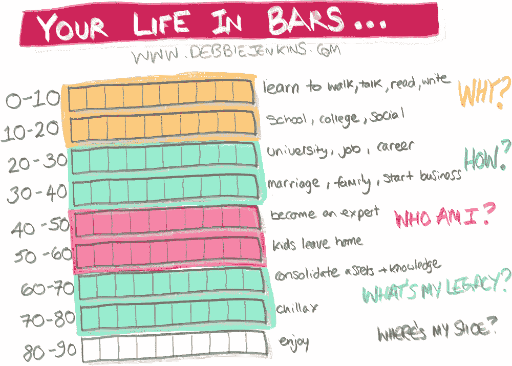

# 羽绒被馕、空盘子、酒吧和不写有什么关系？

> 原文：<https://medium.com/swlh/what-do-duvet-naans-empty-plates-and-bars-have-to-do-with-not-writing-b39d582991a1>

Are you wasting your life?

## 写作浪费 4:等待合适的时间、许可或灵感

羽绒被馕已经吃完，辣酱已经蘸过，盘子正在收拾，“等等！把那些酸辣酱碗、边盘和一个 balti 盘留给我，”我们还没吃完。