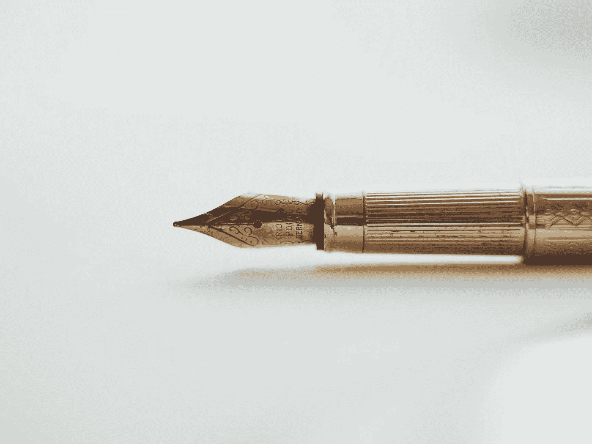

# 成为“真正的作家”意味着什么？

> 原文：<https://medium.com/swlh/what-does-it-mean-to-be-a-real-writer-32f8e4980b49>

Photo by [Art Lasovsky](https://unsplash.com/@artlasovsky?utm_source=unsplash&utm_medium=referral&utm_content=creditCopyText) on [Unsplash](https://unsplash.com/search/photos/writing?utm_source=unsplash&utm_medium=referral&utm_content=creditCopyText)

几周前，一位老朋友在喝咖啡时请我对她的一些诗歌提出反馈意见。应该提到的是，这是一位朋友，她的艺术感受力我一直很欣赏:当我第一次认识她时，她的重点是戏剧，但她已经离开了，并且非常清楚诗歌是她的艺术出口。