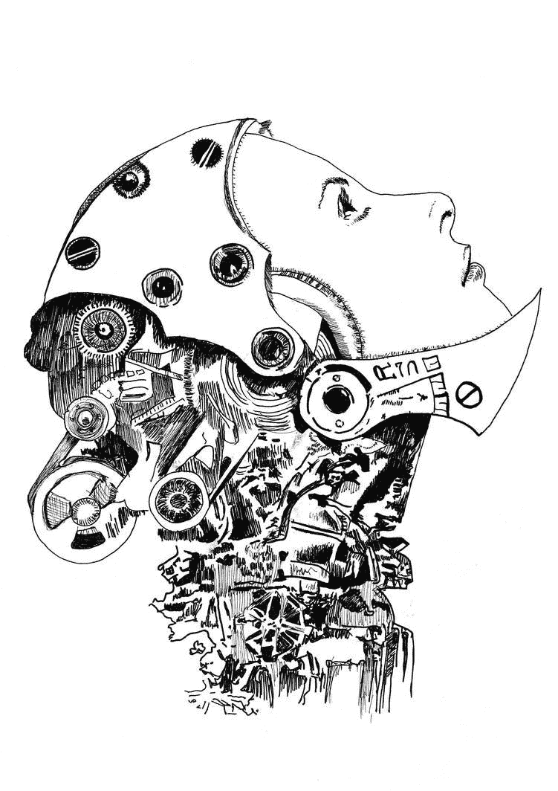

# 作为人类意味着什么？

> 原文：<https://medium.com/swlh/what-does-it-mean-to-be-human-a94352a53591>

你的答案是什么？

Deviant Art [cyborg](https://www.deviantart.com/kittana/art/cyborg-80881409)by [Kittana](https://www.deviantart.com/kittana)

史密森自然历史博物馆的人类起源倡议想知道你认为这对人类意味着什么。你可以去他们的[网站](http://humanorigins.si.edu/about/become-involved/submit-your-response-what-does-it-mean-be-human)回答这个问题。

他们会报道并公布你的答案。

例如，以下是他们网站上发布的一些常见问题的答案: