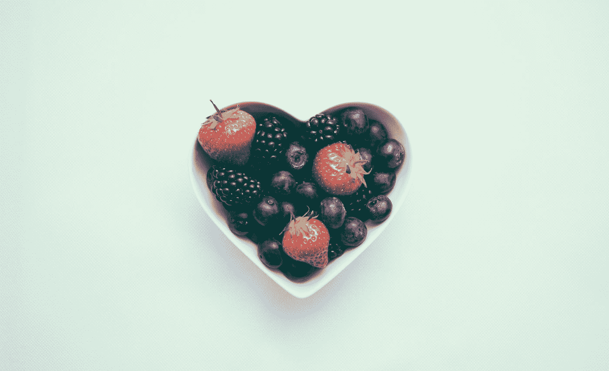

# 吃掉你的感觉真正意味着什么:心理健康和自我认知

> 原文：<https://medium.com/swlh/what-eating-your-feelings-really-means-16c4da7a7ac1>

Photo by [Jamie Street](https://unsplash.com/@jamie452?utm_source=medium&utm_medium=referral) on [Unsplash](https://unsplash.com?utm_source=medium&utm_medium=referral)

俗话说，“你吃什么就是什么。”

但是这种说法是真的吗？

还是你妈妈为了让你吃蔬菜而对你说的话？

根据最新的研究，答案是肯定的，但是答案比电视上显示的要复杂得多