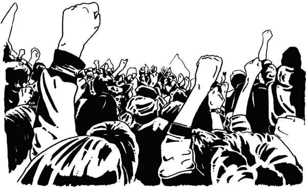
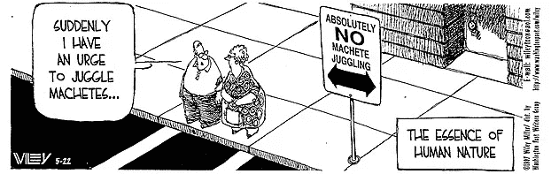
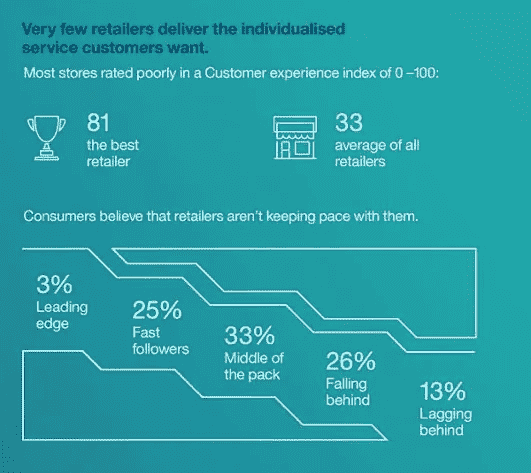
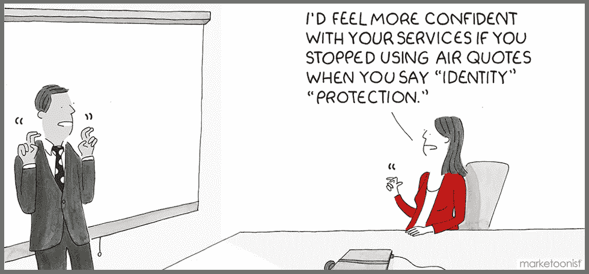
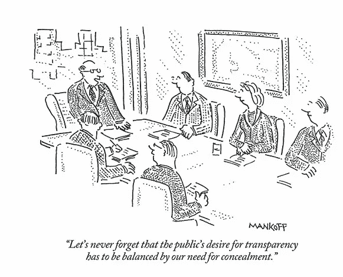
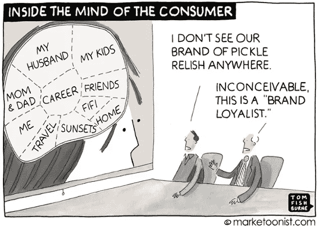

# 每个营销人员都应该知道的抵制心理

> 原文：<https://medium.com/swlh/what-every-marketer-should-know-about-resistance-psychology-4d0e762f79c7>

在 Crobox，我们经常谈论说服。从[行为驱动设计](https://blog.crobox.com/article/persuasive-design-bfm)到信息传递，我们试图解释人类行为的细微差别，希望激发更有说服力的营销。

但是，由于采用了这些理论和策略，这个难题还有另一个经常被忽视的关键部分:阻力。

在学术文献中，阻力有许多定义、应用和解释。但从本质上来说，阻力是对变革压力的反抗。

这种形式的抵抗与社会和政治抵抗形成了鲜明的对比，在社会和政治抵抗中，人们渴望变革并为之奋斗。相反，这种抵抗存在于个人内部，当试图改变某人的态度、意图或行为时，这种抵抗就会爆发。反抗“男人”的内心斗争，而反抗的人往往完全没有注意到。

理解阻力是行为难题的关键部分。通过了解你的听众抵制你的信息的原因或情况，你可以创造出受到热烈欢迎的信息。

因为，归根结底，营销的目标不是强迫或操纵个人购买你的信息。相反，它是教导、提醒和激励个人相信你的品牌和产品。

# 营销阻力的形式

# 电抗

逆反心理是指消费者在抵制胁迫性或威胁其自由的信息时所采取的心理状态，导致他们以相反的方式行事。这是最有记录的抵制形式，在回应营销信息时有多种表现形式，尤其是在个性化方面。

到现在为止，你可能已经听说过或者处理过[个性化悖论](http://www.the-future-of-commerce.com/2016/10/21/personalization-paradox-marketing/)。技术让我们的营销人员能够获得高质量的数据，帮助我们更好地了解我们的客户——这太棒了！

购物者期望无缝的客户体验，对吗？作为营销人员，我们有责任给他们最好的体验，我们可以利用他们的数据来塑造这种体验。

不幸的是，现实情况并非如此简单。

[来源 my customer&IBM](https://www.mycustomer.com/experience/engagement/infographic-changing-retail-customer-expectations-experiences)

虽然网络公众确实期望从零售商那里获得更好的客户体验，但这些体验必须在他们想要的时候出现。

例如，有多少次你浏览一个网上商店，只是为了在接下来的几周里有几个精选的产品跟随你？我敢打赌，我们都有过这样的经历，至少有一半人被它逼得走投无路。

当谈到(糟糕的)重新定位活动时，几乎一半的用户[会出于纯粹的烦恼而忽略广告](https://www.invespcro.com/blog/ad-retargeting-2/)。当这种情况发生时，用户会对劝说行为做出反应。

有了这些，我并不是想说重定目标是无效的——因为它是有效的。但这并不意味着这是推动转化的最佳方式。事实上，消费者已经受够了被他们的产品跟踪，以至于[谷歌正在加强他们的广告拦截能力](https://www.digitaldoughnut.com/articles/2018/april/the-death-of-re-marketing)，以阻止针对这些消费者的转售广告。

无论如何，抵制是对在线广告的普遍反应，在对[推荐服务](https://www.sciencedirect.com/science/article/pii/S0378720609000962)和[广告视频](http://www.journalofadvertisingresearch.com/content/55/1/37.abstract)的反应中也发现了这种反应。

这个故事的寓意是，我们人类喜欢自由，这是我们最基本的价值观之一。因此，当自由受到威胁或限制时，我们会奋起，尽我们所能恢复自由。在某些情况下，这可能是一场社会运动，而在另一些情况下，这可能只是简单的视而不见。

作为一名在线营销人员，需要持续关注[取悦观众，让他们的生活更轻松](https://blog.crobox.com/article/choice-overload)。离开品牌平台后，干扰用户体验的侵入式广告应该谨慎对待。

# 不信任

鉴于最近一连串的丑闻，不信任是一种抵抗的形式就不足为奇了。今天，我们正目睹数据所有权和存储被从角落推到全球互联网用户的最前沿。

用你的主张增强信任感，不再是可以隐性推断的事情。相反，它需要被明确地陈述和强调。

近年来，我们已经看到了一个向透明社会的转变。互联网的广泛使用起到了催化剂的作用，因为它为举报者和调查记者提供了一个发表意见的平台。它为每个人提供了他们需要的工具，来发现一些有问题的品牌或政府可能已经被埋没的信息。

幸运的是，在脸书和剑桥分析公司等丑闻出现之前，许多公司就察觉到了这种沟通方式的变化。透明的时代已经让位于渴望与愿意倾听的受众分享他们的故事、公司动态和愿景的品牌。

更不用说区块链和分散化技术项目的兴起了，在这些项目中，透明度是必然的。这种开源的崛起向所有行业的公司发出了一个明确的信息:未来将建立在开放和透明的交流之上。正如他们所说，越早开始越好。在这种情况下，拖延可能是“品牌的死亡”。

不用说，消费者会避开不诚实和夸大的宣传。诚实是最好的策略，所以试着向你的顾客敞开大门。这反过来会加强他们的忠诚度和与你的品牌的联系。

# 细看

源于不信任的是它的小兄弟，审查。因为我们生活在一个做决定时喜欢把事实摆在面前的社会，所以要做好准备，让你的听众来拆穿你的每一个主张。

审查是一种抵制形式，强调提案本身，当个人意识到他们是影响企图的目标时就会出现。认识到这一点后，个人将仔细评估该主张，以找到任何有助于他们对该主张做出决定的优势或劣势。

但是，由于我们通常容易受到人类偏见的影响，我们可能会发现论点中已经与我们的观点一致的部分(即确认偏见)。

个人经常通过寻找你的有说服力的主张无效的原因来反驳。这突出了避免容易被反驳或与你的目标受众的理想相冲突的公开主张的重要性——尤其是在你的受众[高度参与](https://blog.crobox.com/article/persuasive-design-elm)的情况下。

应该注意的是，审查也可能是一件好事。因为审查需要对信息进行更多的处理，当信息令人信服或与接受者的观点一致时，它就会更多地出现在他们的脑海中。

这是因为当你批判性地分析一个主张时，你会比被动地接受或拒绝它花费更多的精力。这种增加的能量使得与主张的关联更强，确保它保持在头脑的顶端。

最终，审查的水平和结果在很大程度上取决于所传达的信息、所讨论的产品以及目标受众的态度和价值观。为了安全起见，你可以随时提供赞成和反对的理由，或者直接(诚实地)与你的竞争对手进行比较。或者，您可以在产品描述中解决常见问题，以缓解您的潜在客户可能会有的任何担忧。

# 惯性

你的顾客可能面临的最后一个阻力是惰性。惰性不一定是对提议的反应，就像反应、不信任或审查一样。相反，它更多的是一种保持不变的愿望，而不是明确地抵制变化。

就电子商务而言，惯性有利于留住客户。总的来说，[研究发现](http://www.emeraldinsight.com/doi/abs/10.1108/09604521311312219)只要没有其他力量迫使他们改变，许多消费者会继续留在目前的网上商店。这些经历高度惰性的消费者会犹豫是否要改变，即使替代品更有吸引力。

惯性范围背后的原因，但一些促成因素包括:

*   **减少消费时间**:不需要浪费时间去熟悉一个新网站，比较价格，分析评论等等。
*   **熟悉度**:我们喜欢我们知道的东西。因此，在访问了一个网站并获得了一个总体上积极的印象后，我们发现回到那个网站比面对更换网站的风险要舒服得多。
*   **差异感知**:个人感觉不到熟悉的商店与其替代品之间的巨大差异。所以转行似乎不值得。

这种形式的抵制给品牌带来了一个有趣的机会，尤其是当你考虑到[获得新客户](https://www.retailtouchpoints.com/features/trend-watch/retail-customer-acquisition-vs-retention-a-zero-sum-game)可能比保持现有客户多花费*五到七倍的成本。另外，获得新客户的可能性很小，在 5%到 20%之间。*

这似乎是一个显而易见的事实，即应该把更多的注意力放在让你的客户保持现状上。利用惯性似乎是一个很好的方法，因为人们发现它甚至比品牌满意度发挥更大的作用。但是怎么做呢？

不久前，我们讨论了流畅对于无缝用户体验的重要性。回顾一下，建立流畅度就是让你的网站尽可能容易理解和浏览。说到促进惯性，也差不了多少。通过以下方式使你的网站尽可能流畅:

*   通过详细的过滤或高级搜索选项，缩短查找产品或浏览所需的时间。
*   通过使其直观和简单，使购物者容易熟悉你的网上商店。
*   通过提供独特的 USP，如忠诚度奖励、快速发货、免费退货等，发展您的客户关系。
*   为您的客户建立一个一站式商店，找到他们最喜欢的相关产品。

# 接受阻力

抵抗是多年来进化出来的自我保护冲动之一。虽然它在我们的数字社会中可能会有不同的面貌，但它的起源仍然深深植根于人类的生存之中。

理解并接受抵制是购物者行为的自然组成部分，将有助于你进行更有说服力的营销，你的受众也会喜欢。从这篇文章中，以下是你的主要收获:

*   **反抗**通过做与你的要求相反的事情来引起你的观众的反抗。避免让你的观众失望的侵扰性广告。
*   **不信任**可能是你与顾客关系成败的关键，将透明度融入你的商业模式，为持久的关系奠定基础。
*   做出夸大或“半真半假”的声明时，应考虑审查。假设每个人都会尽职调查并进行相应的沟通。
*   **惯性**可以帮你留住你的尊贵客户。确保你的网上商店和服务是流畅的用户体验的推动者。

*Crobox 的解决方案通过提供减轻心理负担的相关信息，帮助用户完成购买之旅。想看看怎么样吗？* [*查看我们的白皮书！*](https://blog.crobox.com/persuasive-personalization-wp)

*原载于***。**

**

## *这篇文章发表在 [The Startup](https://medium.com/swlh) 上，这是 Medium 最大的创业刊物，拥有+417，678 名读者。*

## *在这里订阅接收[我们的头条新闻](http://growthsupply.com/the-startup-newsletter/)。*

**