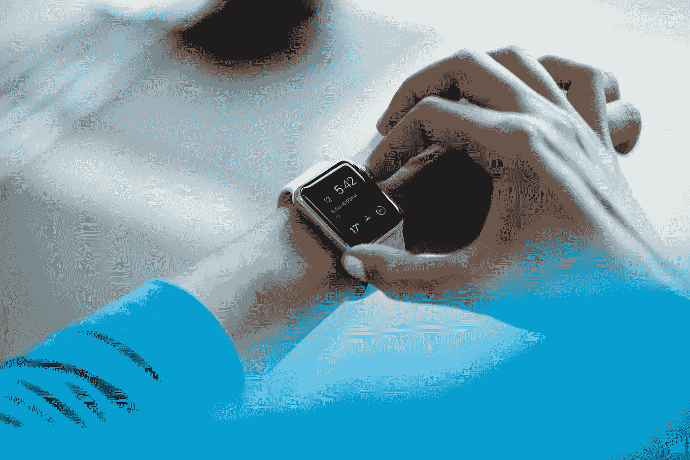

# 你们的 sh*t 在一起到底意味着什么？

> 原文：<https://medium.com/swlh/what-exactly-does-it-mean-to-have-your-sh-t-together-75d20d462398>

## 这只是我们的想象吗？

Photo by [Luke Chesser](https://unsplash.com/@lukechesser?utm_source=unsplash&utm_medium=referral&utm_content=creditCopyText) on [Unsplash](https://unsplash.com/?utm_source=unsplash&utm_medium=referral&utm_content=creditCopyText)

我有一个坦白:有时候我上班会迟到。(*喘息！*)

不是所有的时间，肯定没有我以前那么多。这些天来，我更善于提前计划，也更善于认识到一项任务需要多长时间才能完成。