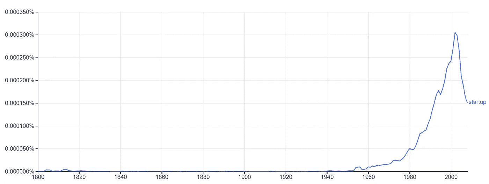
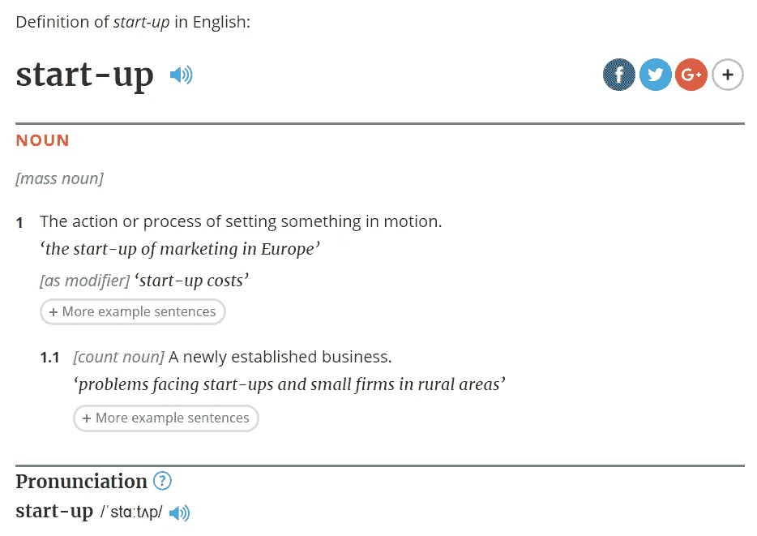

# 到底什么是创业公司？

> 原文：<https://medium.com/swlh/what-exactly-is-a-startup-5ba629d7a0f7>

## 创业与中小企业:了解区别。

当我们谈论**创业**的时候，有一个我们可以听到的趋势词几乎指的是每一个新的业务:*创业*。

当任何人告诉他们正在创建一家创业公司时，这个项目似乎比任何其他小企业都更现代、更具创新性和科技含量。关于这个词有一些新鲜的东西，但是大多数人并不知道为什么是 T10。

那么，**到底什么是创业公司？**和任何一个最近创建的企业不一样吗？为了理解这一点，我们将简单回顾一下我们最近的历史。

 [## 硅谷聚焦:R3 CORDA

### 商业区块链的未来概述

medium.com](/swlh/silicon-valley-spotlight-r3-corda-2b9ced92a646)  [## 假人区块链

### 理解什么是区块链的五个关键

medium.com](/swlh/blockchain-for-dummies-d3daf2170068) 

# “创业”这个词从何而来？

1976 年《福布斯》的一篇文章首次将该术语用于新公司的含义:

> *“投资电子数据处理领域* ***初创企业*** *的……冷门生意。”——1976 年《福布斯》杂志第 15 期，8 月 6 日/2 日*

因此，这个术语并不像看起来那么新。然而，由于互联网和其他技术的进步，创建和投资创业公司在今天变得更加普遍。互联网使许多人以低成本创建自己的企业成为可能。他们可以从事他们的项目，并让他们接触到大量的公众。企业的精英管理。

事实上，随着网络公司的到来，创业这个词在 20 世纪 90 年代和 21 世纪初变得非常流行。由于谷歌图书 Ngram 服务，我们可以对这种趋势有所了解:

Ngram View from Google Books, analyzing the apparition of the term “startup” in more than 6 % of all the books published in the world.

今天，许多成功的创业公司激励新一代年轻专业人士通过创业谋生。谷歌、亚马逊和许多其他公司现在都是以小项目起家的商业参考。

# **“启动”是什么意思？**

根据可以在网上查阅的《牛津英语词典》,初创企业就是新成立的企业。

Definition of “startup” according to the [Oxford English Dictionary](https://en.oxforddictionaries.com/definition/start-up)

我们不能说这不是真的，但如今“创业”一词还包含其他含义。我们可以列出一些创业公司的基本特征，这些特征使它不同于任何其他传统企业，无论它是否是最近成立的。然而，这些特征很难定义，因此它们可能会随着时间而变化。

*   创业公司确实是**最近创立的公司**。如今，我们不能说脸书或 Spotify 是初创公司，即使它们在起源上可以称得上是初创公司。
*   初创公司是拥有高度可扩展商业模式的小公司。与大多数中小企业相反，他们的长期计划并不止于企业的建立。创业公司关注的是影响力的持续增长和扩大。
*   **创业创新**。他们通过产品、流程或商业模式增加新的价值来参与市场竞争。初创公司不一定是第一个应用这些创新的公司，但他们可以适应其他公司开始做的事情。总有许多风险，但也有潜在的丰厚利润。
*   与同行业的其他公司相比，初创公司的成本**更低**。即使他们努力成为大公司，他们的小规模也使他们的内部流程简单快捷。他们只将价值链的关键部分添加到他们的活动中，并寻找重要的合作伙伴来促进他们的增长。

大多数读者可能会想:**那么技术呢？这难道不是创业公司最重要的特征之一吗？不是所有的专家都这么说，但是我同意很多人的观点，技术本身并不是一个新公司被称为创业公司的必要条件。**

然而，如果阅读上面列出的四点，很明显新的**技术是所有这些特征**的主要促成因素。要找到一家在业务的任何关键部分都不使用技术的初创公司并不容易。**技术促进可扩展性**。初创公司通常提供基于技术的服务，或者通过应用市场这样的技术平台接触他们的客户。

并不是初创公司允许技术的发展，而是最初的**技术促成了初创公司**的诞生。今天，他们生活在一种共生关系中，这种关系使得创业生态系统在技术发展的同时成长。

 [## 为移动应用程序设计伟大的图标

### 进行正确设计的分析、指南和示例。

medium.com](/swlh/designing-great-icons-for-mobile-apps-a515f254eb31)  [## 在一小时内学习 Adobe XD 的基础知识

### 理解体验设计来执行你自己的设计项目

medium.com](/drill/learning-the-basics-of-adobe-xd-in-one-hour-3537f3ac02a3) 

> 你喜欢这篇文章吗？ [*关注我*](/@telmosubirar) *阅读更多内容！*
> 
> *不要犹豫* [*在 LinkedIn 上联系我*](https://www.linkedin.com/in/telmo-subir%C3%A1-rodr%C3%ADguez-6103416b/) *。*

## 这篇文章发表在 [The Startup](https://medium.com/swlh) 上，这是 Medium 最大的创业刊物，拥有+443，678 名读者。

## 订阅接收[我们的头条](https://growthsupply.com/the-startup-newsletter/)。

