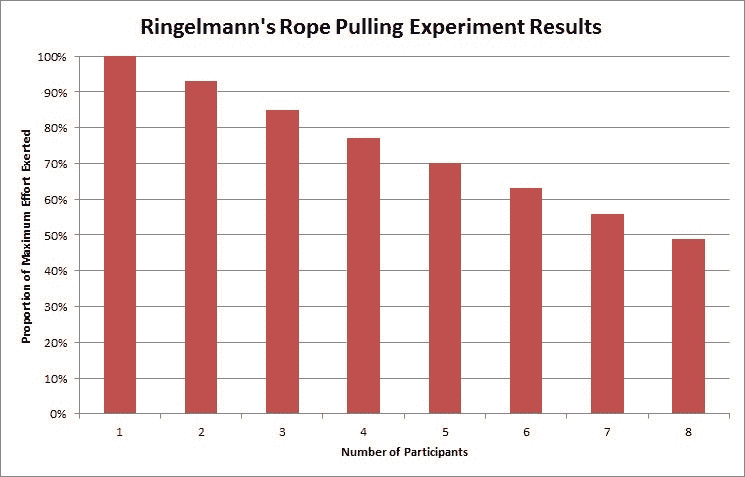

# 在 IDF 工作的五年教会了我什么是责任

> 原文：<https://medium.com/swlh/what-five-years-in-the-idf-taught-me-about-responsibility-f67f587b63b1>

在部队里，我养成了设置两个闹钟的习惯，一个在 5:30，另一个在 5:45。我真的在第一天起床了吗？你可能已经猜到了——不，我会暂停它，等待备份。

在这篇短文中，我将解释一种叫做社交游手好闲的现象，以及重复或分担责任是如何导致重大失败的。

# 责任

在以色列国防军的军官培训学校，在一堵光秃秃的水泥墙上，用大号字体刻着以下引文:

> 责任不能分担或转移
> ——伊扎克·泰托

信息很清楚——如果你被分配了一项任务，你不能*把你的责任*转移给别人，你只能*重复*它。如果你决定进一步将任务分配给你的下属，那么现在你们两个都要负责。

我们来打个比喻:如果你很快乐，和一个朋友分享你的快乐，现在你们之间有 200%的快乐。听起来不错，不是吗？事实是，责任和快乐完全不同。

# 社会闲散

社交游手好闲的概念是由马克西米利安·林格曼教授在 1913 年提出的:想象一个人在拔河比赛(拉绳子比赛)中用尽全力。如果我们再派 4 个队友去帮助他，我们将会得到 5 倍的力量。令人惊讶的是，事实并非如此。

> 随着越来越多的人参与到一项任务中，他们的平均表现会下降，每个参与者都会觉得自己的努力不那么重要。

[Ringelmann Rediscovered: The Original Article](http://www.researchgate.net/profile/David_Kravitz2/publication/209410111_Ringelmann_Rediscovered_The_Original_Article/links/0deec5384ffc87e9c4000000.pdf)

# 考虑这些例子

## 1.电子邮件收件人

在我服务期间，我注意到将一个任务发送给多个收件人会适得其反。假设你需要一个问题的快速答案，而你有四个联系人可以帮助你。大多数人会起草一封邮件发给所有四个联系人，这不是最佳做法，因为每个收件人更容易拖延。

更有效的方法是发送四份电子邮件，每份发给一个收件人。让人们觉得自己很重要，好像他们的贡献是唯一重要的。

## 2.在会议中重复代表

在我所在的部门，少校由他的下属陪同去参加学习会议是很常见的。下属们几乎从不为这些会议做准备，而少校最终会一直说个不停。

如果由于某种原因，少校不能参加会议，就会发生剧烈的变化。突然，角落里那个孤独的船长会站出来，展示他的真实能力。

如果你想让人们茁壮成长，就让他们自主，对自己的劳动承担全部责任(和荣誉)。

## 3.警卫任务

我所在的基地在大门口有两个警卫，两人都被指派负责检查每个进入的人。这有一个有趣的副作用:如果你微笑着走进来说“嘿，伙计，你好吗？有一段时间没见你了”每个警卫都会认为他的同伴认识你并让你通过。

如果你想让人们对自己的行为负责，就需要明确责任完全落在他们肩上。与直觉相反的是，只将其中一个守卫定义为负责人，而将另一个定义为支持者会更有效。

# 总结…

大型官僚机构似乎从分配责任中获得了某种被禁止的快乐。虽然这不完全是一个坏习惯，但是一旦分配了重复的责任，它就会变得适得其反。当许多人分担同样的责任时，他们实际上倾向于觉得 ***不如*** 负责，这种行为可以用社会游手好闲现象来解释。

由于这篇短文呈现了一个非常简单和狭隘的观点，强烈推荐进一步阅读:

1.  [林格曼重新发现:原创文章](http://www.researchgate.net/profile/David_Kravitz2/publication/209410111_Ringelmann_Rediscovered_The_Original_Article/links/0deec5384ffc87e9c4000000.pdf)
2.  [人多力量大:社会闲散的原因和后果](http://web.mit.edu/curhan/www/docs/Articles/15341_Readings/Group_Dynamics/Latane_et_al_1979_Many_hands_make_light_the_work.pdf)