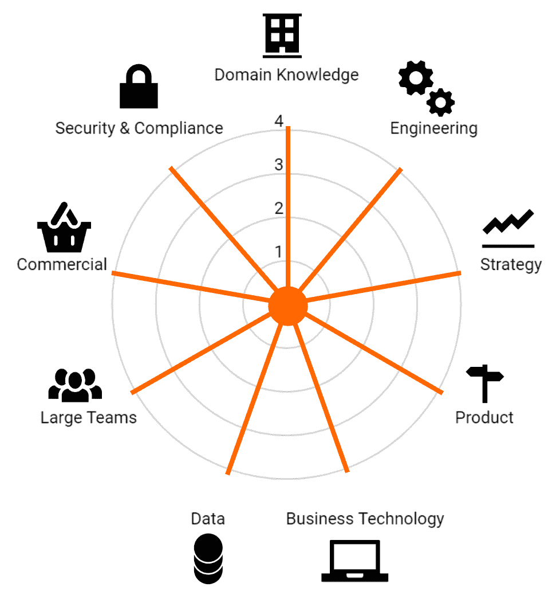

# 你的企业需要什么样的首席技术官？

> 原文：<https://medium.com/swlh/what-flavour-cto-does-your-business-need-d86e8153fe6e>

The CTO Skillset wheel — 9 axes of CTO skills that not all CTOs need

*本文提到的 Google Sheet 是* [*这里任何人都可以使用*](https://docs.google.com/spreadsheets/d/153XXBagUQOVlGC4DhYcLsvgYMaZvuwyPzn-WN-qkZFc/edit?usp=sharing) *。*

如果你不在科技行业工作(或许即使你在科技行业工作)，你可能不知道公司里的“终极”科技角色是多种多样的。在同一业务中，同一角色甚至会随着时间的推移而改变，这意味着 CTO 要么需要适应，要么需要改变以适应业务的需要。