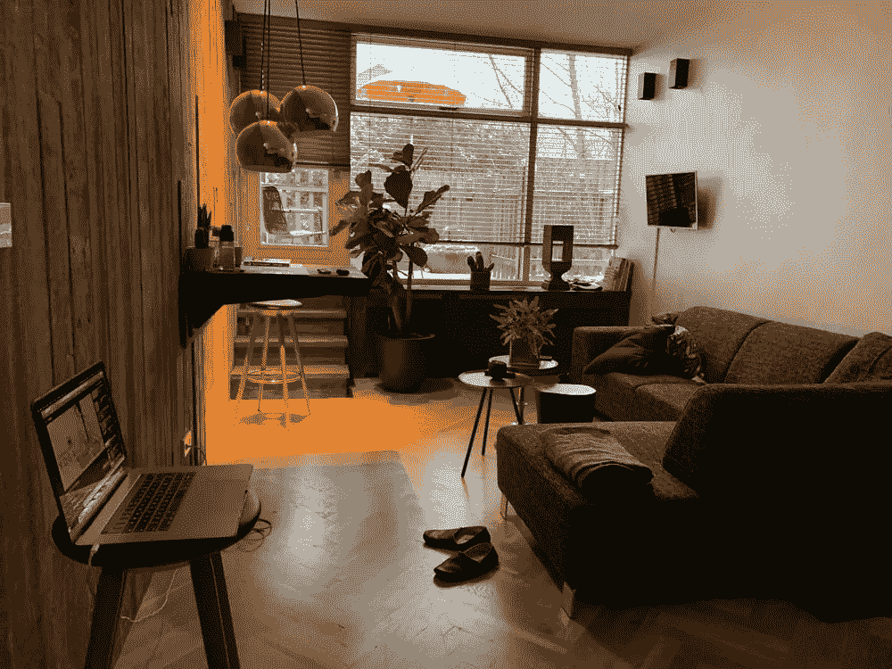

# 当你在迷幻静修会——裸盖菇素实验——呆上 3 天会发生什么

> 原文：<https://medium.com/swlh/what-happens-when-you-stay-3-days-in-a-psychedelic-retreat-a-psilocybin-experiment-7ff4dadfc5a5>

## 合成静修:第一个安全的、受保护的、专业的、合法的和医学监督的中心，使用裸盖菇素从松露到 T2 开发人类潜能

几天前我进入了迷幻合成静修。一个安全的、受保护的、专业的、合法的和受医学监督的中心，使用来自 松露的裸盖菇素 [**来**](https://es.wikipedia.org/wiki/Psilocibina) **[**开发**](https://www.vice.com/es_latam/article/5gvdm8/los-beneficios-medicos-de-los-hongos-magicos) [**人类所有方面和感官的潜能**](https://isragarcia.com/high-impact-mindfulness-experiment) 。昨天，这种经历结束了。我打算把这篇文章转变成一种报告，解释一切**实验。因为对我来说，这是一次实验，也是一堂人生课。我不知道的是它会如此深远。****

# **裸盖菇素撤退**

**这个地方位于赞德沃特，距离阿姆斯特丹 40 分钟的路程，在一个旧的改革宗教堂里。你可以在这里看到更多的位置。禅三包括三天，第一天到达是为了适应环境，第二天是 psilocybin 仪式，第三天是融入和告别。在我录制的关于这次经历的视频中，我按照时间顺序解释了这些事件。**

****

# **主持人**

**毫无疑问，这是最杰出的，一群训练有素的专业人士，从你到达时起到向导、同伴和训练员的作用，直到你离开后，从 [**Natasja**](https://www.facebook.com/IAMnatasjapelgrom/) 和 Dan 到 Martijn，厨师或负责照顾参与者福利的一群医生。你可以在这里 了解全部 [**的更多信息，虽然不是全部出现。**](https://synthesisretreat.com/about-us/)**

# **一群参与者**

**我们是 16 个先前被选中的人，我和我的一些朋友分享了这一经历。有些人来自俄罗斯、美国、比利时、德国，有些人甚至是第二次留级。从 30 岁到 50 岁，这是一个非常多样化的群体。**

# **什么是裸盖菇素合成撤退撤退**

**总而言之，这是一个让你深入并找到你所带来的意图的根源的地方，公正而明白。**

****

# **意图**

**听着，你可能有一个具体的想法，关于你为什么做你要做的事，你要去哪里，做你该做的事，想你该想的事，或者在你完成的事情上努力。也可能不会。**

**这个“想法”会根据你的思维方式而变化，它可以以许多不同的方式呈现。有些人是视觉型的，有些人更善于思考，有些人更善于分析，有些人更敏感或动觉。不管我们是什么类型的人，清楚我们的意图是至关重要的，尤其是当你参与这样一个神圣的和转型的经历时。**

**我说过，几天前裸盖菇素实验结束了。一个至关重要的部分是意图，它有助于个人的过去，好奇心，创造力，成长本身，这是一个指数级的进步。**

# **我对裸盖菇素的 7 个意图和发现**

**这些是我曾经努力(并将继续努力)的目标和结果:**

1.  ****缺乏自我价值。自我判断，自我要求，过度自我批评**。发现——我明白了为什么有时我觉得自己不值得拥有，如何接受它并找到克服它的最好方法。**关键**:学会接受并消除我的限制性信念。**
2.  ****对关注的渴望和我对“更多”的追求**:为什么这种对更多更好的贪得无厌。**发现**——主要是因为缺乏关爱。**
3.  **找到我最深处的自我。尽可能深入地回答这些问题:到底是什么如此推动我，让我觉得不可阻挡？答:我的本性，我的精神，我的存在方式，我的本质，仅此而已。我的天赋是什么？首先推动自己，然后迫使他人释放我们拥有的无限潜力，让我和他人做大事，能够不断超越。我需要从根本上关注哪里？在我身上，对自己更温柔，在我进行的实验中，在高性能中。**
4.  ****我怎样才能更“我”，而不是我需要成为的人，或者我认为我需要成为的人？**伟大的目的和意义。**发现** —如何发现？我意识到这是海市蜃楼，这是一切，我是一切，没有什么可以到达或寻找。**
5.  ****自我的解散**。**发现** —问题不在于小我出现，问题在于我觉得我可以化解它。**
6.  ****爱与自爱**；这里有什么是我应该学习而忽略的吗？**发现**:是的，学会接受和给予一样多，没有债务，没有悔恨。继续照顾自己，而不是惩罚自己。**
7.  **[**释放我的全部潜能**](https://isragarcia.com/unstoppable-attitude-self-reliance-story) **，拓展、拉伸、强化我的最大表现？尽可能地加深我的精神、灵魂、身体和情感，以解开所有被封锁和沉睡的东西。从觉知中醒来，多感受，少思考。**寻找** —我不需要更多，更好或更极端，我需要更温和，对自己和环境，进入更多与自然，与地球，与简单和容易的联系。****

**我明白了，要找到我们想要的结果，我们需要仔细选择 [**我们的意图**](https://isragarcia.com/i-made-it-happen) 。因为它的深度会决定转化的程度，我们会经历。**

# **四种不同类型的萨满体验**

**他们向我们解释说，这些经历有四种不同的类型，它们是:**

1.  **什么都没有:当你和自己坐下来，什么都没有发生。**
2.  **绘画:当分形、颜色和形状出现时。**
3.  **情绪化:当情绪化的东西成形并最终在身体上显现出来。**
4.  **向导:当实体作为向导出现时。**

**毫无疑问，我的经历介于第一、第二和第三之间。**

****

# **我从裸盖菇素实验中得到的有趣问题**

**是我提炼出来的，是以问题的形式引起我注意的。有两个非常特别(猜猜是哪两个)**

*   **为什么你会觉得这是针对你个人的？**
*   **你怎么能玩这个游戏呢？**
*   **你第一次感到恐惧、喜悦、喜悦、充实、沮丧是什么时候？(无论感觉如何)**
*   **你打算教我什么？(指你现在生活的情况)**
*   **这一切会带来什么样的礼物呢？**
*   **我还没看到的正在发生的事情，哪一点是正确的？**
*   **你上一次喜极而泣是什么时候？悲伤呢？**
*   **恐惧想教会我什么？**
*   **是自我想要控制我吗？**
*   **哪里出现了你没有把学过的东西融会贯通的迹象？**

# **由此产生的裸盖菇素要点/要点**

**以下是我从使用裸盖菇素之前、期间和之后的经历中收集到的一些要点:**

*   **我们应该坦然面对拒绝。**
*   **当你回家的时候，用音乐、气味、感觉、写作来重现这种经历。**
*   **我们必须做好一切准备。**
*   **你的哭泣会帮助另一个人。**
*   **他在身体里，不在头脑里。**
*   **口头禅:我要自怜了。我是完全不完美的。我的人生，我的努力，我的结果，都是应该的。**
*   **关键是自我反省。**
*   **没有自我接纳，你就无法获得自尊。**
*   **情绪释放手法: [**敲打**](https://www.thetappingsolution.com/what-is-eft-tapping/) 。**
*   **当有限制性的信念时，呼吸是不够的。**
*   **元意识:意识到你没有理解。如果发生了，不要感到内疚，不要惩罚自己，改变行为。**
*   **认知整合: [**记日志**](https://isragarcia.es/journaling-tecnica) 技巧。**
*   **我学会了两个新的咒语。**
*   **从专业角度来说:**
*   **一个坚决的项目，我不知道该往哪个方向集中。**
*   **两个新的商业理念。**
*   **启动新项目的行动。**
*   **让 [**高性能**](https://isragarcia.com/category/high-performance) 项目现在开始。**
*   **两项新的合作**
*   **与 [**华伦天奴**](https://isragarcia.es/disrupt-everything/?p=admin&do=edit&=episode&name=2018-07-20_44_dep_-_valentino_barrioseta.mp3) 的联合项目。**

# **裸盖菇素实验的反思与结论**

**这个视频收集了我在测试前、测试中和测试后的证词。包括对合成静修联合创始人[**Martijn Schirp**](https://highexistence.com/people/martijn/)的简短采访。**

***(视频是西班牙语，但对马丁的采访是英语)***

**你对裸盖菇静修有什么问题吗？还是关于实验？如果有兴趣加入合成静修，可以在这里申请**。****

********

## ****这篇文章发表在 [The Startup](https://medium.com/swlh) 上，这是 Medium 最大的创业刊物，拥有+421，678 名读者。****

## ****在这里订阅接收[我们的头条新闻](https://growthsupply.com/the-startup-newsletter/)。****

********