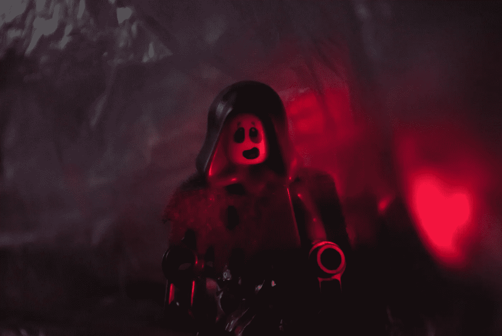

# 当你“像艺术家一样偷窃”却被指控直接偷窃时会发生什么？

> 原文：<https://medium.com/swlh/what-happens-when-you-steal-like-an-artist-but-are-accused-of-simply-stealing-f0c6cc27eddd>

## 适应工作的可怕灰色地带

Photo by [Izabella Bedő](https://www.pexels.com/@izabrella?utm_content=attributionCopyText&utm_medium=referral&utm_source=pexels) from [Pexels](https://www.pexels.com/photo/enemy-fear-fearing-fight-1007577/?utm_content=attributionCopyText&utm_medium=referral&utm_source=pexels)

在*像艺术家一样偷窃*中，作者兼创作者奥斯汀·克莱恩断言:

*   你是你影响的总和。
*   每一个新想法都只是一个或多个先前想法的混搭或混合。