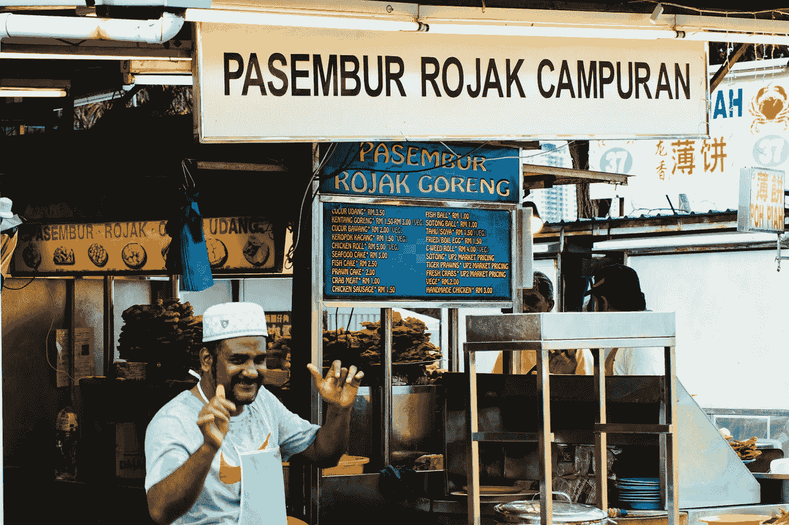

# 有哪些小贩摊档可以教我们利基

> 原文：<https://medium.com/swlh/what-hawker-food-stalls-can-teach-us-about-niching-ad6ef531c39d>

## 方便顾客选择

Personalities and stories draw customers in. Photo by [Nicholas Punter](https://unsplash.com/photos/cnP6TSdh1Qo?utm_source=unsplash&utm_medium=referral&utm_content=creditCopyText) on [Unsplash](https://unsplash.com/?utm_source=unsplash&utm_medium=referral&utm_content=creditCopyText)

我们的衬衫不舒服地粘在我们过热的、黏糊糊的身体上。

我们对从巨大的下水道飘来的腐烂食物和流浪动物尿的强烈恶臭嗤之以鼻。

一想到掉进下水道，我们就不寒而栗——即使我们的眼睛又回到了…