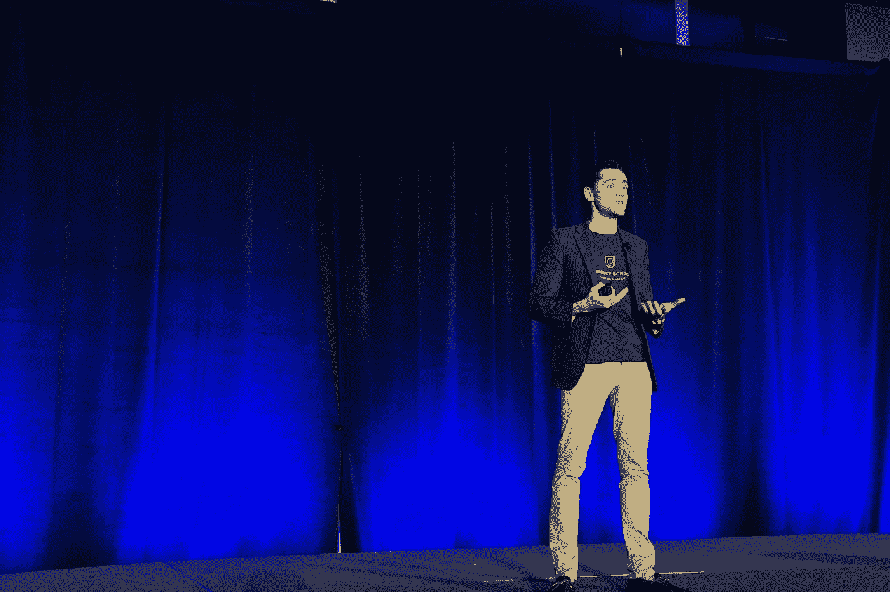

# 我完成了戴尔·卡内基课程，这是我学到的东西

> 原文：<https://medium.com/swlh/what-i-discovered-about-the-famous-dale-carnegie-course-at-20-years-old-689f3690dd29>

“Happiness doesn’t depend on external conditions. It is governed by our own mental attitude.” -Dale Carnegie

那是第一天，2019 年 3 月 20 日。

我穿上一件熨好的白领衬衫，塞进裤子里。15 分钟后，我到达了进行培训的酒店。当我走进大楼时，我紧张地咽下自己的口水。

## 我很焦虑。