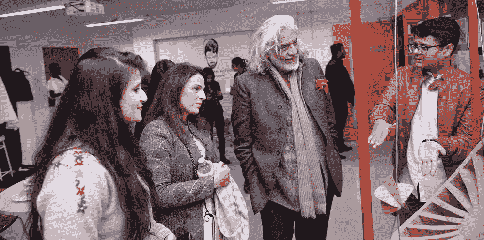

# 我从设计评审团中学到了什么

> 原文：<https://medium.com/swlh/what-i-have-learned-from-being-on-design-juries-d18a37ae8e61>

陪审团。这个词唤起了一种恐慌感&责任取决于你站在分歧的哪一边。评审团成员见证了令人兴奋的想法、创意和创新项目。这些都是鼓舞人心的和学习的经验，也强调了责任感。对于学生来说，评审团的反馈可以产生巨大的影响，并帮助他们发展自己的想法，作为设计师谁…