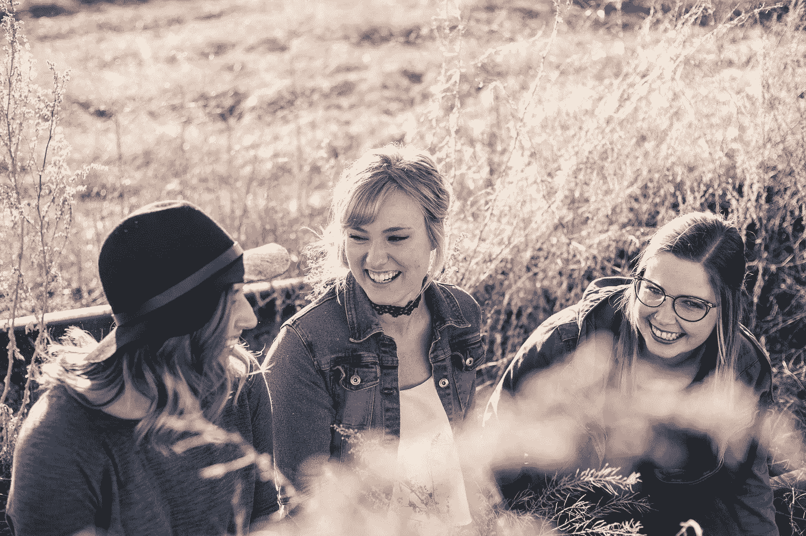

# 我从 30 天每天会见 2-3 个陌生人中学到了什么

> 原文：<https://medium.com/swlh/what-i-learned-after-meeting-2-3-strangers-per-day-for-30-days-73c3dd8a0887>

## 克服社交恐惧

> 你害怕人们会评判你，拒绝你，阻止你，羞辱你，嘲笑你或讨厌你，如果你做你自己，并真正向他们敞开心扉。