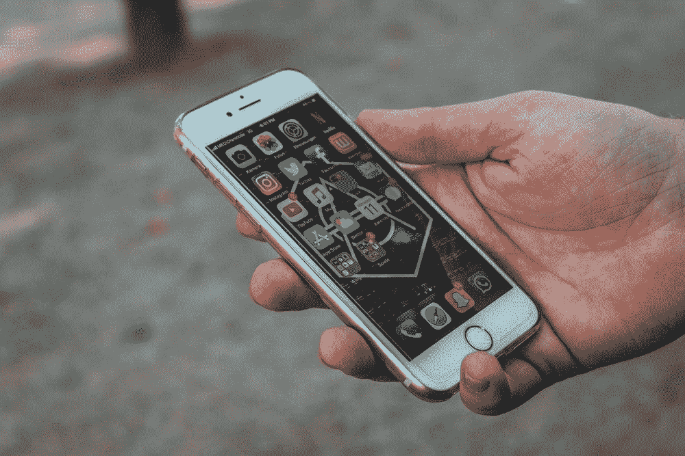

# 我沉浸在社交媒体两周之后学到了什么:

> 原文：<https://medium.com/swlh/what-i-learned-after-two-weeks-of-immersing-myself-in-social-media-fa8824f8438e>

## 这是《权力的游戏》,如果我在游戏过程中迷失了自我，我就不想玩了

为了努力成为一名成功的兼职自由职业者，我阅读了大量关于如何让自己“脱颖而出”的文章我遇到的一个建议是，新作家需要通过…