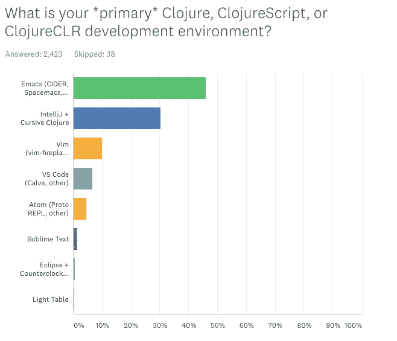
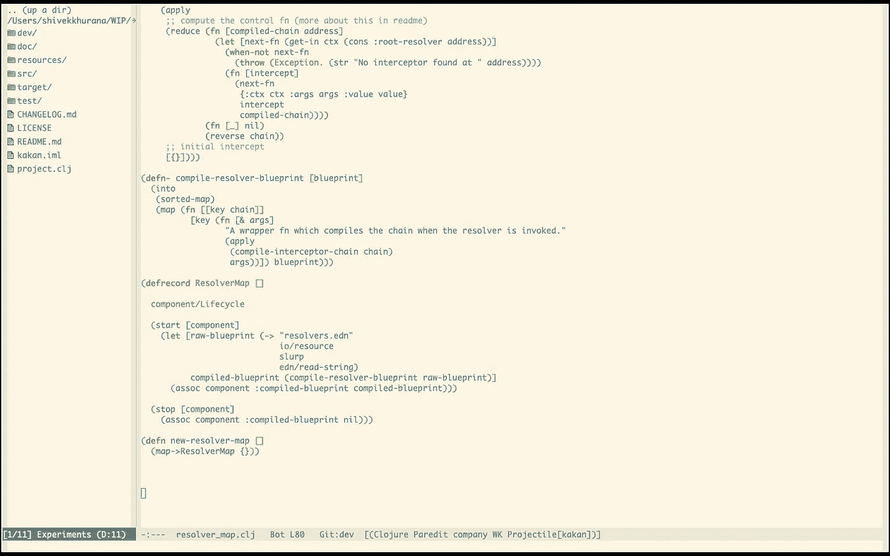
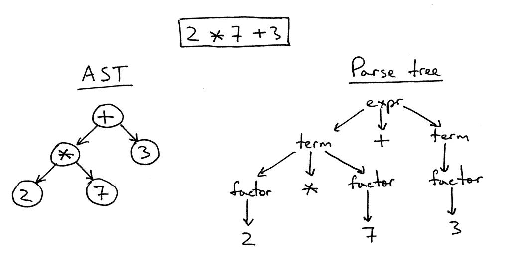
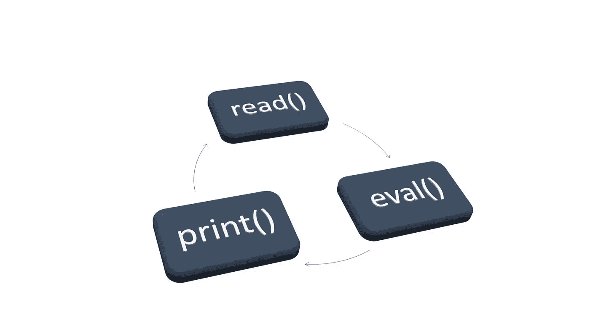

# 写 clo jure 424 天后学到的东西，直

> 原文：<https://medium.com/swlh/what-i-learned-after-writing-clojure-for-424-days-straight-8884ec471f8e>

## 好的，不是每天，但是大多数工作日

我已经在 Juxt 从事 Clojure 项目一年多了，但是我从来没有写过我的经历，因为:

*   在写文章之前，我研究了社区在 Reddit、HackerNews、GitHub 问题和 Google 趋势上面临的问题。


Past 12 months Google Trends for Python (Red) vs Clojure (Blue) vs JavaScript (Yellow)

*   Clojure/Script 似乎从来没有问题或需求
*   没有多少人使用 Clojure/Script 作为他们的第一语言
*   那些知道的人不需要任何指导
*   作为一个博客作者，我没有动力去写它

Clojure 从根本上改变了我的思维过程。它影响了我写 JS 的方式和我一般的编码方式。所以即使写 Clojure 没有明显的营销/品牌效益，我还是会去做。

# 什么是 Clojure & ClojureScript？

Clojure 是 LISP 的一种方言，最初是为了编译成 JVM。它被进一步扩展到 ClojureScript，一个编译成 JavaScript 的 Clojure 版本。


Clojure Logo

Clojure 和 ClojureScript 都是生产就绪的，受 Cognitect 支持。还有许多社区实现: [Clojerl](https://github.com/clojerl/clojerl) ， [Cljperl](https://metacpan.org/pod/CljPerl) ， [Las3r](https://github.com/aemoncannon/las3r) ，以及[其他](https://en.m.wikipedia.org/wiki/Clojure)。

# 先说 Clojure 为什么烂

考虑向堆栈中添加新内容时，考虑长期后果很重要。Clojure 是一门很棒的语言，但是它也有一些问题。他们大多数人都有办法。

## 很难找到工程师

没有多少人编写 Clojure，当我和别人谈论它时，这成为一个经常关注的问题。


Photo by [CoWomen](https://unsplash.com/photos/7Zy2KV76Mts?utm_source=unsplash&utm_medium=referral&utm_content=creditCopyText) on [Unsplash](https://unsplash.com/?utm_source=unsplash&utm_medium=referral&utm_content=creditCopyText)

这似乎也是其他依赖 Clojure 的公司的准则。与 Node.js 或 Python 相比，Clojure 资源的需求和供应微不足道。同样的原因也很难找到 Clojure 的工作。

## 它被 Rich Hickey & Cognitect 严密控制

很难给这贴上赞成或反对的标签。Rich Hickey 是一个了不起的思想家，Clojure 是一种极其成熟的语言。然而，社区中存在一些冲突，Cognitect 拒绝解决核心层的问题。也就是说，标准是使用库来扩展语言。我个人喜欢这样。让 Rich control Clojure。他很擅长这个。

## (它(充满了(括号)))

这个 XKCD 只有在你没有局内人视角的情况下才是准确的。


[https://xkcd.com/297/](https://xkcd.com/297/)

诚然，括号有时会是一个问题，尤其是在你刚开始的时候。我曾经认为我必须手动键入和匹配所有这些括号。但事实并非如此。有一些工具可以帮助你进行结构编辑，几个月后，括号就看不见了。

## 它的启动时间很慢

Clojure 运行在 JVM 上，与 Node 相比启动时间要慢得多。还是那句话，这只是一个局外人角度的问题。我们有 REPL。你只需启动一次应用程序，它就会一直在后台运行。您可以交互式地包含新的更改，而不必每次都启动。

## 它的学习曲线很陡

如果你是一个有经验的开发人员，并且从未使用过 LISP，那就更是如此。工具有点复杂。大多数 Clojure (46%)开发人员使用 Emacs，如果你是从 Sublime Text 或 Atom 开始职业生涯的话，这是很难学会的。



The preferred environment for Clojure Dev — State of Clojure 2019 [[https://www.surveymonkey.com/results/SM-S9JVNXNQV/](https://www.surveymonkey.com/results/SM-S9JVNXNQV/)]

有一个老笑话仍然流传，“Emacs 是一个伟大的操作系统，但缺乏一个好的文本编辑器”。根据我的经验，Emacs 是一只值得驯服的野兽。我的看起来是这样的(没有标签，也没有“转到任何东西”的功能),但仍然完成了所有的事情。



My Emacs setup — Config at [https://github.com/shivekkhurana/emacs.d](https://github.com/shivekkhurana/emacs.d)

如果 Emacs 对你的胃口太大，有一个 IntelliJ 的草书插件。也可以使用 VSCode。

# 我为什么开始学习 Clojure？

我的导师建议学习任何口齿不清。YCombinator 的创始人保罗·格拉厄姆是一名 LISP 黑客。你知道 HackerNews 是用一种叫做 [Arc](http://www.paulgraham.com/arc.html) 的 LISP 方言写的吗？


Photo by [Aaron Burden](https://unsplash.com/photos/6jYoil2GhVk?utm_source=unsplash&utm_medium=referral&utm_content=creditCopyText) on [Unsplash](https://unsplash.com/search/photos/learn?utm_source=unsplash&utm_medium=referral&utm_content=creditCopyText)

Reddit 的[第一版也是用 Common LISP 编写的。](https://github.com/reddit-archive/reddit1.0)

我很好奇，因为我的日常工作包括编写 JS 和 Python，我经常发现自己被困在语言级别的特性中。我一直在寻找更好的工具。在过去的 2 年里，我已经在 Clojure 和 React 上安顿下来，我不认为我会走得更远。

# 为什么我会继续和 Clojure 一起工作(可能是永远)

用令人印象深刻的行话来说，它是一个函数式 lisp，内置了对持久数据结构、异步通道和反应性的支持。它还拥有一流的标准图书馆。一切都是围绕一个精益核心构建的。

ClojureScript，针对 js 的版本使用了 google closure 库(众所周知它比 WebPack 快，有时甚至比得上 vanilla js)。

如果你来自 JavaScript 领域，想象一下 js，但是 RxJs，不可变的和 Lodash 内置在语言中。

如果你像我一样是一个怀疑论者，你必须尝试一下。Clojure 提高了我作为开发者的能力。它影响了我写 JavaScript 的方式和我解决问题的方式。

## 口齿不清

像 Python 这样的语言通过使代码看起来像英语来关注可读性。另一方面，LISPs 完全忽略了英语语言的语义，而强制使用结构化的语法。



Abstract syntax tree for a mathematical expression from [Ruslan’s Blog](https://ruslanspivak.com/lsbasi-part7/)

例如，表达式 2*7+3 可以在图像中表示。

所有 LISP 代码都是原语列表。图元是向量、地图、字符串、数字或符号集合中的元素。首字母缩写 LISP 代表 **Lis** t **P** 处理。你的代码基本上就是一棵 LISP 的树。

结构化代码允许编译器优化，而这对于受英语启发的代码来说是不可能的(或极其困难的)。

## 不变

不变性意味着你的变量永远不会被覆盖。当需要更改时，旧变量保持不变，并生成一个新的副本。

> 在上面抹点不变性。你会没事的。
> 
> ——[假富豪吻痕](https://twitter.com/fakerichhickey/status/392960823204663296)

这个看似简单的功能有助于构建复杂的管道。编程中最棘手的问题之一(除了命名和缓存管理)是处理副作用。不可变的数据结构使得处理副作用不容易出错，因为你观察的东西永远不会改变。永远不会。

## 编译成 JVM 和 JS(和 Graal)


[https://xkcd.com/303/](https://xkcd.com/303/)

您可以使用 Clojure 轻松编写基于 Java 的后端和基于 JS 的前端。互操作非常简单。

学习一次，在任何地方写，有一个薄的抽象层。以一种语言的所有运行时为目标。

## REPL 驱动的发展

直到它成为我日常生活的一部分，我才意识到这个功能的强大。你可能必须亲自体验，才能欣赏 REPL(或 Read Eval Print Loop)的独创性和天才。

REPL 基本上允许你在一个交互式运行时中加载你的部分代码，并像在你的应用程序中使用它一样使用它。



REPL Illustration from [This is why your read-eval-print-loop is so amazing](https://medium.freecodecamp.org/this-is-why-your-read-eval-print-loop-is-so-amazing-cf0362003983) by [IObert](https://medium.com/u/89849e960748?source=post_page-----8884ec471f8e--------------------------------)

例如，考虑一个数据库函数，它绑定到一个通过 REST API 调用的控制器。现在，您的任务是优化查询。在现实世界中，您需要对 DB 函数进行修改，让代码自动(或手动)重新加载，然后检查 REST API 的结果。

有了 REPL，你可以跳过所有无聊的部分，把 DB 函数和它的依赖项带到 REPL，并实时编辑它。如果你对《REPL 驱动的发展》感兴趣，我强烈推荐你观看 Stuart Halloway 的演讲。

## 相对更简洁和高效

这是一个非常主观的说法，所以要有所保留，但是我发现 Clojure 语法比我使用过的所有其他语言都更简洁、更有表现力。这导致更小的代码基础和更高效的团队。

## 不打字，但规格

在 Clojure 中没有强制类型的本地方法，但是我们有一种不同的方法来强制契约，叫做 [specs](https://clojure.org/guides/spec) 。它不仅仅是一个类 Java 类型的系统，而且是完全可选的。

## clo justics 不修理没坏的东西

在生产中使用过去两年没有更新的库是完全可以的。社区对其工作流采取立场并坚持多年，不像“咳咳 Javascript，咳咳”。

## 宏指令

Clojure 允许您使用对宏的一级支持来扩展语法。考虑下面的例子:

```
(if something-is-true
  (do
    (something-else))
```

这可以转换成如下的`when`宏:

```
;; actual when source(defmacro when
  "Evaluates test. If logical true, evaluates body in an implicit   do."
  {:added "1.0"}
  [test & body]
  (list 'if test (cons 'do body)))
```

现在可以用作:

```
(when something-is-true 
  (something-else))
```

## 里奇·希基

不确定将 Rich Hickey 作为 Clojure 的一个特性是否有意义，但是一旦你迷上了他的演讲，你就会改变。

# 总之；TL；DR；

Clojure 是一个实用的 LISP。它是精简的，设计良好的核心可以帮助你编写可维护的代码。对 Java/JavaScript 互操作的一流支持有助于利用现有的生态系统。你在生态系统中听到的问题很容易解决。

如果您想了解更多关于 Clojure 的知识，我强烈推荐以下资源:

*   [里奇·希基的谈话和采访](https://github.com/tallesl/Rich-Hickey-fanclub)
*   JUXT 的博客 (PS: JUXT 最近发布了一个名为[症结](https://juxt.pro/crux/index.html)的双时态数据库)
*   [勇敢的 Clojure](https://www.braveclojure.com/)
*   [斯图尔特·塞拉的博客](https://stuartsierra.com/)

[](https://krimlabs.com/courses/tinycanva-clojure-for-react-developers)

[https://krimlabs.com/courses/tinycanva-clojure-for-react-developers](https://krimlabs.com/courses/tinycanva-clojure-for-react-developers)

您可能还喜欢:

*   [通过构建药品经销商 API 学习 Clojure 第 1 部分](/@shivekkhurana/learn-clojure-by-building-a-drug-dealer-api-part-1-83bd4adb9946)
*   [通过构建药品经销商 API 学习 Clojure 第 2 部分](/@shivekkhurana/learn-clojure-by-building-a-drug-dealer-api-part-2-de8c47512a71)
*   [通过构建毒贩 API 学习 Clojure 第 3 部分【结束游戏】](/@shivekkhurana/learn-clojure-by-building-a-drug-dealer-api-part-3-endgame-b12717164574)
*   [道德、开源、同时盈利](/@shivekkhurana/ethical-open-sourced-and-profitable-at-the-same-time-16c53efdfe5a)
*   [一个简单的用户界面改进 UX 的入职流程](/@shivekkhurana/a-simple-ui-hack-to-improve-onboarding-ux-ocd-93ed5d77247)
*   [用 Clojure 的 REPL 达到心流状态](https://shivekkhurana.medium.com/reaching-flow-state-with-clojures-repl-231f0f28d972)