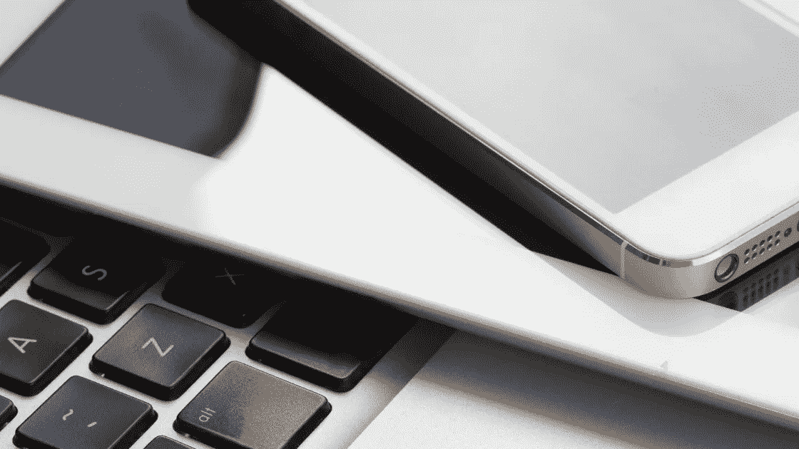

# 没有网络的两个星期我学到了什么

> 原文：<https://medium.com/swlh/what-i-learned-from-2-weeks-without-internet-c8cc65475626>

大约一个月前，我们失去了网络连接。一开始，我非常生气。当你的激情和收入依赖于互联网时，失去这种联系会令人非常沮丧。虽然我喜欢远离手机和所有社交媒体的早晨和晚上，并且绝对陶醉于在湖边没有使用 wifi 的时间，但被夺走的感觉太糟糕了。然后我…