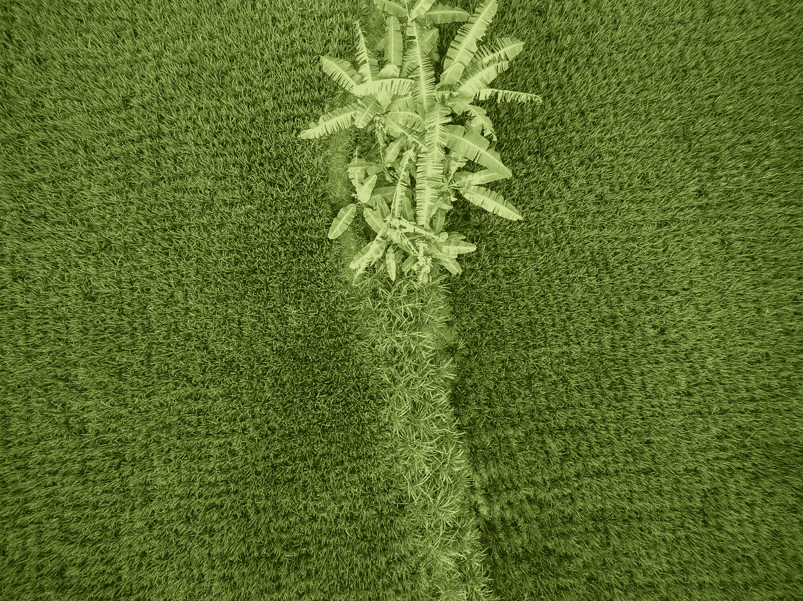

# 我从一个农民那里学到了我在学校里没有学到的东西

> 原文：<https://medium.com/swlh/what-i-learned-from-a-farmer-about-business-that-i-missed-in-school-6592c9e7d5d2>

他向我展示了什么是真正的生活——一个字也没讲

Photo by [Josh Withers](https://unsplash.com/photos/LjSO-Y1nExU?utm_source=unsplash&utm_medium=referral&utm_content=creditCopyText) on [Unsplash](https://unsplash.com/search/photos/paddy?utm_source=unsplash&utm_medium=referral&utm_content=creditCopyText)

在互联网成为主流的十年前，一个星期天的清晨，一个年轻的农民从我祖父在南印度的家乡来到这座城市拜访我们。在弄清楚他来自哪里的几分钟内，他手里就有了新煮的过滤咖啡。