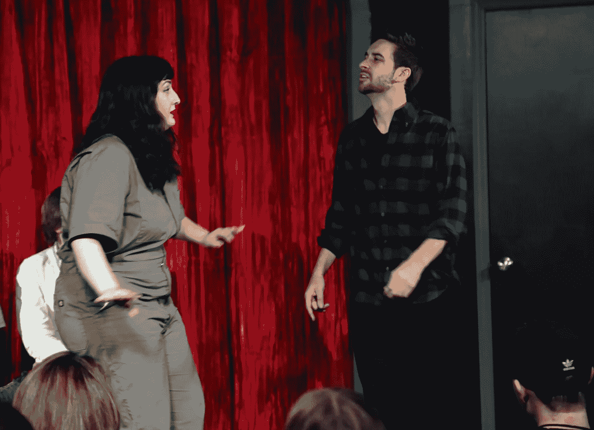

# 我从音乐剧即兴表演中学到的

> 原文：<https://medium.com/swlh/what-i-learned-from-musical-improv-81342ee604c>

你有没有做过这样的梦，你站在舞台上，人们期待你唱歌，但你不知道歌词？我在那里住了八个星期。

几年前，我爱上了《T2》即兴表演的《T1》。我开始在纳什维尔的第三海岸训练中心上课，直到我完成整个课程才停止。 [**我甚至去芝加哥参加了为期一周的强化培训**](https://www.mattwilliamscreative.com/my-week-doing-an-improv-intensive-at-io-chicago/)