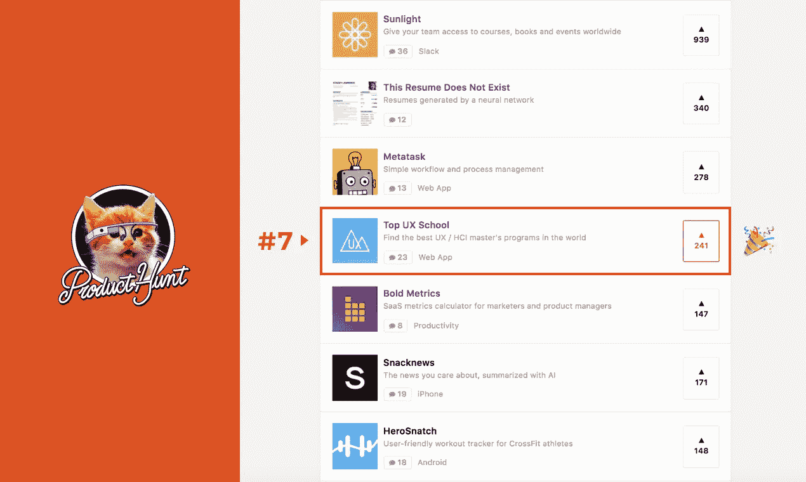
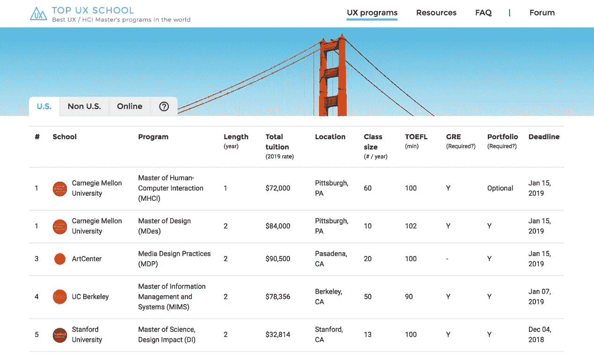

# 作为一名独立制作人，我从成功启动我的产品搜寻副业中学到了什么

> 原文：<https://medium.com/swlh/what-i-learned-from-successfully-launching-my-side-project-on-product-hunt-as-an-indie-maker-b8821539ee7e>

2019 年 3 月 18 日，我第一次在产品搜索上推出了我的副业项目。它在 3 月 19 日达到了#7，并在主页上停留了一整天。为了增加更多的背景， [Product Hunt](https://www.producthunt.com/) 是制造商、企业家、记者和技术爱好者发现新产品的头号全球社区。通常每天会有近 100 种产品发布。同一天，我的竞争对手包括谷歌、Typeform 和许多其他合法公司的产品。

这个结果让我感到既骄傲又卑微。此外，来自用户和社区的支持温暖了我的心，坚定了我成为独立制作人的选择。我想分享这个旅程的开始。

# 该产品

作为一名 UX 设计师，我学的东西比我应该学的要多一点(确切地说，我分别获得了荷兰和美国的两个硕士学位)，这些年来，许多有抱负的设计师向我寻求学校推荐。当我回复他们每一个人时，我发现自己重复了很多信息，最重要的是，我不一定有他们需要的建议。我想也许在这个过程中我能帮上忙。于是，[顶级 UX 学校](https://www.topuxschool.com/)诞生了。

[https://www.topuxschool.com/](https://www.topuxschool.com/)

[顶级 UX 学校](https://www.topuxschool.com/)是一个为那些正在探索攻读 UX 学位可能性的人而设的网站。受另一个著名的“列表风格”网站 [Nomad List](https://nomadlist.com/) 的启发,[顶级 UX 学校](https://www.topuxschool.com/)的关键特征非常简单——根据职业成果排列的全球 UX 学校列表。用户可以根据不同的属性对学校进行排序，比如地点、学费和入学要求。我还为用户提供了一个论坛，供他们互相提问和分享想法。

我花了大约六周的业余时间用我所知道的技术栈来建立这个网站——[vue . js](https://vuejs.org/)、 [Node.js](https://nodejs.org/en/) 和 [Webpack](https://webpack.js.org/) 。为了使更新更容易，我将所有数据放在一个 Google Sheet 中，并编写了一个脚本来将其转换为可以在前端轻松显示的 JSON 文件。对于论坛，我知道从头开始写并维护它会有太多的工作，所以我将 [Discourse](https://www.discourse.org/) 与网站集成，这是一个开源的论坛软件，具有我需要的所有基本功能。

# 预发布

去年 10 月我悄悄把这个项目放到了网上。我只是通过我的个人社交媒体分享了这些，并在[我过去写的一篇关于挑选学校的文章](https://blog.prototypr.io/how-to-choose-a-ux-masters-program-d398ae4e122b)中添加了一个网站链接。人们最初的反应是积极的，但我不确定他们是否真的认为这个网站有用，或者他们只是对我客气。尽管如此，我还是根据得到的反馈做了一些 UI 和功能上的改进(感谢[年成](https://medium.com/u/660067007496?source=post_page-----b8821539ee7e--------------------------------)、[黄婉婷](https://medium.com/u/8405daaeb31e?source=post_page-----b8821539ee7e--------------------------------)！).

2018 年 10 月 18 日，第一次有人在论坛上注册并提出了一个问题。这可能看起来微不足道，但它标志着一点点有机增长的潜力。我在网站上投入的努力实际上帮助了地球另一端的一个真实的人，这让我有一种奇怪的满足感，除此之外，我从未和他说过话。

# 发布日

推出产品搜索实际上是一个相当冲动的决定。在发布之前，我在内部争论我是应该继续这个项目还是开始一个新的项目。老实说，我没有想到这个项目会产生明显的经济收益，因为 UX 高等教育是一个有点利基市场，但另一方面，简单地退出这个项目似乎就像是没有谈清楚就和某人分手。我想至少在精神上得到一个了结。

一旦我得出了这个结论，我花了第二天的时间为发布做准备。我主要是按照官方的产品搜索发布指南以及通过谷歌搜索找到的几篇文章来做的。我只为发布设定了一个目标，那就是让我的项目出现在 Product Hunt 的主页上。我认为这将使我的网站有足够的曝光率来衡量人们的兴趣并获得反馈，我认为这是一次“成功的”发布。我把我的项目安排在太平洋时间 3 月 18 日凌晨 1 点启动，然后心满意足地上床睡觉了。

 [## 如何启动产品搜索🚀

### 有几十篇不同的文章和帖子，每一篇都承诺成为“产品发布的终极指南……

blog.producthunt.com](https://blog.producthunt.com/how-to-launch-on-product-hunt-7c1843e06399) 

3 月 18 日，我早上醒来，查了一下产品 Hunt 网站。令我惊讶的是，即使我滚动到页面的最底部，我也没有看到顶级的 UX 学校。在[项目页面](https://www.producthunt.com/posts/top-ux-school)上，写着:“7 小时前发布”，只有 2 个赞成。一个当然是我自己，另一个是我的设计师朋友(感谢[艾米·罗伯特](https://medium.com/u/66cad58cfeeb?source=post_page-----b8821539ee7e--------------------------------)！).

经过快速调查，我意识到我完全低估了项目在产品搜索主页上的竞争力。我天真地认为所有提交的项目都会被社区看到，成员们只会投票支持他们喜欢的项目。然而，在现实中，大多数项目都被放入一个名为“最新”的列表中，几乎没有人会访问这个列表。只有最受欢迎的项目或最有潜力的项目会被算法挑选出来，并移动到主页上的“特色”列表中。

我知道我搞砸了，我只有几个小时来扭转局面。我认为拼命给我认识的每个人发垃圾邮件可能是行不通的(Product Hunt 有降级“朋友和家人的投票”的算法)。相反，我需要与可能对这个项目感兴趣的人分享发布信息。这个想法让我决定给几个人发消息，包括[的编辑](https://medium.com/u/e37e141b11de?source=post_page-----b8821539ee7e--------------------------------)[格雷姆](https://medium.com/u/a23713792675?source=post_page-----b8821539ee7e--------------------------------)。(事后看来，我应该在发射日之前就这样做了。我知道我知道😱😱😱)

几年前我认识了格雷姆，因为我给 Prototypr.io 的出版物投了一些文章。他自己就是[的制造者](https://www.producthunt.com/@graeme_fulton)，[已经在产品搜索上推出了 10 款产品](https://www.producthunt.com/@graeme_fulton/made)！很快，他无私地与我分享了他的经历，最关键的是，他主动发了一条关于发布会的微博。(谢谢，[格雷姆](https://medium.com/u/a23713792675?source=post_page-----b8821539ee7e--------------------------------)！😭)

此外，我鼓起勇气接触了一些我钦佩的有影响力的创客，并在网上悄悄关注了一段时间，包括 [Nomad List](https://nomadlist.com/) 的创始人 [Pieter Levels](https://twitter.com/levelsio) ，以及灵感设计师+程序员+教育家[孟到](https://medium.com/u/63d03024cad3?source=post_page-----b8821539ee7e--------------------------------)。我的信息很简单——让他们了解这个项目，并寻求一些反馈。我不期望得到任何回应，因为他们并不真正“了解”我，他们可能经常收到这种信息。然而，令我惊讶的是，皮特最终在推特上发布了这个项目，而孟最终在产品搜索上投票支持了这个项目。对他们来说，这可能只是一个简单的善举，但对我来说，我觉得我是世界上最幸运的人！(谢谢 Pieter &孟！😭😭😭)

在这些人最初的帮助下，我的项目开始积累投票，并最终在第二天在产品搜索主页上排名第七。看到社区中的人们如此慷慨地表示支持真是令人惊讶——我不认识大多数投票支持我的项目的人。他们中的一些人甚至抽出时间留下评论/反馈。虽然有一个成功的发布并不意味着这个项目会成功，但我确实从这个过程中受益匪浅。以下是我的主要观点:

# 外卖食品

## 1.打造产品不仅要用手艺，更要用心

在进入 UX 顶尖学校之前，我有一长串的兼职项目。他们中的大多数人从来没有离开过我的硬盘，因为我不想在最初的蜜月期结束后继续下去。[UX 顶尖学校](https://www.topuxschool.com/)有点不同，我建立它是为了解决我自己的问题。我设计它的时候考虑到了我希望在我亲自经历学校选择过程时就已经存在的工具。我相信人们普遍对这种方法更有共鸣。

## 2.建立一个观众群和建立一个产品一样重要

没有上面提到的那些人的帮助，我的项目不可能被注意到，他们慷慨地与我分享他们的观众。 [Product Hunt](https://medium.com/u/b8b4445269d0?source=post_page-----b8821539ee7e--------------------------------) 的创始人[瑞安·胡佛](https://medium.com/u/c2146664c8e4?source=post_page-----b8821539ee7e--------------------------------)已经写了一篇关于同一概念重要性的文章。“有时候你只需要 1000 个真正的粉丝就可以开始了。”

 [## 创业？首先，建立一个观众群。

### 几天前，我收到了一封电子邮件，有人向我咨询如何为自己的初创公司找到一名技术联合创始人…

medium.com](/@rrhoover/building-a-startup-build-an-audience-first-9fbba4f1fa15) 

## 3.为赞美、批评和…惊喜做好准备

发布一个产品最重要的一点是，你可以大致了解人们对你的产品的感觉。就我而言，很多赞美来自真实的用户，这验证了我的假设，即[UX 顶级学校](https://www.topuxschool.com/)对一些人有用。批评集中在我目前对学校的排名上，我完全预见到了这一点(因为我知道这并不好),我的首要任务是改进它。

另外，还有一个我没想到的事件。我在网上认识了一个作家。我向他寻求对这个项目的反馈，他友好地提供了一次个人采访。在我拒绝采访后，他继续发表了一篇关于我的付费媒体文章，并在媒体出版物、Twitter、FB 群、微信群和 Reddit 上分享。虽然这可能是出于好意，但文章的内容让我震惊——未经我的同意，他重复了我的旧文章，添加了误导性的夸张，并包括了我个人 FB & IG 账户上的大量照片(看到这么多我自己的随意照片非常令人反感😅).在我礼貌地要求他停止后，他大发雷霆，斥责我浪费他的时间，天真地认为他的方法有助于我的网站产生流量。

真的吗？！

这件事坚定了我的信念，那就是我再也不会参与那些为了获得虚假粉丝，制造毫无意义的流量激增，单纯以数字来定义个人成功的活动了。

## 4.你并不孤单。

在筹备发布的过程中，我通过产品搜索发现了一个名为 [Femake](https://femake.tech/) 的网站和一个名为 [Women Make](https://womenmake.com/) 的在线社区。这两个平台都旨在支持、庆祝和联系科技领域的女性制造商。看到像我一样的人们*主动创建各种各样的项目，我感到很受鼓舞。*

## *5.从小处着手，坚持不懈。*

*一些人感到震惊的是，我发起产品搜索的初衷仅仅是为了获得反馈，以使产品变得更好。没有具体的货币化计划。没有明确的收购策略。路线图上没有要销售的产品。*

*虽然我可能会在某些时候更认真地考虑这些事情，但我内心深处知道，制造产品的选择从来不仅仅是为了赚钱。最重要的是，这让我觉得自己在这个世界上是有创造力和有用的。从任何标准来看，我都是一个幸运的人。如果我的技能可以帮助其他人更接近他们想要的地方，我会非常高兴。[顶级 UX 学校](https://www.topuxschool.com/)只是一个开始。我会继续走下去。*

*这篇文章也发表在[我的博客](https://kaitinghuang.com/journal/)上。*

**

## *这篇文章发表在 [The Startup](https://medium.com/swlh) 上，这是 Medium 最大的创业刊物，拥有+438，678 读者。*

## *在此订阅接收[我们的头条新闻](https://growthsupply.com/the-startup-newsletter/)。*

**