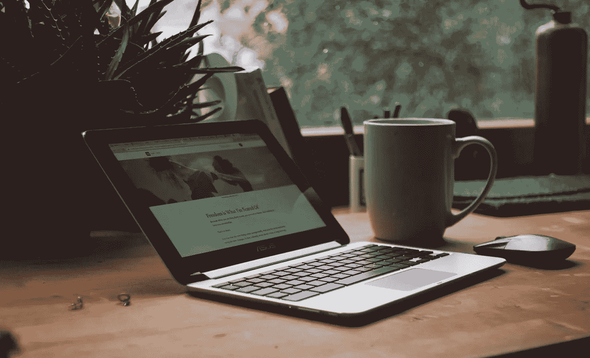

# 我作为自由职业者的第一个月学到了什么

> 原文：<https://medium.com/swlh/what-i-learned-in-my-first-month-as-a-freelancer-741ea9b1e58c>

## 开店，创造收入流，吸引我的第一批客户，计划

Photo by [Anna Auza](https://unsplash.com/@annaauza?utm_source=unsplash&utm_medium=referral&utm_content=creditCopyText) on [Unsplash](https://unsplash.com/search/photos/freelancing?utm_source=unsplash&utm_medium=referral&utm_content=creditCopyText)

今年早些时候，我说我要辞职，去旅行，然后开始自由职业。我做了一个和两个，现在我在追求我对自己的第三个承诺。