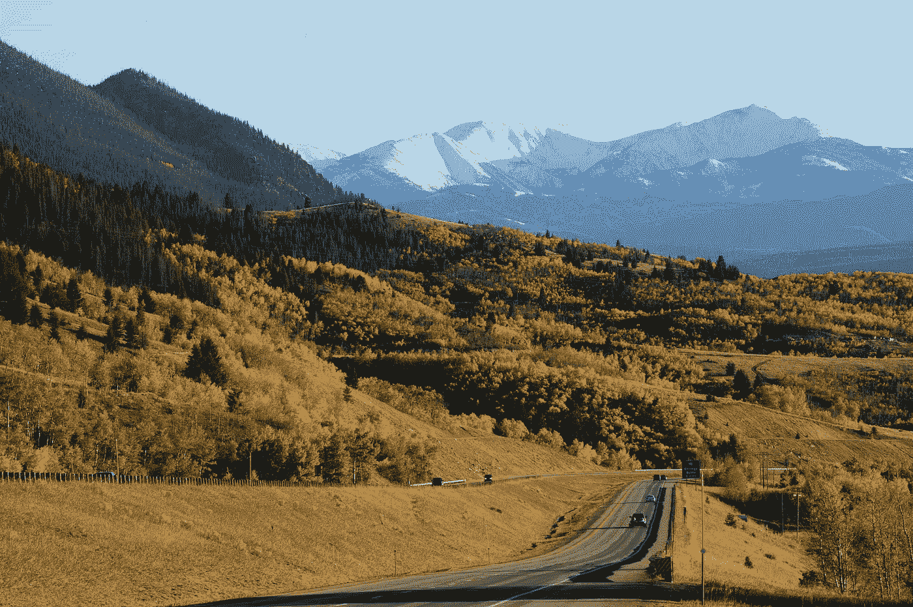

# 我在穿越全国的公路旅行中学到的关于政治和技术的知识

> 原文：<https://medium.com/swlh/what-i-learned-on-my-road-trip-across-the-country-about-politics-technology-90b68e64d823>

上周末，我和我的朋友马頔以及我的父亲(西蒙)从波特兰开车去了伊利诺伊州的芝加哥。我不确定在这 35 个小时里我期望谈论什么，但不知何故，从来没有一个安静的时刻让蒙大拿州、怀俄明州和南达科他州的空旷变得更有趣(也更令人恼火)。虽然我很希望开车…