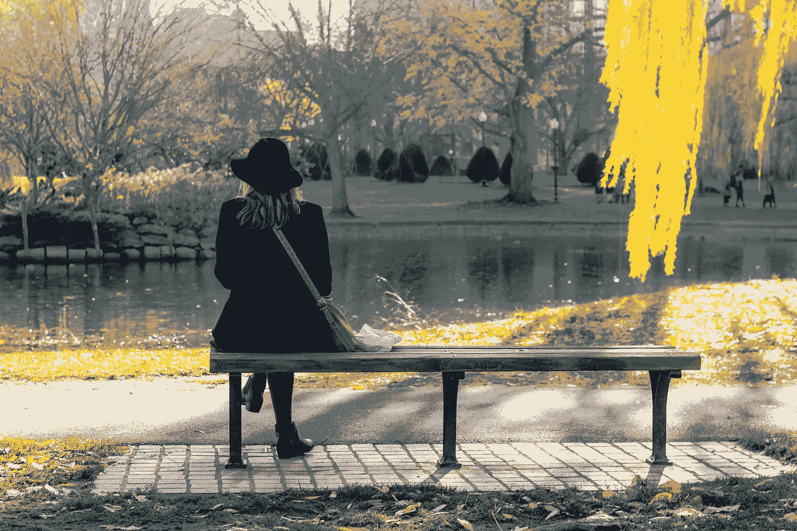

# 我想告诉年轻时的自己

> 原文：<https://medium.com/swlh/what-i-want-to-tell-my-younger-self-dc0d043f4df1>

Photo by [Snapwire](https://www.pexels.com/@snapwire?utm_content=attributionCopyText&utm_medium=referral&utm_source=pexels) from [Pexels](https://www.pexels.com/photo/adult-back-view-beautiful-bench-316889/?utm_content=attributionCopyText&utm_medium=referral&utm_source=pexels)

## 不要让别人左右你的决定。

Image by [Pixource](https://pixabay.com/users/Pixource-3867243/?utm_source=link-attribution&utm_medium=referral&utm_campaign=image&utm_content=2573111) from [Pixabay](https://pixabay.com/?utm_source=link-attribution&utm_medium=referral&utm_campaign=image&utm_content=2573111)

相信你自己，为你所做的决定负责。不同的人有不同的经历和观点，没有一个完全符合你的…