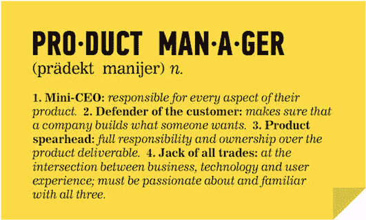

# 成为另一名工程师后，我想成为什么样的人！

> 原文：<https://medium.com/swlh/what-i-wanted-to-be-after-becoming-yet-another-engineer-d25af5557bde>

**大学上学期(~ 2015 年 1 月):**

在印度的工程学院里流传着一个笑话，

"*如果你想弄清楚你想成为什么，你首先得成为一名工程师！"*

我和我的朋友们，在大学的四年里，一直坐在同一张长椅上，思考着我们下一步该做什么。其中 3 人获得了 CTS 和 Infosys 提供的 IT 工作机会，以及校园实习机会(稍后会有更多信息！)是他们最不感兴趣的。因为我糟糕的成绩，我甚至没有资格和他们面谈。所以我们想出了一个游戏计划，在笔记本背面潦草地写下，

*   要么写硕士的 GRE 和托福——什么方面的硕士？毫无头绪！
*   编写所有的管理招生考试(CMAT，GMAT，猫等)。)—我们都以为自己是伪企业家，想让自己觉得更重要
*   或者最终接受了提供的工作，同时考虑下一步该做什么

现在你要明白，那是绝望的时代。我的父母非常怀疑我是否能完成工程，更不用说相信公司会雇佣我了。

**校园实习:通往“意外职业”的道路**

对于那些不熟悉的人来说，校园实习是一种现象，大学与公司达成协议或谅解备忘录，每年从他们的校园雇佣一定数量的学生。它类似于美国大学的职业发展办公室，只是公司必须雇用至少数百名学生。美国的学校只是帮助指导学生找到合适的工作。在印度，学校通常会轻而易举地给你一份工作。这些工作大部分是在 IT 领域，而不是学生们在大学四年中所学的专业领域。

电信工程师成为软件开发人员

机械工程师成为项目工程师

化学工程师成为产品顾问/售前工程师

…..诸如此类。

当然，他们是否继续留在这份工作取决于他们是否在这份职业中看到了自己的未来。

就我而言，就业季即将结束，因为大多数学生已经在 2014 年末收到了录取通知书。只有几家公司来校园招聘，竞争非常激烈。

我发现一家名为 [Zoho](http://www.zoho.com) 的鲜为人知的公司(对我来说)要来校园招聘内容作者。后来我才知道，它们之所以广受欢迎，是因为它们不重视你的成绩、分数或学术地位。他们所关心的是你是否表现出认真，是否有才能，是否能完成工作。于是，关我去写他们的筛选测试，当时借口逃课两节课。

这是一场灾难，至少我是这么认为的！这次测试感觉像是莎士比亚小说中的一次折磨人的练习，我确信就是这样。

一周后，出乎意料的是，我接到了 Zoho 人力资源部的电话，说我已经通过了第一轮，必须在下周一去他们办公室报到，接受为期一周的培养。

**在 Zoho 孵化、实习和全职工作:**

Zoho 的招聘门槛*非常非常高*。他们会花很多时间来评估和雇佣合适的人，而不是雇佣一大堆人。这就是他们为新毕业生举办孵化营的原因，主要是为了支持、产品和营销角色。事实上，他们更有可能雇佣没上过学的人来培训他们，而不是雇佣有传统学位的人。

在一周的时间里，我们被分配了各种任务，例如，

*   对产品了如指掌，并进行产品演示
*   了解产品、工程、支持、营销团队在团队中做什么
*   与技术作家交谈，了解向数百万用户推出内容的过程
*   了解行业、竞争对手和客户
*   向招聘经理介绍各种行业趋势

我不确定他们是否还在做这些孵化营，但这是一种非常有效的方法来筛选候选人，确定他们最擅长什么，而不是给他们可能不喜欢做一百遍的工作。

夏令营结束一周后，我们被叫到办公室领取我们的付款。

等等，什么？我们因为这些“采访”而得到报酬？

在那之前，我认为你在“实习”中得到的唯一货币是“曝光度”。

那天晚上，我得到了成为 Zoho Books 的技术作家的邀请。他们甚至要求我在正式毕业前就开始实习。在我那一批人中，我是唯一一个在实习季节结束时得到工作机会的人，但却是第一个真正开始赚钱的人。

在接下来的四个月里，我以实习生的身份和团队一起工作，毕业前我被要求做的唯一一件事就是*客户服务*。起初，我对在一个我不愿意承担的角色中工作感到有点恼火。但在接下来的几个月里，我开始意识到理解用户的需求是多么重要，以及我如何与产品和工程团队一起帮助他们解决这个问题。

我每天回复 50 多封电子邮件，每周进行 2-3 次产品演示，在论坛上与数百名用户互动，同时记录产品反馈或建议。然后，我会将这些信息传递给产品经理和工程团队，并了解接下来的步骤。有时，任何错误修复或调整都可以在下一个版本中推出，而一些功能请求需要时间。令人敬畏的是，项目经理会花时间解释他们如何以及为什么会优先考虑一个功能，这样我就可以起草一个适当的响应给客户。这四个月的支持让我为真正的交易——技术写作——做好了准备。

**技术写作、产品营销和产品管理之旅:**

*技术作家做什么？*

大多数人认为我是这样的。

除了笑话，技术写作是一个为用户手册或 FAQ 记录说明和过程的过程。技术写作是新兴技术公司和 SaaS 产品公司非常需要的技能。一个技术写作者必须彻底了解产品和它的特性，并在各种用户角色需要帮助的时候分解它，使其易于理解。

*然后一些。科技写作和科技作家也在进化，变得更擅长做其他事情。*

技术作家是传播者。他们以不同的方式传达关于一个实体或产品的不同种类的信息。他们创建和分发内容的范围、规模和媒介可能会因行业或产品领域而异。

就像产品经理一样，他们充当跨学科团队之间的接口，是与工程师讨论技术的人，同时能够与产品经理一起深入研究功能背后的业务和战略。他们还学习在用户界面/UX 线框、产品内复制、解读用户感知上工作，并最终帮助建立产品的个性和声音。

*技术写作和市场营销不是一样或相似的吗？*

**又大又胖，不！**

技术写作侧重于事物的“如何”，而营销侧重于事物的“为什么”。有道理？我强烈推荐一位同事几年前写的这篇[精彩文章](https://www.linkedin.com/pulse/why-you-should-hire-techical-writer-content-person-radhika-bhangolai/)，她在文中讨论了技术写作者和内容写作者之间的区别。

然而，我也要说，当我进入 Freshworks 并最终进入 SAP 的产品营销时(这种奇妙的经历本身就值得另写一篇文章)，我发现我的科技写作技能在各种营销项目中多次帮助了我。当你的受众是企业的首席技术官、首席信息官或 CISO 时，在推销你的产品的价值主张时，这有助于表达和展示一个坚实的技术理解。

我为什么决定进入产品管理行业？

技术写作者面临的最大难题之一是，他们从来没有真正确定自己在组织中的位置。虽然我一直坚称自己是产品管理团队和工程团队之间的桥梁，但和我交谈过的人几乎总是有不同的看法。

如果你处理得当，这将是一个巨大的优势。在功能展示的不同阶段，*经常与产品、UX 设计、支持或营销人员密切合作。我为所有这些团队做出了贡献，即使是简单到为产品内的行动号召(CTA)按钮建议不同的设计或产品内副本。*

有很多例子表明，我工作过的项目经理根据我的一些建议对他们的功能进行了调整。当然，这是他们的决定，但是我有很小的机会去积极地影响他们。

当我参与开发的一个新功能被用户迅速采用并在社交媒体上赢得赞赏时，这给了我巨大的快乐。我想显著地增加我的贡献，并在构建客户和用户喜欢的软件产品方面有更大的作为。还有什么比成为产品经理更好的方法呢？

Source: [SumoLogic](https://www.sumologic.com/blog/business-insights/7-things-that-product-managers-should-say/)

**解决问题——一天一天来:**

正如我在标题中提到的，在过去的四年里，我从一名新工程师变成了一名产品经理。我完全相信，我工作过的所有公司和经理帮助我做出了这个决定。

人们会说，“追随你的激情”。嗯，首先，我从大学毕业后就没有过，更不用说能让我赚钱的了。所以如果你现在没有也没关系。你还有一辈子的时间去想清楚。

正是来自 Zoho 的这个机会，让我有时间去探索，去品尝成功的滋味，当然，在决定未来几年我想做什么的时候，也会有一点失败。

如果你有类似的机会，抓住它。如果没有，就去寻求。

我将给你们留下一段视频，是一个单口相声，讲的是印度的工程学，

[https://youtu.be/9ZiOgWmWhXs](https://youtu.be/9ZiOgWmWhXs)

我希望你喜欢阅读这篇文章。欢迎分享任何评论、反馈或您自己的经验！

****************************************************************

*你可以在:* [*LinkedIn*](https://www.linkedin.com/in/nharishkumar/) *，* [*脸书*](https://www.facebook.com/harishkumar) *，*[*insta gram*](https://www.instagram.com/iamnharishkumar)

## 这篇文章发表在 [The Startup](https://medium.com/swlh) 上，这是 Medium 最大的创业刊物，拥有+418，678 名读者。

## 在这里订阅接收[我们的头条新闻](http://growthsupply.com/the-startup-newsletter/)。

