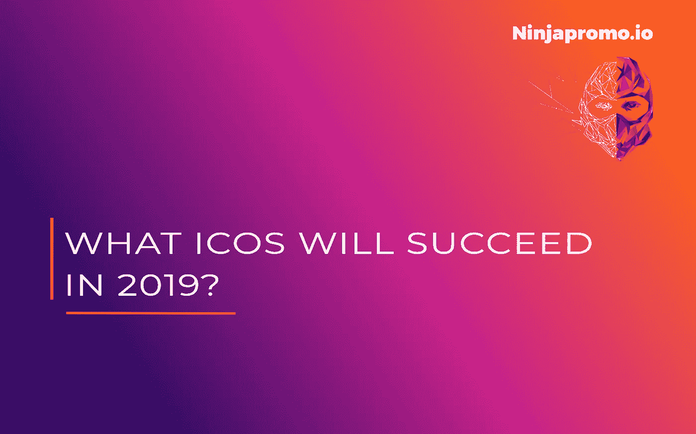

# 今年有哪些 ICO 项目会成功？

> 原文：<https://medium.com/swlh/what-ico-projects-will-be-successful-this-year-d65c68dd892c>

经历了艰难的一年后，ico 面临着严重的信任问题。悲观主义者甚至预言 ICOs 将彻底消亡。但这样的预测以前就有过，而[*NinjaPromo*](http://ninjapromo.io/?utm_source=medium&utm_medium=article&utm_campaign=emailmark)*正在研究那些在 2019 年几乎不用担心的项目类型。*

> ICO(初始硬币发行)是以加密货币形式公开销售企业代币。大多数情况下，这样做是为了吸引对新项目的投资。

要回答 2019 年哪些代币会被点播的问题，我们先回过头来看看去年有哪些 ico 是成功的。

# **游戏代币**

根据 ICOrating 的数据，最大的一块利益蛋糕——大约 40%——被视频游戏夺走。这不是巧合:许多研究得出结论，这一部门仍然是最稳定的部门之一。尽管有危机、汇率或气候变化，人们总是有娱乐的需求。据 Newzoo 分析机构的专家称，到 2021 年，视频游戏的总支出将达到 1801 亿美元，因此在 2017-2021 年期间，市场将增长 10.3%。

2018 年发布了相当多的区块链游戏和游戏相关服务，例如，区块链应用 Truegame，这是一个为用户提供不同类型游戏的平台，可以通过 Tgame 令牌购买。 *(Medium 把这个项目排在最成功 ico 的第三位)。*

鉴于游戏社区的敏感性，今年将显示类似的项目和游戏相关的 ico 是否有任何未来，或者成功是否完全由区块链应用于游戏的新颖性所确保。

# **通信**

第二种最受欢迎的 ico 类型与社交互动和平台相关。根据 I corporation 的数据，2018 年，人们相互交流的应用程序激发了投资者的信心。这一领域的成功企业占据了 20%的市场份额。

去年，皮尤研究中心对美国人进行了一项关于社交网络的调查。结果发现，在网络上难以拒绝交流的人数占所有受访者的 40%。同时，14%的人表示这对他们来说会非常困难。有意思的是，几年前，2014 年，这样的人要少很多。然后 28%的人无法走出社交网络，11%的人承认这对他们来说会非常困难。人们可以交流的平台在世界上不断增长。我们的生活越来越饱和，并不总是有时间进行现场交流。与此同时，根据心理学家的说法，社交网络有助于人们不感到孤独。这应该有助于社交应用的需求，并吸引尽可能多的投资。

# **助手**

专家排名中的铜牌被卫生、金融、贸易和其他区块链服务项目获得，占据了 10%的市场份额。

这类公司的利润通常取决于人们的真实需求。例如，根据 BCD Travel 的分析师，2019 年全球对欧洲国家航空旅行的需求将保持高位。这意味着区块链购买机票的申请很有可能获得成功。

另一个已经持续了一段时间并将在 2019 年继续的趋势是对个人健康越来越关注的态度。根据各种消息来源，人们去健身房的次数越来越多，找到了更多的时间做运动。另外，坚持节食的人数也增加了。由此可以得出结论，健康生活方式的应用程序今年肯定会找到受众。

> 娱乐和个人利益将永远是每个人的头等大事，所以这类项目有望在 2019 年成为最受欢迎的项目也就不足为奇了。

*感谢您阅读这篇文章！如果你喜欢，请分享。你认为今年最有前途的 ico 是什么？另外，你可能会喜欢我们的其他故事:*

> [*——年度流行趋势:稳定的硬币代替 ICO*](/@NinjaPromoAgency/trend-of-the-year-stablecoins-instead-of-ico-688d28844a7a)
> 
> [*-区块链影响者营销手册*](https://hackernoon.com/influencer-marketing-fdff540b092e)
> 
> [*——ICO 为什么需要它的社区，如何关注它*](/@NinjaPromoAgency/why-crypto-community-matters-and-how-to-focus-on-it-ebd2d293c94)
> 
> [*——在推销你的加密项目时，因为显而易见而被你忽视的事情*](/@NinjaPromoAgency/things-you-neglect-because-they-are-obvious-while-marketing-your-crypto-project-4100cf3bef05)
> 
> *-* [*ICO 发布会:你想法的真实价格*](https://hackernoon.com/ico-launch-the-true-price-of-your-idea-52dcc61587d4)

## 这篇文章发表在 [The Startup](https://medium.com/swlh) 上，这是 Medium 最大的创业刊物，有+432，678 人关注。

## 订阅接收[我们的头条新闻](https://growthsupply.com/the-startup-newsletter/)。

