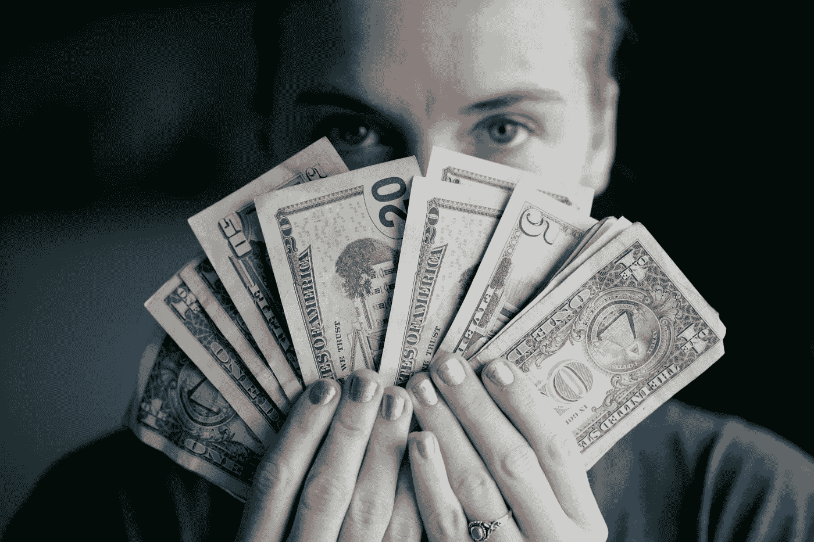

# 我在 30 多岁时学到的关于金钱的东西，是我在 20 多岁时就应该知道的

> 原文：<https://medium.com/swlh/what-im-learning-about-money-in-my-30-s-that-i-should-ve-known-in-my-20-s-7aa41bb989ce>

## 但是，嘿，迟到总比不到好，对吧？

Photo by [Sharon McCutcheon](https://unsplash.com/@sharonmccutcheon?utm_source=unsplash&utm_medium=referral&utm_content=creditCopyText) on [Unsplash](https://unsplash.com/search/photos/money?utm_source=unsplash&utm_medium=referral&utm_content=creditCopyText)

我讨厌电子邮件，但我从未如此高兴地看到这封邮件。它来自美国最令人厌恶的公司之一:Navient(它不知何故接管了 Sallie Mae)。我的学生贷款提供者。