# 什么是聊天机器人，如何在您的企业中设置聊天机器人？

> 原文：<https://medium.com/swlh/what-is-a-chatbot-and-how-to-set-it-up-in-your-business-bcff6274e5a8>

客户服务变得比以往任何时候都更加直接。凭借当今的技术，每个企业都可以在自己的网站上免费安装一个基本的实时聊天服务。

如果我们调查最流行的[实时聊天解决方案](https://picksaas.com/live-chats)并使用 Similartech 的支持，我们可以很容易地估计出有**+100 万家企业使用在线实时聊天软件。**

大多数流行的实时聊天技术的安装数量以 6–7%的速度增长。也就是说，我们可以很容易地说，实时聊天支持已经成为一种日益增长的客户服务标准。

但是与客户聊天需要时间和额外的资源。如果你能**把它变成一个自动化(或者至少是半自动)的过程**会怎么样？借助当今的聊天机器人技术，自动化在每个企业触手可及。

聊天机器人越来越受欢迎，超过 47%的网上购物者准备从自动机器人那里购物。

那么什么是聊天机器人，如何设置它，为什么要使用它呢？

# 什么是聊天机器人？

根据 [Techopedia](https://www.techopedia.com/definition/16366/chatterbot) :

> *聊天机器人(Chatbot)是一种人工智能(AI)程序，通过使用预先计算的关键用户短语和听觉或基于文本的信号来模拟交互式人类对话。*

相当复杂且不明确的定义，不是吗？

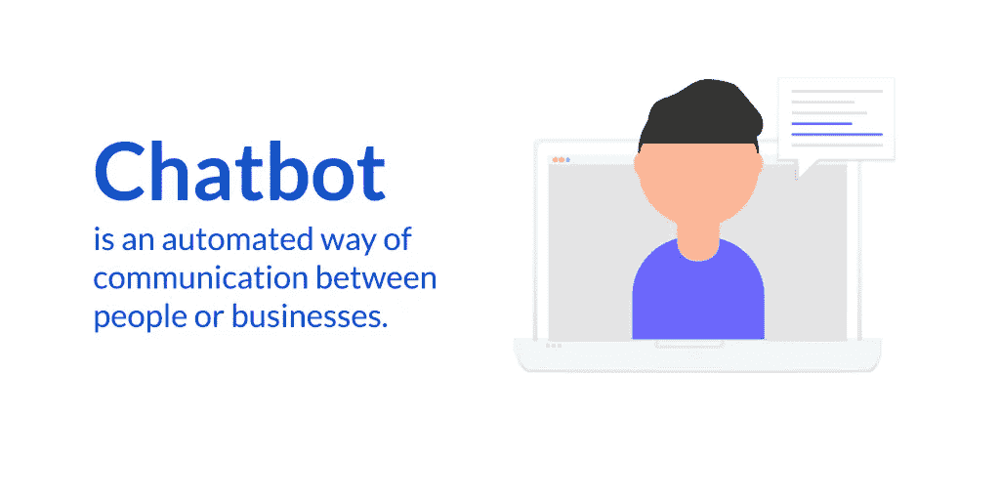

那么用更简单的话来说，什么是聊天机器人呢？聊天机器人是一种人与人或企业之间的自动化交流方式。毕竟，这是用机器人自动响应来代替真人。

然而，今天聊天机器人不仅仅是纯粹的自动化。当谈到电子商务和营销功能时，它们也提供了很好的机会。

# 为什么要使用聊天机器人？

那么，你的业务中为什么需要聊天机器人呢？

让我们来看看您的企业可能面临的一些问题，以及 chatbot 如何在日常工作中帮助您:

*   一遍又一遍地回答同样的问题

你很有可能在聊天或电子邮件中不断重复相同问题的答案。你可以使用快速回答来保存最常见的答案，但是为什么不通过设置一个**聊天机器人在你不在的时候自动回复最常见的问题来完全自动化它们呢。**

*   收集访问者的信息

您可以通过询问或调查表从客户那里收集信息。但是有了聊天机器人，你可以自动完成这个过程，机器人会收集大部分信息，比如电子邮件或姓名。

*   将高容量对话引向正确的人/部门

当你的企业规模很大，管理大量的对话成为一个问题时，你可以使用聊天机器人自动将对话导向正确的人。

*   缩短销售路径

是的，聊天机器人实际上可以通过直接在聊天窗口发送产品报价来缩短购买产品的路径。这可能意味着更高的销售额和更多的顾客真正购买你的产品。

*   通过聊天进行再销售

聊天机器人可以让你**向你以前的访客或客户进行再营销，例如通过 Messenger** 。这可以帮助你驱使客户回到你的网站，或者简单地向他们销售额外的产品。

*   自动检查订单状态

一些聊天机器人解决方案，如 [Tidio](https://picksaas.com/live-chats/tidio-chat) ，与电子商务平台，如 [Shopify](https://picksaas.com/e-commerce-platforms/shopify) 进行了本地集成，让你可以自动检查订单状态，而不需要真正的客户支持。

这些只是使用聊天机器人的几个原因。实际上，可能还有更多，包括为您的客户提供关于您的产品的特别优惠的自动信息或特定于特定登录页面的信息。

那么，了解聊天机器人如何帮助你解决业务中的一些问题，目前市场上有哪些类型的聊天机器人呢？

# 聊天机器人的类型

您可以在自己的企业中实现两种主要类型的聊天机器人。

1.  简单、基本的聊天机器人，基于自动化一些预定义的答案。
2.  基于人工智能的聊天机器人不断学习新的答案。

您在业务中更愿意使用的类型实际上取决于您的运营类型以及您在与客户的日常互动中实际希望如何使用它。

如果你的目标是自动化一些基本的响应，你可以使用像 Tidio Chat 这样的解决方案很容易地创建一个。

如果你的目标是一个更高级的聊天机器人解决方案，你可能更喜欢使用一个非常高级的平台，比如 Dialogflow。

但是除了智能和不智能的聊天机器人，聊天机器人还可以通过许多不同的渠道使用:

*   网站上的聊天机器人
*   信使聊天机器人
*   登录页面聊天机器人
*   iMessage/SMS/WhatsApp 聊天机器人
*   Slack 聊天机器人

你也可以通过许多不同的渠道使用一个聊天机器人。这就是通常所说的全渠道聊天机器人。

# 聊天机器人的例子

随着聊天机器人市场[年同比增长 37%](https://www.marketresearchfuture.com/reports/chatbots-market-2981),我们可以看到越来越多的公司在业务中使用聊天机器人的例子。

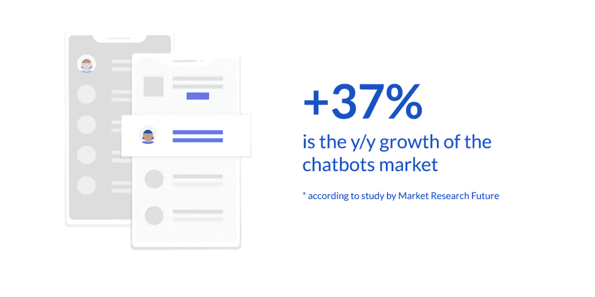

那么最常见的使用聊天机器人解决方案的公司有哪些呢？

## 达美乐披萨聊天机器人

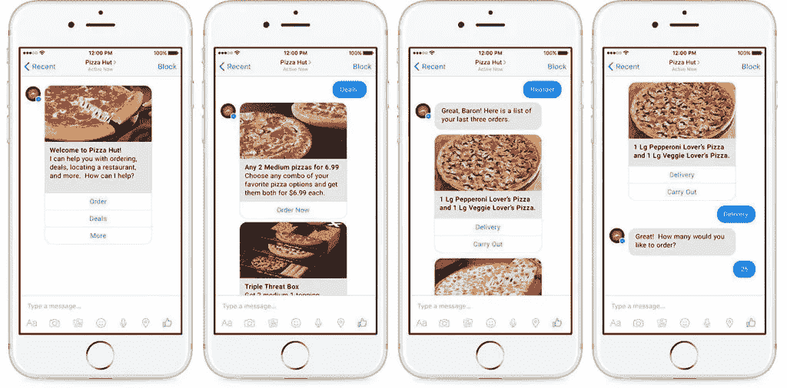

Messenger chatbot to order a pizza from Domino’s pizza

就速度和配送而言，达美乐比萨绝对是最好的比萨之一。这也是我在寻找快速披萨订单时的首选。

达美乐通过三个主要渠道提供聊天机器人客户支持:

*   脸书信使
*   亚马逊的 Alexa
*   短信机器人

使用每个频道，您将能够轻松订购披萨，浏览披萨供应或跟踪当前订单的状态。

## 诊断你健康问题的症状机器人

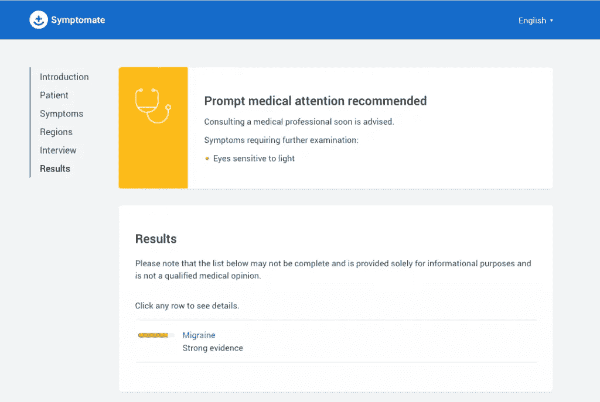

Symptomate’s chatbot to diagnose health issues.

[症状](https://symptomate.com/) bot 由 Infermedica 创建，用于根据与用户的自动对话来诊断健康问题。它是一个更高级的版本，基于高级的依赖关系和算法。

Symtomate 将:

*   对你进行一次医学面试
*   对你的疾病/问题进行诊断
*   根据诊断结果推荐后续步骤/实验室测试

## 多林哥语言训练机器人

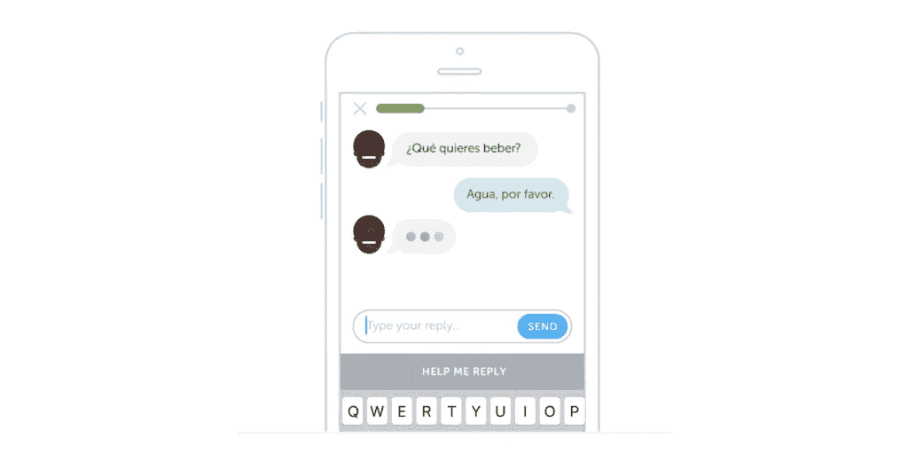

Duolingo language training chatbot

与人交谈可能是学习新语言的更聪明的方法，然而，真人可能不总是有空聊天。相反， [Duolingo](http://bots.duolingo.com/) 让你在自动化机器人的帮助下练习语言技能。

基于 Duolingo 应用的机器人将:

*   用选定的语言和你进行一些现实生活中的对话
*   每当卡住时建议答案
*   实时了解你的语言水平，并尝试相应地调整对话

聊天机器人越来越多地出现在我们的日常生活中，无论是食品/产品订购、健康问题还是学习新语言。

但是现代云技术让每个企业都可以建立并拥有一个聊天机器人。那么，如何让它也在你的业务中发挥作用呢？

# 在你的企业中设置聊天机器人

让我们来看看如何在您的企业中建立聊天机器人，并以更加自动化的方式提供客户支持。

为了让它工作，你可以考虑 3 个主要选项:

*   使用[实时聊天软件](https://picksaas.com/live-chats)解决方案之一设置基本聊天机器人
*   使用更高级的[聊天机器人构建器](https://picksaas.com/chatbots)来设置聊天机器人
*   将聊天机器人的设置外包给第三方

让我向你展示如何使用 Tidio Chat 的实时聊天解决方案来设置聊天机器人。

建立帐户后，你将使用的软件的主要部分将是“自动化+机器人”功能。

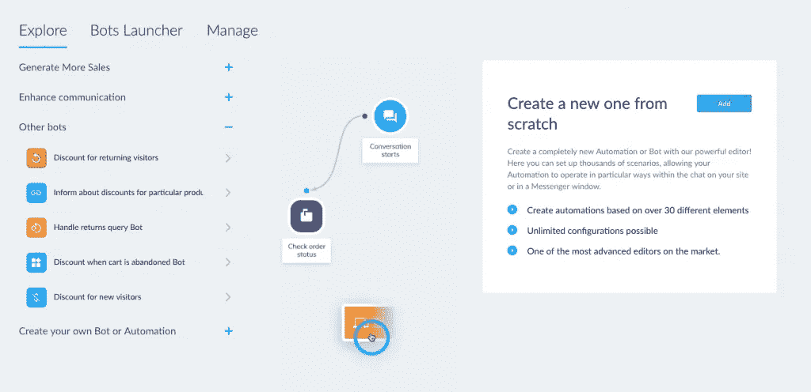

Setting up a chatbot using Tidio Chat

*- >* [*免费试用提迪奥聊天*](https://www.tidiochat.com/en/?ref=mattpliszka)

在这里，您可以轻松浏览预定义的机器人示例，例如:

*   销售线索生成机器人——建议更多关于产品的信息
*   回拨机器人—建议回拨
*   折扣机器人——为游客提供折扣
*   返回机器人—处理返回查询的机器人

要从头开始设置您自己的定制 bot，您需要选择最后一个选项:

*   从头开始创建一个新的机器人

因此，让我们来看看如何创建自己的基本机器人。

# 选择触发器

在设置聊天机器人时，您需要做的第一件事是为聊天机器人发送的特定消息设置触发器(原因)。

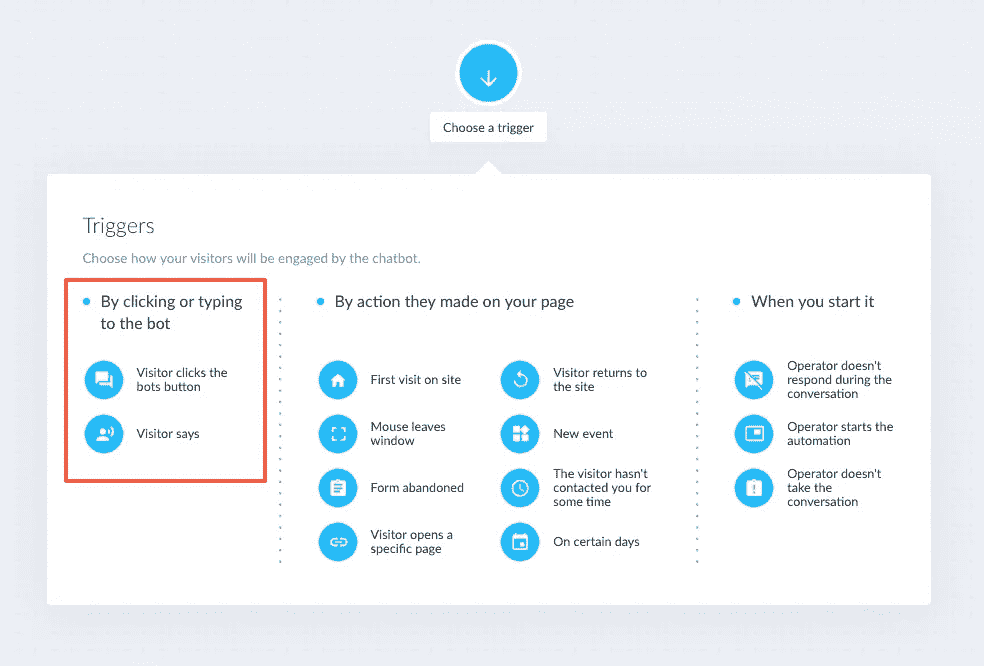

Selecting the triggers for automated chatbot messages

这可以是:

*   访客发送或选择的信息，例如访客询问特定产品
*   特定的现场操作，例如访问者打开特定的子页面
*   您的代理没有回应，例如，当支持代理没有回应访客的问题时

***例如*** *一旦你的访问者询问你的报价，你想设置一个自动的机器人消息。*

# 选择操作

一旦您选择了触发器，现在是时候选择要相应触发的动作了。

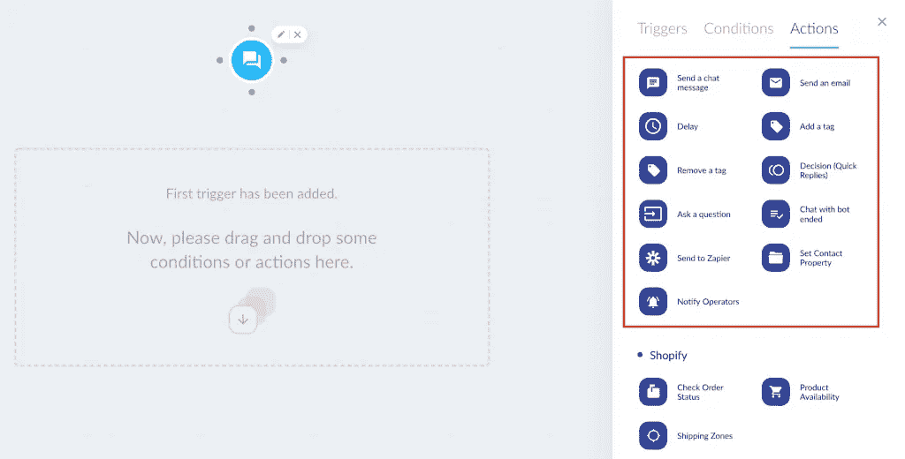

Selecting actions triggered by the chatbot.

这些可以发送

*   聊天信息
*   电子邮件
*   要添加更多选项(以建议问题/按钮的形式)

比如说，我们假设你希望你的机器人提供更多关于这个问题的细节，比如提出关于特定产品的信息。您可以将操作设置为在客户询问价格后发送建议的快速回复。

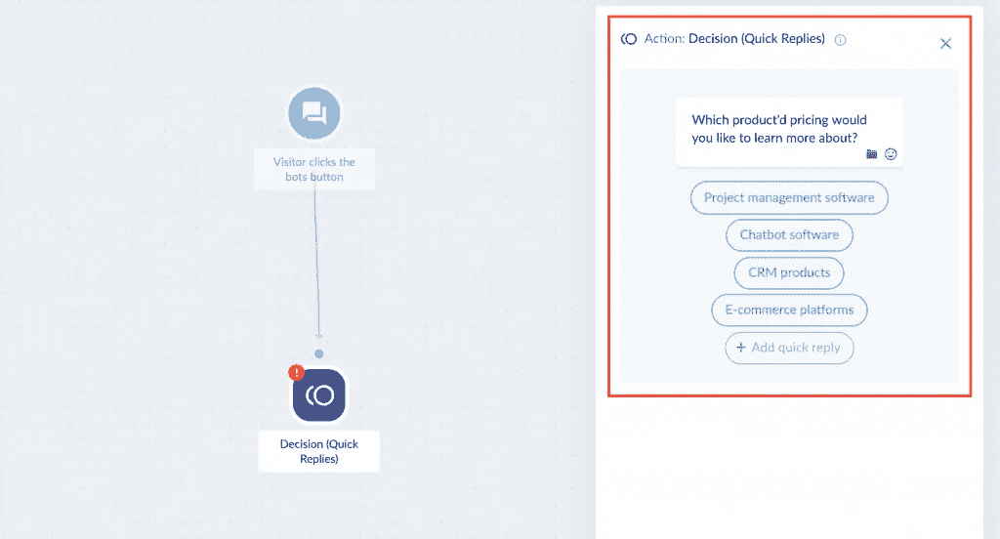

Setting up quick replies in your chatbot

*下一步，您可以设置发送给访客的信息，其中包含特定产品的价格。*

# 询问你的访问者关于电子邮件的问题，并自动发送后续信息

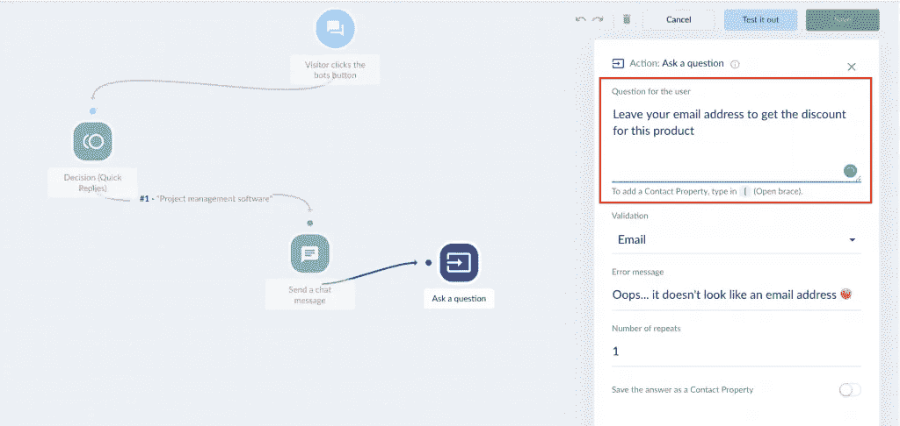

Collecting email address with a chatbot

一旦你知道你的访问者对某种产品感兴趣，你可以鼓励他留下一个电子邮件地址来获得该产品的特价。

你可以很容易地设置一个聊天机器人，通过自动信息询问访问者的电子邮件信息。

一段时间后，您可以使用电子邮件发送自动跟进消息。

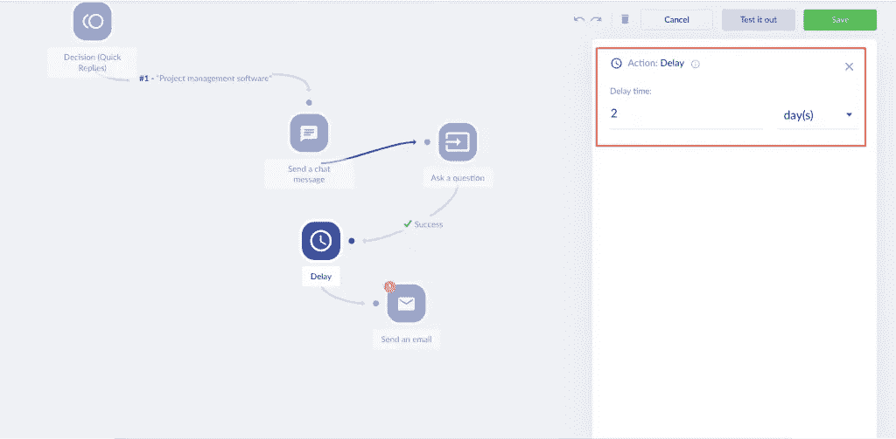

Sending an automated email follow-up message

***例如*** *假设你的客户向一个聊天机器人询问具体产品的定价。你可以鼓励他留下电子邮件地址，以便获得关于产品折扣的通知。之后，你可以设置在聊天后 2 天自动给他发送后续消息。*

# 通知您的操作员重要的操作

如果您的聊天机器人检测到或结束了特定的对话，他可以通知您的操作员。

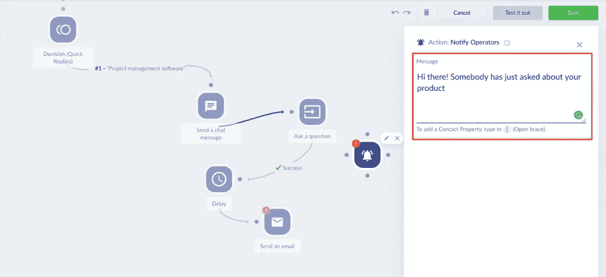

Sending notifications to operators.

当你想通知你的团队你的聊天机器人执行的更重要的行动时，这可能非常有用，例如，确保他们能够做出反应并直接接近大线索。或者，您的操作员可以收到聊天机器人处理对话的任何问题的通知。

# 节省您和您团队的时间

聊天机器人会接管这个世界的客户交流吗？那似乎很有可能。尽管我们喜欢在日常生活中与人交流，但我们更希望我们的业务问题能得到快速而准确的回答。

随着聊天机器人技术变得越来越先进和精确，每个企业现在都可以在几周甚至几天内为其业务准备好聊天机器人。这为我们的日常手工工作自动化提供了巨大的机会。

节省时间，早点回家，更快帮助客户。今天就开始在你的业务中使用聊天机器人吧！

*- >* [*免费试用梯迪奥聊天*](https://www.tidiochat.com/en/?ref=mattpliszka)

*- >* [*在 pickSaaS.com 的体绘聊天简介*](https://picksaas.com/live-chats/tidio-chat)

*在 pickSaaS 中，我们提供了一种更快找到最佳软件的方法。*

*我们研究软件解决方案，并通过网站*、实时聊天和电子邮件提供在线软件咨询*。*

*搜索或开始与我们聊天，找到发展您业务的最佳软件。*

## 这篇文章发表在 [The Startup](https://medium.com/swlh) 上，这是 Medium 最大的创业刊物，拥有+441，678 读者。

## 在这里订阅接收[我们的头条新闻](https://growthsupply.com/the-startup-newsletter/)。

