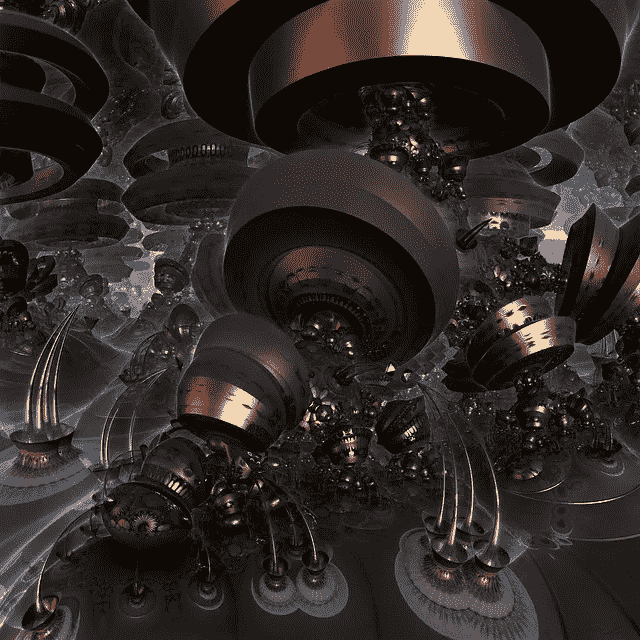

# 什么是量子计算机，我们能很快买到一台吗？

> 原文：<https://medium.com/swlh/what-is-a-quantum-computer-and-can-we-buy-one-anytime-soon-e86e468e974f>

量子计算机是一个最近越来越受欢迎的术语，尤其是每年都有大量的收入用于其研究。虽然大多数人都知道这个领域正在进行研究，但没有多少人真正了解其背后的复杂性和工作原理。本文旨在提供一个基本的概述，涉及的原则，面临的问题，以及解决这些问题的解决方案。基本上，量子计算是利用叠加和纠缠等量子力学现象来执行计算。

Image from Pixabay

量子计算领域实际上是量子信息科学的一个子领域，包括量子密码术和量子通信。量子计算开始于 20 世纪 80 年代初，当时理查德·费曼和尤里·马宁表达了一种想法，即量子计算机有潜力模拟经典计算机无法模拟的事情。1994 年，Peter Shor 发表了一种算法，它能够有效地解决非对称加密中使用的一些经典计算机难以解决的问题。

目前物理实现量子计算机有两种主要方法:模拟和数字。模拟方法进一步分为量子模拟、量子退火和绝热量子计算。数字量子计算机使用量子逻辑门进行计算。这两种方法都使用量子位。

量子位是量子计算的基础，有点类似于经典计算机中的位。量子位可以处于 1 或 0 量子状态。但是它们也可以是 1 和 0 状态的叠加。然而，当量子位元被测量时，结果总是 0 或 1；这两种结果的概率取决于它们所处的量子态。

今天的物理量子计算机非常嘈杂，量子纠错是一个新兴的研究领域。不幸的是，现有的硬件噪音太大，容错量子计算仍然是一个相当遥远的梦想。截至 2019 年 4 月，没有大型可扩展量子硬件被展示，也没有针对今天小型、嘈杂的量子计算机的商业上有用的算法被公布。政府、老牌公司和初创公司对量子计算的投资越来越多。在学术和工业研究中，近期中等规模装置的应用和量子优势的证明都是积极追求的。

量子计算机利用一些近乎神秘的量子力学现象，在处理能力上实现了巨大的飞跃。量子机器有望超越当今和未来最强大的超级计算机。

不过，它们不会消灭传统电脑。使用传统的机器仍然是解决大多数问题最简单和最经济的方法。但是量子计算机有望推动从材料科学到药物研究等各个领域令人兴奋的进步。公司已经在用它们进行试验，以开发更轻、更强大的电动车电池，并帮助开发新药。

# 量子位

今天的计算机使用比特——一串代表 1 或 0 的电脉冲或光脉冲。从您的音乐、游戏、视频等一切。本质上是这些二进制数字的长串。

另一方面，量子计算机使用量子位，量子位通常是亚原子粒子，如电子或光子。产生和管理量子位是一项科学和工程挑战。一些公司，如 IBM、Google 和 Rigetti Computing，使用冷却到比深空还要冷的温度的超导电路。其他的，如 IonQ，在超高真空室内的硅片上的电磁场中捕获单个原子。在这两种情况下，目标都是将量子位隔离在受控的量子状态中。

量子比特有一些古怪的量子属性，这意味着一组相连的量子比特可以提供比相同数量的二进制比特更多的处理能力。其中一个特性叫做叠加，另一个叫做纠缠。

# 量子比特叠加

量子位可以同时代表 1 和 0 的多种可能组合。这种同时处于多种状态的能力被称为叠加。为了将量子位叠加，研究人员使用精密激光或微波束操纵它们。

由于这种违反直觉的现象，具有几个叠加量子位的量子计算机可以同时处理大量的潜在结果。只有当量子位元被测量后，计算的最终结果才会出现，这会立即导致量子态崩溃，回复到 1 或 0。

# 量子比特纠缠

研究人员可以利用量子纠缠生成量子比特对，这意味着一对中的两个成员存在于单个量子状态中。改变其中一个量子位元的状态，将会以可预测的方式立即改变另一个的状态。即使他们相隔很远，这种情况也会发生。

没有人真正知道缠结是如何或为何运作的。这一现象也让爱因斯坦感到困惑，他著名地将其描述为“幽灵般的超距作用”。但这对量子计算机的能力来说是内在必需的。在传统计算机中，位数增加一倍，处理能力也就增加一倍。但是由于纠缠，在量子机器中加入额外的量子位会使它的数字处理能力呈指数级增长。

量子计算机利用一种量子菊花链中的纠缠量子位来执行计算任务。机器使用特别设计的量子算法加速计算的能力是释放其潜力的关键。

虽然量子计算机的优势显而易见，但坏消息是，由于退相干，量子计算机比经典计算机更容易出错。

# 脱散

量子位元与其环境的交互作用会导致它们的量子行为衰减并最终消失，这种交互作用称为退相干。它们的量子态极其脆弱。最轻微的振动或温度变化——在量子语言中被称为“噪音”的扰动——都可能导致它们在正常工作之前脱离叠加态。这就是为什么研究人员在那些过冷的冰箱和真空室中尽最大努力保护量子比特免受外界影响。

但是尽管他们做出了努力，噪音仍然会导致大量的误差进入计算中。智能量子算法可以弥补其中的一些，增加更多的量子位也有所帮助。然而，可能需要数千个标准量子位来创造一个单一的、高度可靠的逻辑量子位。这反过来消耗了大量量子计算机的计算能力。

到目前为止，研究人员还不能产生超过 128 个标准逻辑量子位，这远远不能满足执行复杂任务的需要。所以，我们离得到广泛使用的量子计算机还有很多年。

# 量子优势

尽管存在退相干的缺点，但所有研究量子计算机的公司和研究人员的目标都是实现量子优势。在这一点上，量子计算机可以完成数学计算，这显然超出了最强大的超级计算机的能力。

目前还不清楚到底需要多少量子位才能实现这一点，因为研究人员一直在寻找新的算法来提升经典机器的性能，超级计算硬件也在不断进步。但是研究人员和公司正在努力争取这个头衔，与世界上最强大的超级计算机进行测试。

关于实现这一里程碑有多重要，研究界有很多争论。各公司已经开始试验由 IBM、Rigetti 和 D-Wave、阿里巴巴等公司制造的量子计算机，而不是等待霸权被宣布。一些企业甚至正在购买目前庞大笨重的量子计算机，而大多数其他企业正在使用通过云计算服务提供的计算机。

# 量子计算的当前用途

量子计算机最有前途的应用之一是在分子水平上模拟物质的行为。大众和戴姆勒等汽车制造商正在使用量子计算机模拟电动汽车电池的化学成分，以帮助找到提高电池性能的新方法。制药公司正在利用它们来分析和比较可能产生新药的化合物。

这些机器也非常适合优化问题，因为它们可以极快地处理大量潜在的解决方案。例如，空中客车公司正在使用它们来帮助计算飞机最省油的上升和下降路径。大众汽车推出了一项服务，可以计算城市中公交车和出租车的最佳路线，以最大限度地减少拥堵。一些研究人员还认为量子计算机可以用来加速人工智能的发展。

量子计算机可能需要几年时间才能实现其全部潜力。从事这方面研究的大学和企业正面临着该领域熟练研究人员的短缺，以及一些关键部件供应商的短缺。然而，最近有希望的发展，如纳米桥，可以为量子电路提供潜在的冷却解决方案，并可能减少退相干。但是，对于潜在的消费级量子计算机来说，这种技术的任何实际应用至少还需要 10 到 15 年的时间。如果这些奇异的新计算机不辜负他们的承诺和期望，他们可能会迎来一个创新的时代，并可能改变整个行业。