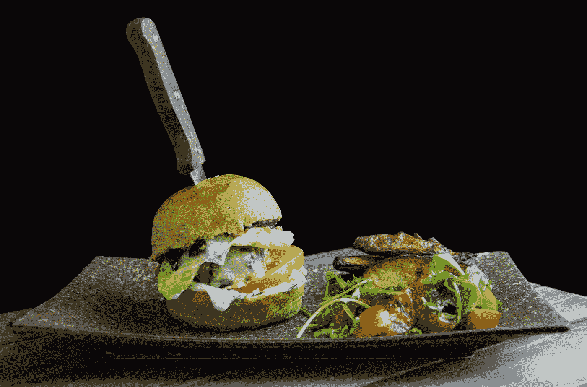

# 什么是创业公司？TL；大卫:就像汉堡一样

> 原文：<https://medium.com/swlh/what-is-a-startup-tl-dr-its-like-a-burger-96db568d50f7>

## 沐浴在创业的思绪中。(简化叙述)

That knife is something that is cutting through the entire startup, the founders have no ideas but they are keeping all the bread and filling together. Don’t ask them how? [Photo by [Alice Pasqual](https://unsplash.com/photos/rCqoCFkBcH4?utm_source=unsplash&utm_medium=referral&utm_content=creditCopyText)]

我不打算重新定义一个已经超载的术语。创业公司不再是业内人士眼中的黑箱。但是我们经常遇到许多人问“那么你需要什么来开始创业？”或者“创业公司的做法有什么不同？”或者一般的*“什么是创业公司？”*。

这些问题大多来自那些从未与创业界人士有过直接联系的人——他们可能是家人、朋友、你的高中老师，或者是在投资创业公司之前需要澄清的人😬。

如果你期待一份详尽的指南，那就去看看[如何创业(YC)——斯坦福大学](https://www.youtube.com/watch?v=CBYhVcO4WgI&list=PL11qn6zM2Y3bMZdChxEqHKaCaKUjwItGL)和[创业前需要阅读的文章(创业启动清单)](https://startuplaunchlist.com/)。

# 什么是创业公司？

这个博客在过去的四个月里一直在我的草稿里，没有被改动过。

我曾经回过头来看这份草稿，认为我没有经验来评论*‘什么是创业公司？’。*但突然之间，我工作的[初创公司](https://1ramp.io)的事情变得相当真实，我对自己说*‘好吧，我现在可以评论一些事情了’*。

从广义上来说，一个汉堡有四个部分，创业也有四个部分。这是汉堡和创业之间唯一的比较。汉堡很简单，味道很好，每个人都可以吃一个，但创业公司不是这样。

# 1.团队=奶酪、番茄、培根、洋葱、蛋黄酱、番茄酱或“特殊酱料”

*就是这个味道。*

他们把面包和馅饼放在一起。这些成分的组合定义了汉堡和创业。你不需要为面包付很多钱，你只需要为酱料和肉饼付钱。人们不投资产品，他们投资团队。

这个核心团队的想法/意识形态、工作与生活的平衡以及专业精神将一切联系在一起，从他们在一个奇怪的时间讨论的最初想法，到最终产品、金钱，以及两者之间的一切。

# 2.意识形态=基础面包/小圆面包

*酱料与创业之锚。*

一切都依赖于这一层。意识形态定义了创业公司的使命。这个团队相信一些东西，并且他们决心借助他们的产品和服务来实现它。

例如，SpaceX 的成立是基于这样一种信念，即人类探索星球的未来从根本上来说比我们不探索的未来更令人兴奋。

脸书最初的使命是“给人们分享的力量，让世界更加开放和互联。

他们在团队内部、在过程中以及在构建产品时所采取的行动都是由这种意识形态所驱动的。这能让他们坚持十多年，永远不会失去他们最初的目标和精力。没有这个基础，所有的东西都会掉下来，汉堡就不是汉堡了

# 3.产品=馅饼

没有馅饼的两片面包叫什么？绝对不是汉堡。

想法是好的，但工作产品更好，如果人们使用它们，那是最好的。我看到周围的人在完善他们的推介平台(已经有人这么做了)，集思广益，想出数百个可以实施的想法，并努力完成文书工作和尽职调查。这不是创业公司应该做的。他们应该构建(而不是提出)一个解决方案，然后把它带给那些可能从中受益的人。

没有最起码的可行/可爱的产品，就不是创业。汉堡也是如此。谁想要两片面包，上面有一个沥青甲板和一个登陆页面，声称一旦我们把肉饼放进去，它将成为汉堡历史上最好的汉堡。

# 4.财务=顶级面包/面包

*必须掩盖它。无论是自举还是资助，没有这一层，你就不能把整个事情联系在一起。*

迟早，每个创业公司都需要弄清楚财务状况，以维持他们正在做的令人敬畏的事情。没有这一层，你就不能拿着汉堡太久。我所知道的大多数创业公司创始人都不是以赚钱为唯一目的来建立他们的产品和团队，但这种财务可持续性(而不是稳定性)的顶层会让创业公司做他们应该做的事情。

此外，与汉堡不同，创业并不适合所有人。他们很酷，节奏很快，他们有潜力改变我们所知道的世界。

## 这篇文章发表在[《创业](https://medium.com/swlh)》上，这是 Medium 最大的创业刊物，有+409714 人关注。

## 在这里订阅接收[我们的头条新闻](http://growthsupply.com/the-startup-newsletter/)。

