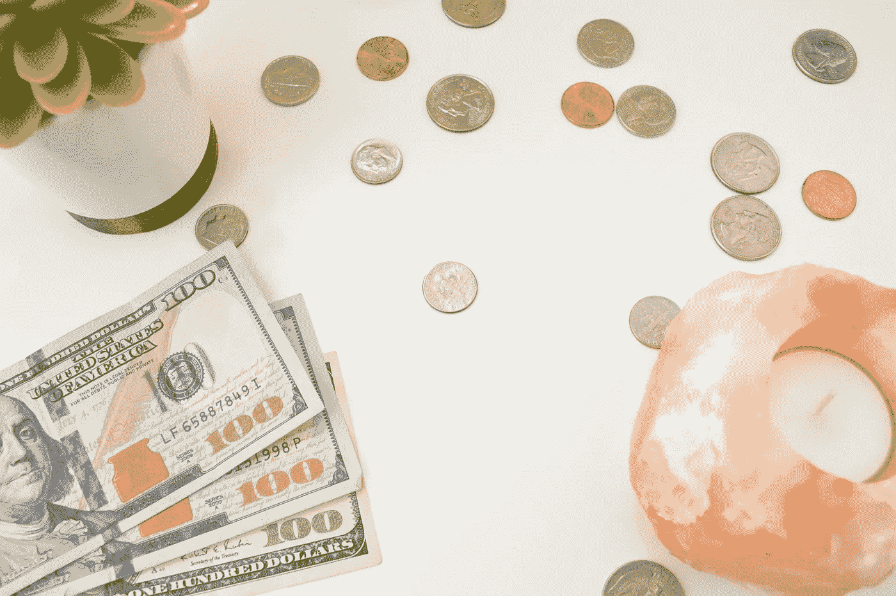
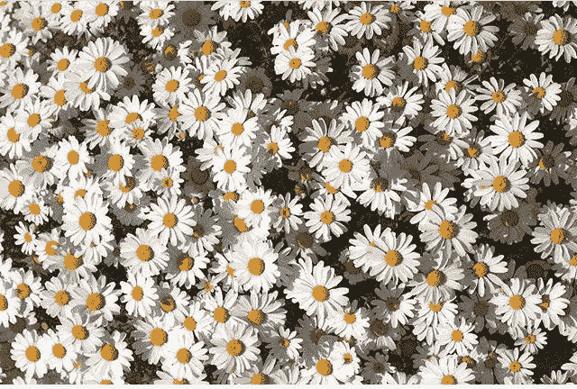

# 富足到底是什么？

> 原文：<https://medium.com/swlh/what-is-abundance-really-1fa82a026047>

晚上好，朋友们！

Photo: Katie Harp

如果你和我一样，在自我发展或精神领域消费媒体，你可能经常听到“富足”这个词，有时是在“富足心态”或“丰富地生活”这样的短语中它通常指的是围绕着你所爱的事物(并欣赏这些事物)过着充实、丰富的生活，而不是专注于缺乏和你没有的东西。

我自己的旅程的一部分是为自己创造丰富的生活——用我渴望的所有经历来馈赠自己，并努力实现一种允许我自由旅行、吃好、玩得开心的生活。

我曾经认为，为了实现所有这些梦想，我必须赚很多钱。具有讽刺意味的是，当我试图创造“富足”的时候，当我想要的收入没有达到的时候，我却感觉缺乏。

我对富足的认知有限，这让我无法欣赏我生活中所有不一定以金钱形式出现的幸福。

例如，我最近意识到我最大的梦想之一实现了。我曾经梦想能够走进机场，自发地去任何我想去的地方。我想为了实现这一点，我必须变得富有。

作为一名空姐，我的公司允许我去他们飞往的任何地方旅行，要么免费，要么费用很低。只要我有时间，我真的可以这样做。真的坐在那里欣赏它，就像梦想成真一样，这让我大吃一惊。

我已经拥有了很多我想要的东西，并且在没有达到我的“收入目标”的情况下也能经常享受快乐。我们真正想要的通常是一种感觉，而不是一件东西。如果我有快乐，如果我有爱、自由和对生活的热情(所有我认为钱可以买到的东西)，那么为什么要限制自己只在达到一定数量的钱时才感到富足呢？

Photo: Gabriela Melgar

富足无处不在。在绿叶中，在笑声中，在我们一天中经历的各种味道中。你可以在最小的细节中找到它，或者在意识到你正处于人生中一个近乎完美的阶段时的不知所措中找到它。

如果你曾经因为金钱或任何你“缺少”的东西而感到沮丧或压力，我鼓励你花同样多的时间和精力去积累所有对你有利的小(或大)奇迹、喜悦、快乐、天赋和礼物。感受这份感激，直到你的心快要爆炸。尽可能多地这样做，尽可能经常地这样做，挖掘你的财富。

*爱，*

*加布里埃拉*