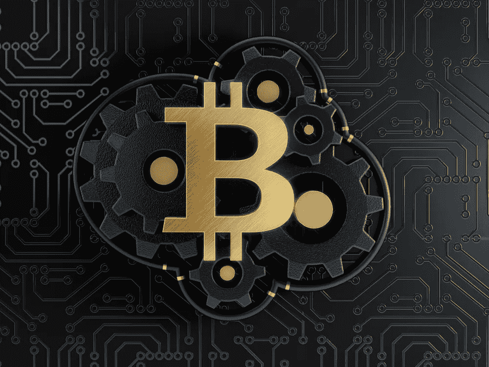

# 什么是比特币(BTC)？—原始加密货币的起源、崛起和潜在未来

> 原文：<https://medium.com/swlh/what-is-bitcoin-btc-the-origins-rise-and-potential-future-for-the-original-cryptocurrency-c440db456cd7>

由于围绕加密市场的大部分焦点都集中在比特币上，所以在本文撰写之时，比特币的价格已经飙升至超过 19000 美元，市值接近 2000 亿美元也就不足为奇了。

作为交易量和价值最大的加密货币，它在 2017 年迅速占据了一席之地…