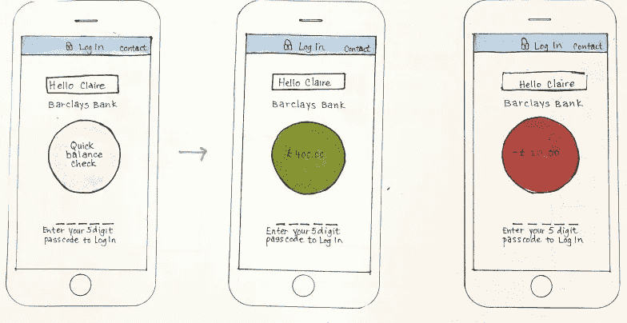

# 什么是设计思维？

> 原文：<https://medium.com/swlh/what-is-design-thinking-bafbfd454f23>

Mobile Banking App- Barclays Bank. Photo credit S. Wong

假设你有一个关于产品或服务的想法。作为初创企业的创始人或产品经理，你编写产品规格，你联系供应商以了解实现你的想法的成本(或者如果你足够幸运，拥有编码或制作技能，你就去做)。不知不觉中，你已经在做生意了，但你还没有问出最重要的问题。**这种产品是顾客真正需要的吗？**这个问题是……的关键