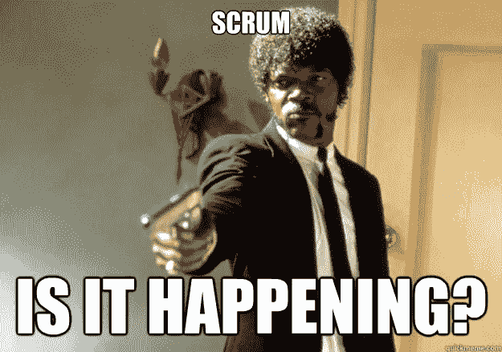

# 什么不是 SCRUM？

> 原文：<https://medium.com/swlh/what-is-not-scrum-b5c63670416a>

上周我参加了认证 Scrum 大师培训，观察了不同的心态，不同的经验水平，开发人员，测试人员，管理人员试图理解 Scrum 是什么。他们中的许多人带着期望加入了这个班级，期望 Scrum 能够解决他们的问题，延迟的项目、不满意的客户、不满意的团队、截止日期……任何你能想象到的项目问题:)

SCRUM

但是这不是 Scrum 的目的。它不是解决你的问题项目的良方。还有什么不是？

# 项目交付指南

Scrum 实际上是你所期望的一大堆强制性食谱指南的对立面。它不是一种方法论。它用一种启发式方法取代了大量 PM 食谱中使用的算法方法，尊重人和自组织来解决复杂问题和处理不可预测性。它建立在四个核心价值观之上:

*   个人和交互**超过**流程和工具
*   工作软件**超过**综合文档
*   客户协作**超过**合同谈判
*   按照计划响应上的**变化**

相对于，我更强调**这个词，因为它描述的是价值观和优先事项，而不是该做什么和不该做什么的指示。**

它还遵循[十二条敏捷原则](https://agilemanifesto.org/principles.html)——一套易于理解但难以掌握的规则。

# 对于每个项目

尝试使用 Scrum 搭建一座桥梁。想想吧。这真的意味着即使在开发的后期，你也欢迎改变需求吗？构造是您可能想要考虑传统方法而不是敏捷方法的例子之一。对于这种项目，你应该在一开始就非常准确地熟悉项目的输出。

现在考虑一下您的传统 IT 管理项目。你的客户和团队开心吗？项目是否交付了预期的东西(价值、金钱)？你可能不需要仅仅为了使用 Scrum 而改变它，它甚至会造成一些伤害(至少在产品化阶段)。在你匆忙下结论之前要三思。

# 仅适用于 IT 项目

"你不能用敏捷方法来构建定制的踏板车."哦，你当然可以。Scrum 中有趣的部分是获得反馈。如果你正在开发一个产品，需要来自市场和用户的评估，这是一条可行的道路。从有时间限制的冲刺开始，计划你想在冲刺过程中带来什么价值，并在冲刺结束时将它传播给测试用户。对于像定制踏板车这样的产品，可能需要更多的时间和金钱，直到你找到市场上的最佳点，但肯定比只是猜测方式和生产一个又一个无用的踏板车要少。测试用户不必马上成为最终客户，只是一些内部和外部人员的合理组合，他们最终将驾驶汽车。

Example of non software backlog items

# 对于每个组织

组织向 Scrum 转型的第一步是什么？

"[解雇所有经理](https://giphy.com/gifs/foxtv-gordon-ramsay-fired-you-are-done-ToMjGpmjnM666vQ73X2)"

当然，你可以从它开始。但我先问几个问题:你知道 Scrum 是什么吗？它带来了哪些价值观和规则？您的组织需要它吗？底线问题是:你为什么要转型？

在进入敏捷组织之前，每个人都需要明白，你为什么要转型。如果没有动力，结果可能有些相似。如果你确定你需要转型，先从小团队开始并评估。用这种方法你可以节省一些时间和金钱。

# 赚钱机器——还是？

这是让人们认为 Scrum 无用的一个方面。在 [CSM](https://www.scrumalliance.org/get-certified/scrum-master-track/certified-scrummaster) 研讨会结束时，我会引用一个小公司老板的话:“不，那不行。没有人会为此付出代价”。

把 Scrum 看做一个过程，在这个过程中，你有资金投入，然后你有一定数量的清晰的步骤和清晰的产出，带来计算好的价值/资金/客户不会完成工作，也没有人会为此付费。然而，将这个框架视为交付市场评价的优秀产品的工具，答案可能会[改变](https://media.giphy.com/media/YDxyPAyIRKS5i/giphy.gif)。Scrum 首先带来商业价值。如前所述，Scrum 并不用于每一个项目、组织、每一个客户。一个人需要首先理解 Scrum 及其好处，然后理解他的项目或产品目标是什么，看看这两者是否匹配。否则你将会在没人需要的东西上花费大量的金钱，用一些令人毛骨悚然的敏捷方法，这绝对不是 scrum(你只需要每天参加 Scrum 会议，因为那很有趣)。

# 结论

关于 Scrum 是什么或者不是什么，存在着并且永远会存在误解。在这篇文章中，我试图指出其中的一部分。我想让你明白的是:Scrum 不是延迟交付、不愉快的团队或客户的万能医治者。确保你明白 Scrum 带来了什么附加值，有什么缺点，以及这是否是你的项目或组织所需要的。Scrum 是一种思维模式，不是每个人一眼就能理解的。实施需要理解、参与和时间。正如我的一位同事，一位谚语专家，会说:[三思而后行](https://www.oxfordreference.com/view/10.1093/acref/9780199539536.001.0001/acref-9780199539536-e-2241)。

你第一次接触 Scrum 是什么时候？你在你的组织中使用这个框架吗？有多成功？