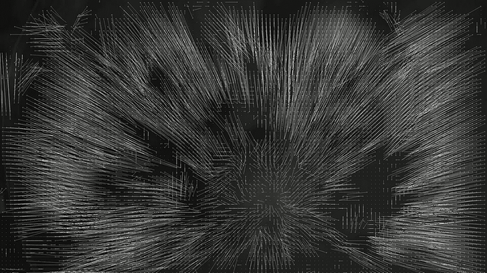

# 什么是光流，为什么它在深度学习中很重要

> 原文：<https://medium.com/swlh/what-is-optical-flow-and-why-does-it-matter-in-deep-learning-b3278bb205b5>

dance Logue(【https://dancelogue.com/】)是一家 AI first 公司，其主要目标是理解和分类舞蹈中的人体运动。为此，能够理解视频结构至关重要。

视频与图像的主要区别在于，除了图像中的空间结构之外，视频还有时间结构…