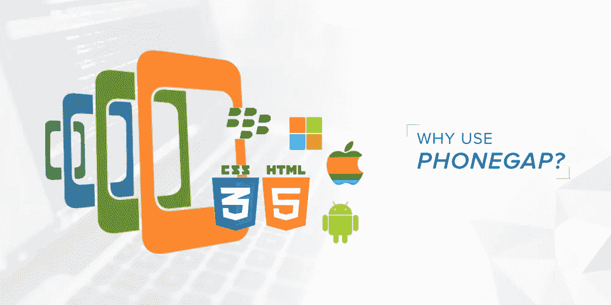

# 什么是 PhoneGap &为什么你应该在应用程序开发中使用它

> 原文：<https://medium.com/swlh/what-is-phonegap-why-you-should-use-it-for-app-development-5ac5e19eb19a>

Why use PhoneGap

PhoneGap 是一种广泛用于跨平台移动应用开发的技术。这个开源的移动应用开发框架是由 Nitobi Software(现在的 Adobe)开发的。它允许开发人员使用 HTML、JavaScript 和 CSS 构建应用程序。

PhoneGap 是最顶级的**手机 app 开发语言之一，最早由 Nitobi 推出，命名为“[Apache Cordova](https://cordova.apache.org/)**”**。Adobe 收购了 Nitobi，并将 Apache Cordova 更名为“PhoneGap”。**

# ****为什么要用 PhoneGap？****

**对于开发者来说，知道为什么他们应该选择 PhoneGap 的原因是很重要的，因为已经有很多其他的框架了。好了，文章的这一节会消除你的疑惑。**

****跨平台兼容性****

**移动应用程序开发确实是一个繁琐的过程，对于开发者来说，选择一个可靠的平台非常重要。PhoneGap 是一款可靠的跨平台产品，兼容不同的移动应用开发平台，包括 iOS、Blackberry、Android、WebOS、Symbian、Tizen 和 Bada。应用程序开发团队只需编写一个代码，减少了为各种平台编写不同程序的工作量。**

****成本效益****

**如果你预算紧张，想要以低投资获得最佳杠杆，那么 PhoneGap 就是你的合适工具。你可以为一个应用程序编写一个单独的程序，让它在不同的平台上运行。这将节省你大量的金钱以及努力。**

****更好地访问本地 API****

**PhoneGap 为您的移动应用程序开发人员提供了对原生 API 的访问，以便您的应用程序可以利用摄像头、地理位置、加速度计、联系人和所有其他原生功能。它帮助用户获得使用本地应用程序的体验，与 web 应用程序相比，这种体验要优越得多。**

****进入大型社区基地的途径****

**如果你正在尝试新的事物，那么获得足够的支持对你来说是至关重要的。科尔多瓦开发社区是最大的社区之一，并且一直在增长。这个社区的人很友好，你会得到大多数问题的答案。有大量的例子和这么多有经验的成员会给你提供巨大的支持。**

****利用网络技术的灵活性****

**Cordova 应用程序是使用一些简单的语言构建的，如 CSS、HTML 和 JavaScript。当你打算 [**开始用 PhoneGap 开发手机应用**](https://technostacks.com/mobile-app-development) 的时候，你没有必要学习新的语言。你可以使用现有的语言，轻松地编写程序。**

**PhoneGap 已经存在很长时间了，有大量的库和框架可以帮助你。因此，您可以使用各种类型的选项来进行更好的编程。**

****强大的后端支持****

**PhoneGap 有强大的后端支持，这加快了开发过程，减少了开发人员的工作量。它们还为开发新手提供了初学者指南，让他们能够很容易地理解整个项目。**

****发展中的柔性****

**由于整个应用程序开发过程非常简单，开发人员具有很大的灵活性和适应性。没有必要认真努力来执行开发过程。上面提到的语言基础知识，足够开发一个 app 了。**

****UI 库改善用户界面****

**对于大多数移动用户来说，浏览只兼容电脑和大屏幕平板电脑的网页是一个常见的问题。向下滚动到页面并检查它和其他一些任务将花费很多努力，人们将无法轻松地访问这些页面。**

**但是有了 PhoneGap 中的 UI 库，应用程序和网页的用户界面得到了极大的改进。这有助于为不同的目标观众提供更好的观看体验。**

**这些是 PhoneGap 的一些值得注意的特性，使其成为开发者的最佳选择，并且易于向客户解释。这些特性使得 PhoneGap 成为竞争激烈的技术领域中应用开发的最佳 android 框架之一。**

# ****什么时候用？****

**如果你想设计一个简单的带有本地应用的移动网络应用，PhoneGap 是一个完美的选择。PhoneGap 有访问本地 API 的能力，但是如果你想要一个健壮的本地应用，那么它不是你的正确选择。**

**如果你想要一个简单的带有本地应用的网络应用，那么它会对你非常有用。最终，一切都是基于要求。**

**如果你在应用程序开发方面有很好的专业知识，这个 PhoneGap 会派上用场，你可以开发一个比 web 应用程序响应更快的应用程序。反响是值得称赞的，你将能够享受像 JQuery，Shensha 这样的框架，让你的应用看起来独一无二，在其他应用中脱颖而出。**

**PhoneGap 性价比很高，所以如果你想省几块钱，那么这是你的正确选择。该框架的用户界面非常直观，因此新手可以在 PhoneGap 的帮助下开始学习应用程序开发。**

# ****PhoneGap 的优缺点****

**嗯，对你来说，在决定使用 PhoneGap 之前，了解它的优点和缺点是很重要的。**

# ****优势****

****更轻松地部署应用****

**大家都明白 PhoneGap 是一个跨平台的框架。这是这个框架的第一个优点。您可以为一个平台创建一个应用程序，然后轻松地将其部署在其他各种平台上。整个过程不会花太多时间，你可以用更少的时间和更少的努力做更多的工作。**

****保持一致性，与平台无关****

**每个企业在起步时都努力在所有平台上保持统一的形象。为 iOS 设计的应用程序在 Android 中看起来不同，为 Android 设计的应用程序在 Blackberry 和 Windows 中可能看起来不同。但是在 PhoneGap 中设计的应用程序在任何其他平台上看起来都是相似的。这是 PhoneGap 另一个值得称道的优势。**

****无需雇佣专业开发人员****

**对任何公司来说，在业务中节省一些钱都是很重要的。雇佣专业开发人员并不是一件容易的事情。他们要价很高。但有了 PhoneGap，任何精通 CSS3、HTML 和 JavaScript 等语言的开发者都足以开发出和原生应用一样好的应用。虽然它们不能与本地应用相提并论，但与网络应用相比，它们要好得多。**

****在 PhoneGap 上开发的应用表现得像本地应用****

**当这些应用程序能够接入手机并使用地理定位、加速度计、摄像头等功能时，它们的行为就像本地应用程序一样。该框架利用了硬件功能，同时在此过程中提供了出色的 UX。它为用户提供了最佳的体验，这些用户几乎不会知道该应用程序是在跨平台的基础上构建和实现的。**

****开源****

**PhoneGap 是一个开源平台，这意味着它基本上是免费的。任何具有最低开发知识的人都可以在这个平台上学习一些东西。有一个大型的开发者社区会在这个过程中指导新手。当你计划在这个平台上开发一个应用程序时，你可以查看 [PhoneGap 初学者视频](https://www.youtube.com/watch?v=ZgUAT7CIhsY)，甚至从社区中的一些开发人员那里获得建议。**

****由强大的资源支持****

**PhoneGap 由 Apache Cardova 提供支持，现在是 Adobe 的一部分。该框架由最佳来源支持，它使整个框架可靠。**

**它提供了一些工具和其他值得称赞的特性，从长远来看对开发人员有所帮助。在 AEM mobile 的帮助下，开发人员将能够从一个地方匹配他们应用程序的所有活动。PhoneGap 内容同步将有助于获取应用程序内容并进行缓存。在 AEM 的帮助下，您将能够测试和预览您在应用程序上所做的更改。**

****易用插件****

**[PhoneGap build](https://build.phonegap.com/) 兼容多个 Cordova 和 PhoneGap 插件。开发者可以通过在 PhoneGap 上开发应用来扩展原生功能。**

# ****缺点****

****PhoneGap 不支持包含挂钩的插件****

**PhoneGap 最大的缺点是它不支持带挂钩的插件，这可能会妨碍功能。WordPress 中有一些钩子可以帮助开发者将他们的代码与 WP 中的核心代码库、主题和插件捆绑在一起。同样，PhoneGap 也不支持带挂钩的插件。**

****不适合游戏应用****

**PhoneGap 是一个旨在开发简单应用程序的平台。它未能提供游戏应用程序，也不适合开发此类应用程序，因为当应用程序发出任何通知时，它们会冻结并出现掉线问题。**

****需要 Mac 来开发 iOS 应用****

**PhoneGap 需要 iOS SDKs，如果没有这个 SDK，开发一个应用是完全不可能的。下载这些 SDK 需要 Mac。没有 Mac，他们将无法开发应用程序。**

****过时的插件****

**在很多情况下，你使用的插件已经过时，不能有效工作。这种情况会完全阻碍整个项目。你可能会在项目进行到一半时意识到这一点，这也可能导致一些灾难性的结果。**

# ****PhoneGap 应用程序****

**这些是 PhoneGap 的一些例子。下面的应用程序是在 PhoneGap 框架平台上开发的，为用户提供了值得称赞的用户体验。**

**[**维基百科**](https://www.wikipedia.org/)**

**这个免费的百科全书应用程序已经被世界各地的许多人使用。它是在 PhoneGap 框架上设计的，应用程序像本地应用程序一样工作。**

**[**DHS 计划**](https://dhsprogram.com/)**

**这可以被认为是小屏幕的大数据。它代表人口和健康调查。该应用程序由 Adobe 开发，提供与健康和调查数据相关的数据。**

**[**支付**](https://www.paylution.com/)**

**它有助于轻松进行国际支付。超级钱包技术被整合到这个应用程序中，用于进行支付。这个应用程序是一个很好的替代付款而不是电汇或写支票的工具。**

*   **[**三脚架**](https://www.tripcase.com/)**

**这是一个智能手机应用程序，可以在用户旅行时为他们提供帮助。这是 PhoneGap 上设计的最智能的应用程序之一。**

# ****关键要点****

**本文涵盖了您想了解的关于 PhoneGap 的几乎所有内容。如上所述，PhoneGap 支持多种阶段，这使得 web 工程师能够使用他们当前的能力创建代码，并进一步发送到多个阶段。简单来说，它提供了一个具有广泛功能和众多应用程序的“WebView”。**

**您可以[满足 PhoneGap 开发人员的需求](https://technostacks.com/contact-us),在您的业务解决方案中实现这一功能。**

**如果你有任何疑问，你可以在评论中问我。**

****

## **这篇文章发表在 [The Startup](https://medium.com/swlh) 上，这是 Medium 最大的创业刊物，拥有+428，678 名读者。**

## **在此订阅接收[我们的头条新闻](https://growthsupply.com/the-startup-newsletter/)。**

****