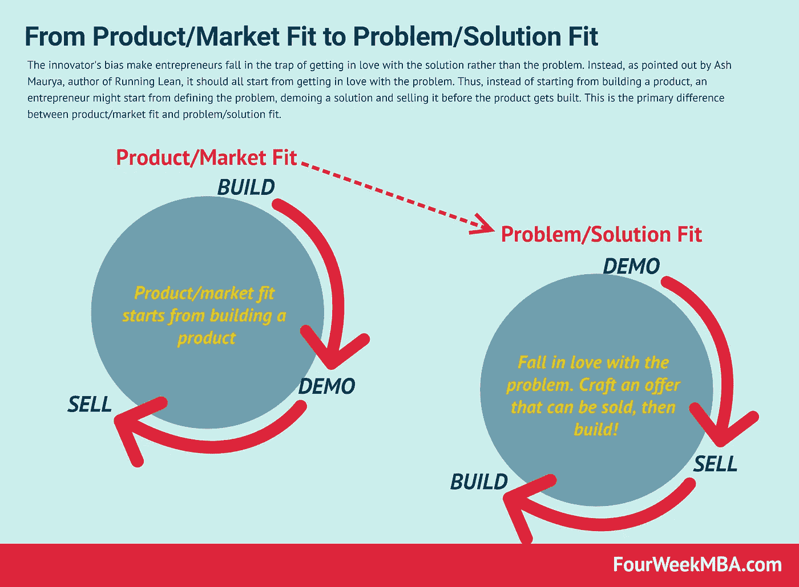
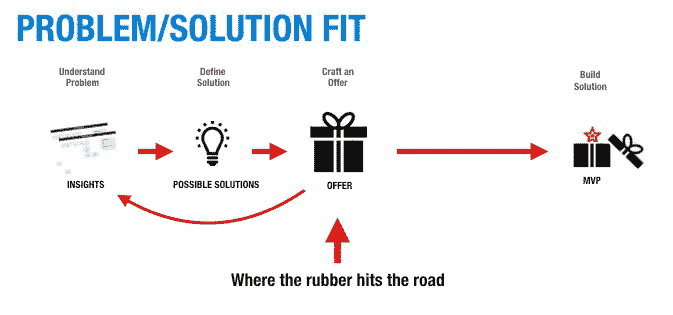

# 什么是问题/解决方案适合度，为什么它对 Ash Maurya 很重要[访谈]

> 原文：<https://medium.com/swlh/what-is-problem-solution-fit-and-why-it-matters-with-ash-maurya-interview-a970ab824465>

Ash Maurya 是一名从业者和企业家。《运行精益、[精益](https://leanstack.com/scaling-lean-book/)和[精益画布](https://fourweekmba.com/lean-startup-canvas/)的作者，建立在[商业模式](https://fourweekmba.com/business-model-canvas/)画布之上。阿什也是 [LEANSTACK](https://leanstack.com/) 的创始人。

我趁机问了阿什几个问题。我试图限制这些，因为我有太多的事情想问他。阿什很友好地回答了所有的问题！

# 你能告诉我们你的故事以及你是如何成为一名企业家的吗？

**灰孔雀:**当然。成为一名作家和演说家，这是我现在除了经营生意之外大部分时间倾向于做的事情，从来不是我总体规划的一部分。如你所说，我是一个实践中的企业家。但是在我的旅程中，我开始了许多项目，然后制造了许多产品。

他们都是以同样的方式开始的。他们开始都很棒，很神奇。他们都很有前途。但他们的结局并不一样。很多都是。我最终关闭了。

困扰我的不是我关闭它们，因为我知道你必须寻找好的想法。当我没有准备好启动和验证这些想法的时候，我已经准备好了。

我说的是从我有一个想法到我知道它可行与否的两年时间，我意识到这太长了，因为我有太多的想法，而没有足够的时间。

我开始研究我是如何制造产品的，开始研究其他人是如何制造产品的。我开始写博客，大约在这个时候，埃里克·里斯和史蒂夫·布兰克开始了一些工作，这最终成为了精益创业。

时机刚刚好。我加入了那场对话，但即使在那时，我仍然是一名企业家。我做这些都是作为一个附带项目。我在写博客。那个博客越来越受欢迎。

最终，我的一些读者开始要求我考虑写一本书。起初，我说不，但后来我最终被说服了。我用非常非传统的方式写了我的第一本书。

博客变成了书，然后我开始更多地沉浸在这个世界中，举办一些研讨会，作为测试内容的一种方式。那是这本书开始发展的时候。然后有一天我意识到世界变了；到处都有企业家。

这是一个激动人心的时刻。我觉得是时候做点什么了。我决定卖掉以前的公司，成为一名全职企业家，或者为其他企业家生产产品。这就是我们在 LEANSTACK 所做的，但同时也在继续发展这一系列的工作。

# 你认为创业者在创业时最大的误区是什么？

**Ash Maurya:** 我发现，作为一名企业家，我刚刚学到的最重要的一点就是冒险。我们都有这种英雄企业家的形象，他会从悬崖上跳下，然后神奇地想出如何在下落的过程中制作降落伞。

**我发现一些更有经验的企业家非常厌恶风险，他们会打包行李，确保在跳下悬崖前带好一个降落伞和一个备用降落伞，因为他们想保护自己的安全。**

对我来说，我不认为这是真的。这是一个误解，我认为这是一个很大的误解，因为当我们开始时，许多人认为冒很多风险是可以的。

但在现实中，我们在 LEANSTACK 教授的框架是我们试图优先移除所有红色头骨，依次移除最危险的部分。**从风险最大的事情开始，然后逐渐地，你剩下的是一个可以运作的业务。**

我看到的另一个也是非常普遍的现象与其说是神话，不如说是偏见。这就是创新者的偏见，或者说企业家爱上他们的解决方案的倾向。当我们看到一个想法时，我们会迅速跳到进入我们脑海的第一个解决方案。但正如我们所知，第一个解决方案并不总是最佳的，它往往是错误的。

但是我们遇到的挑战是我们开始相信那是我们必须建立的。然后我们花费所有的精力去追逐错误的风险。我们追逐产品的生产，如果这个产品不是市场需要或想要的，当你生产它的时候，你已经耗尽了很多资源，你意识到你必须从头开始。这对人们来说，至少对首次创业的人来说，往往是一大挫折。

Gennaro Cuofano: 你有一个框架来帮助创业者完成这个过程。强调关注问题而不是解决方案。

# 你能解释一下问题-解决方案匹配模型是如何工作的吗？

**Ash Maurya:** 许多企业家都会遇到的一个偏见就是对解决方案的过早热爱。就像科学中的第一原理一样，你几乎必须解构一个想法。我们必须从基础开始。在这种情况下**，当我们审视我们的业务时，我们必须将其分解为客户和问题。**

如果您没有合适的客户来尝试解决问题，无论您构建什么解决方案，都没有关系，因为我们知道，除非您正在解决问题，否则客户不会使用它。

他们不会付钱的。即使你能找到他们。即使你拥有专利或不公平的优势，最终也无关紧要，因为你的客户并不在乎。这就是我们逻辑上分解它的方式，但创新者的偏见是其中一种诡秘的东西。

它向我们走来，假装很诱人。当我们有了想法，我们认为这就是解决方案。我们试图克服的是持续测试。

即使我们心中有一个产品，我们也不会构建整个产品。这就是最小可行产品概念的由来。我们建造更小的东西。甚至在那之前，即使我们有一个我们想要制造的小产品，我们甚至都没有开始。

**我们可以从演示开始。我们可能首先去寻找客户，看看我们是否能接触到他们，甚至与他们交谈。因为如果你能和顾客交谈，我们就能卖给他们任何东西。**我们从最终目标开始，然后回到起点，开始自下而上的验证。这通常是我们如何克服创新者对解决方案的偏见。

# 那么，你认为在你制造产品之前就开始销售它是个好主意吗？

**灰孔雀:**是的！从很多方面来说，这也正是我们所教的。如果你从传统的角度来看，我们销售产品的方式是先制造产品，然后向客户演示，然后再销售。

我们教的是**先制作一个演示，然后销售这个演示，如果你能销售这个演示，那就不要制作产品。**不是构建-演示-销售，而是演示-销售-构建。这样，我们可以加快速度，因为我们可以从演示开始，这不仅有助于我们清楚地验证市场风险，而且在某种程度上也有助于您测试您将要构建的产品，因为您的演示可以展示产品将会做什么，如果客户不喜欢，您仍然可以更改它。

*由*[*lean stack*](https://blog.leanstack.com/dont-start-with-an-mvp-aa883de5cd18)提供的问题/解决方案匹配和演示-销售-构建模型的示例

# 这意味着你消除了产品与市场的匹配问题，对吗？

**灰孔雀:**是的！这是因为**我们正在系统地测试风险，因为我们认识到客户市场风险是最大的。如果我们可以销售，我们已经减轻了一部分，但现在下一个问题是你能实现你的承诺吗？因为如果你卖的东西没有建成，那么我们就有可行性风险。**

这通常风险较小，但仍然没有给出。有许多公司无法制造出好的产品，你可能会再次失败，但至少你已经证明了，如果你制造出你向客户展示的东西，那么你至少会赢得客户。

# 那么，你仍然有可行性风险，这可能会使产品不成功？

当然，你知道，所有这些都是相对的。举个极端的例子。理查德·布兰森和埃隆·马斯克已经在出售登月门票了。他们知道今天技术上不可能，但总有一天会发生。那些愿意成为第一个去月球度假的人已经开始买票了。

**Gennaro Cuofano:** 在企业家的世界里，有一种“跨越鸿沟”的东西，这是一个高科技创业公司从早期采用者到早期多数人的能力。问题是整个过程相当困难，在许多情况下，即使你和早期采用者打交道，你可能仍然有生意。

# 你如何看待在早期采用者身上建立业务？

**Ash Maurya:** 大多数公司甚至从未让他们的早期采用者饱和，因为即使对早期采用者来说，打造有价值的东西也不容易。我们经常开玩笑说，“你知道，你应该很幸运，因为大多数人从来没有走那么远。”这是一种思考方式，但我们尝试为此做准备的方式是，我们尝试让早期采用者不要太狭隘。**我们希望它们足够大，让你至少可以建立一个可持续发展的企业。**这将是[商业模式](https://fourweekmba.com/what-is-a-business-model/)的一个小版本，但至少它给了你一些发展空间，让你能够适应并超越产品市场。

这是一种方法。当然也不一定是 5 个人或者 10 个人那样的早期采用者。它必须有一些，一些合理的规模才有意义。但更重要的是，当你开始为那些早期采用者服务时，他们是你从他们那里学到的东西。你从他们那里得到的社会证明是早期大多数人真正需要的，来为他们自己消除这个想法的风险。他们不想成为第一，但只要在他们面前有足够多的第一人，他们就可以愉快地成为第二。

**Gennaro Cuofano:** 在你的书《精益生产》(Scaling Lean)中，你说这不是关于执行，而是寻找一种[商业模式](https://fourweekmba.com/what-is-a-business-model/)。

# 为什么商业模式的探索比执行更重要？

**Ash Maurya:** 如果你看看执行这种思维方式，它会回到最初的商业规划假设，我们会有一个想法，我们会花所有的时间做分析，即使我们不知道所有的事实，我们也会筹集一些资金。建立一个团队，然后开始执行计划。

在竞争不激烈的时候，这种策略曾经奏效。如果你能制造一个产品，并把它推向市场，即使它是错的，你仍然会得到客户的关注，因为他们会和你一起工作。

即使你完全错了，你也可以重新打造一个产品，这就是大公司这么多年来的生存之道。今天的世界非常不同。最近看到一个统计，每年有 1 亿个想法开始。

那可是一亿啊！那是一秒 300！当有那么多想法的时候，如果你花了九个月的时间想出这个完美的计划，并且没有任何缺陷，那么在这段时间里，你可以计算一下。

可能有很多其他的想法和你的相似，你只需要其中一个就能突破。这就是为什么整个模型不工作。我们必须比以前走得更快。

现在如果你走得更快，当你走得很快时，你就可以真正地执行。你必须不断学习。这就是为什么我们说这是一种搜索与执行的心态，我们通过验证过程制定一些粗略的计划。

**我们在不断修正方向，这也是商业规划最初应该做的！商业计划如此庞大，以至于没人想更新它。一个我们不时使用的工具，一个更轻的重量允许你进行那种动态进化。**

**Gennaro Cuofano:** 你认为在发展业务时有一个非常重要的衡量标准:牵引力。

# 什么是牵引力，为什么它如此重要？

Ash Maurya: 问题通常是企业家、创新者以及投资者和利益相关者都想要的一个衡量标准是什么。很多时候人们会说钱或利润，但这还不够，因为你可能在这个季度有钱，但下个季度钱会减少。它不仅仅是金钱或利润；它必须是一个回报率。它必须是增长驱动的。

这就是牵引的意义所在。但是关于牵引力更有趣的是，它不是你赚钱的速度。而是关于一些赚钱的领先指标。

例如，如果我只看像星巴克这样的公司，我看他们的资产负债表，我可以说他们在增长，因为每个季度他们都赚了更多的钱，而我不知道他们是如何增长的或为什么增长。

当你开始问“为什么”的时候，就是你需要仔细审视业务的其他方面的时候。例如，你需要研究顾客的行为，这样你就可以看到顾客在商店里做了什么可能会带来最多的利润。

这就是我们推出新活动、新政策或新实验的地方，我们在那些推动更多资金的事情上加倍努力，然后我们看到它在下一个季度上升。

从很多方面来说，这就是我们所说的牵引力！牵引的令人兴奋之处在于公司从其产品中获取货币化价值的速度，这就是我们对牵引的定义。

**Gennaro Cuofano:** 我想举个例子，如果你看看[亚马逊](https://fourweekmba.com/amazon-business-model/)及其四年的资产负债表，你会发现亚马逊多年来利润一直非常微薄。但实际上，原因是亚马逊抓住了市场价值，同时也在整合其他业务。如果你看看今天的[亚马逊](https://fourweekmba.com/amazon-business-model/)，它的[商业模式](https://fourweekmba.com/what-is-a-business-model/)的构成就大不相同了。尽管在线商店的利润非常微薄，但它实际上推动了其他业务部门的增长，而这些业务部门如今为亚马逊的大部分成功和利润做出了贡献！

今天，如果你看看正在进行的许多科技 IPO，你看看财务报表，你注意到的第一件事是底线是负的。实际上，在某些情况下，它们的净亏损高达数百万或数十亿美元。许多几年前还不存在的创业公司，我们称之为[deca coens](https://fourweekmba.com/decacorn/)。虽然他们有疯狂的估值，但他们仍然没有盈利！

# 即使你还不能盈利，商业模式是否可行？

**Ash Maurya:** 在我看来，不是这样的。这就是我的意思，所有这些公司都有一个拐点。当所有这些公司的产品都符合市场需求时，他们必须做出选择，要么成为一家非常赚钱的公司，要么成为一家快速增长的公司。

这是增长与利润的对比，他们的许多投资者选择了增长而不是利润，因为这可以追溯到亚马逊的战略，即让我们变得如此之大，以至于我们拥有不公平的优势。

然而，错误在于，正如你在亚马逊案例中正确定义的那样，他们本质上是在使他们的[商业模式](https://fourweekmba.com/what-is-a-business-model/)多样化，他们能够以牺牲公司内部的部门为代价来维持公司，以建立一个比部分之和更强大的整体。

对我来说，当你只是为了增长而增长，而没有任何回报的时候，这是没有经济意义的。它变得更像是一个投机游戏，这也是许多衍生资产和债务市场的目的。

但是你看看许多公司，Skype 就是其中之一，它成长到了一个巨大的估值，然后基本上以一个非常大的损失被出售，现在它在另一家公司里面。在某些时候，这有点像烫手山芋游戏，我不太喜欢。在某种程度上，所有公司都需要扭亏为盈。

**Gennaro Cuofano:** 我正在阅读优步的财务招股说明书，他们指出，他们之所以在增长上投入如此多的精力，是因为他们试图抓住他们所谓的[流动性网络效应](https://fourweekmba.com/liquidity-network-effects/)，这意味着他们试图在完全控制的情况下发展他们的网络。

在那个阶段，他们将能够在未来获得更高的利润，我们不知道这是否会发生。而且是相当冒险的[策略](https://fourweekmba.com/business-strategy/)。LinkedIn 的联合创始人雷德·霍夫曼称之为“闪电战”或“将增长放在首位”。

**Ash Maurya:** 我用“叙事货币”这个词是说，如果你看看任何一种衍生产品市场，在那里我们都有住房危机，至少在美国这里，人们发明了各种各样的术语，它们听起来都非常聪明，并假设它们是真实的。这并不意味着它们会长期有效。

这是一种理论。我确信他们可能是对的，也可能是错的，人们在打赌，他们是将要付出代价的人。

**Gennaro Cuofano:** 对。有趣的是，如果他们被证明是错的，人们会损失很多钱，这不是创业的意义。因为正如你在开头所说，企业家，通常，试图将风险最小化，而不是实际上产生额外的金融风险，因为他们是企业家而不是银行家，也不是金融家。

企业家是非常实际的人，他们试图真正启动业务，并将风险降至最低。

# 你有一个有趣的商业模式分类方法，你能阐述一下吗？

**Ash Maurya:** 我来自一个技术背景，我总是喜欢从模式和系统的角度思考问题。如果你看一个[商业模式](https://fourweekmba.com/what-is-a-business-model/)，里面有几个演员。你知道有用户、顾客、买家或卖家。

还有很多不同的商业模式类型。我决定仅仅从互动的角度对商业模式进行分类。互动越多，模型就越复杂。

我提出了三个基本原型，其中之一是**直接模型，**这是最简单的。这就是**你有一个用户，这个用户也是你的客户，或者它可以成为你的客户**。

我早先谈到过星巴克。这是我在书中用的例子。有一家咖啡店，我们知道你去了咖啡店，你闻到了咖啡的味道。如果你喜欢它，你就买它，这样你，用户就变成了顾客。这是一个演员模型。这是最简单的一种。

**然后我们有了多站点模型**。例如，[脸书](https://fourweekmba.com/how-does-facebook-make-money/)，你有用户和顾客。通常用户方面是免费的，但“免费”是指他们不直接付费，但在[商业模式](https://fourweekmba.com/what-is-a-business-model/)中没有免费用户这回事。我们用一种货币支付给脸书，那就是关注！

事实上，脸书为广告商收集并打包的数据变成了公司的钱。这种模式可以在任何时候应用于许多不同的地方。用户创造了一种资产，然后将其货币化。

这可以是数据的货币化和用户生成内容的货币化，即使是在非营利组织中。这听起来可能违反直觉，但是在一个非盈利组织中，你本质上是在将影响力货币化。你有你服务的人。

因此，你在红十字会为人们服务，然后你有捐赠者，捐赠者是顾客，你帮助的人将成为这个系统的使用者。这就是多站点模型。

**最后一个模型是市场模型。**这就像 Airbnb 一样。这个很容易理解。你有买家和卖家，他们走到一起进行交易。然后，这就是企业如何通过从佣金或类似交易费用的交易中获利来赚钱。

**Gennaro Cuofano:** 有意思！我认为非常重要的一点是，他们所说的商业模式总是在不断发展。如果你考虑一下谷歌的商业模式，就会发现有很多讨论正在进行——特别是在搜索引擎优化和出版界——因为他们担心谷歌可能会自动生成部分内容，或者从网站上提取越来越多的内容。因此，像谷歌这样的公司的[价值主张](https://fourweekmba.com/value-proposition/)一直在变化。

因此，我的想法是，你需要关注围绕其建立商业模式的关键角色。例如，如果用户从谷歌提供的信息中获得价值，那么谷歌将关注用户想要什么，而不是关注出版商。

当然，出版商是另一个关键因素，但用户是第一位的。

# 在商界，你有没有建议追随的人？

Ash Maurya: 我倾向于成为一个深思熟虑的读者。这些年来，我跟踪了很多人。当我谈到爱问题，而不是爱解决方案时，很多都是在追逐那些让一个人或让企业保持运转的问题。这就是我通常会遵循的。我看到了像埃隆·马斯克这样的人——除了他缺乏工作与生活的平衡——他还有一种非常非线性的思维方式，这也是我们试图教授的东西。

这种解构问题的 10 倍思维方式。我发现这是你在他的许多想法和业务中看到的东西，我认为这是一个非常强大的思维过程，但也是一种可以发展和教授的技能。这是我非常尊敬他的地方。

我从观察中学到了很多。我从未见过史蒂夫·乔布斯，但我只是通过观察他的职业生涯和他如何经历挫折，以及他是一个多么好的讲故事的人。有很多人是我从更有名的人那里猜的。这些是我倾向于追随的人，但在幕后，有许多来自哲学、科学和工程的作者和思想家，我只是不断地阅读，因为我到处寻找模式。你会在任何地方找到解决问题的方法。**困难的部分是把它们拼凑起来，并试图把它们综合成有意义的东西。**

**Gennaro Cuofano:** 而 10x 思维是如此重要。谷歌称之为[登月思维！](https://fourweekmba.com/moonshot-thinking-and-10x-rule/)

# 有没有什么配套书籍，你建议和《跑步与精益攀登》一起阅读？

Ash Maurya: Eric Ries，精益创业公司。我真的建议这样做，因为这更像是一本大创意书，里面有很多案例研究，至少能让人们理解这些东西的应用背景。

我倾向于阅读大量的入门书籍。沿着这些路线。我还找到了 Alistair Croll 和 Benjamin Yoskovitz 写的《精益分析》一书，这本书更深入地介绍了衡量和测试业务所需的指标和内容。

**Gennaro Cuofano:** 太感谢灰了。很高兴和你在一起！

**灰孔雀:**当然可以。绝对的。我很乐意。谢谢你。谢谢你。

# 关键要点

*   企业家是厌恶风险的
*   创业就是爱上这个问题
*   避免陷入创新者的偏见，或爱上解决方案
*   演示-销售-构建，而不是构建-演示-销售
*   有一个评估企业成功的关键指标:牵引力！
*   商业模式可以根据参与者和互动分为三类:直接、多边和市场
*   商业模式总是在进化
*   寻找合适的商业模式意味着盈利
*   寻找最小的市场，这个市场足够大，可以让你的业务持续发展
*   你需要快速地从想法到执行，因为一些想法会被证明是成功的

# 推荐读物

*   [阿西·莫雅丽恩奔跑](https://leanstack.com/running-lean-book)
*   [灰孔雀](https://leanstack.com/scaling-lean-book/)
*   Eric Ries 的精益创业
*   Alistair Croll 和 Benjamin Yoskovitz 的精益分析

*原载于 2019 年 4 月 24 日*[*https://fourweekmba.com*](https://fourweekmba.com/running-lean-ash-maurya/)*。*

## 这篇文章发表在 [The Startup](https://medium.com/swlh) 上，这是 Medium 最大的创业刊物，拥有+446，678 名读者。

## 在此订阅接收[我们的头条新闻](https://growthsupply.com/the-startup-newsletter/)。

