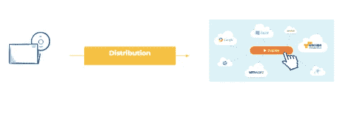
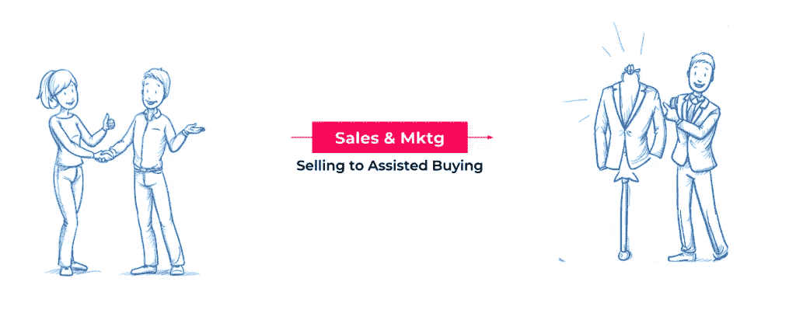
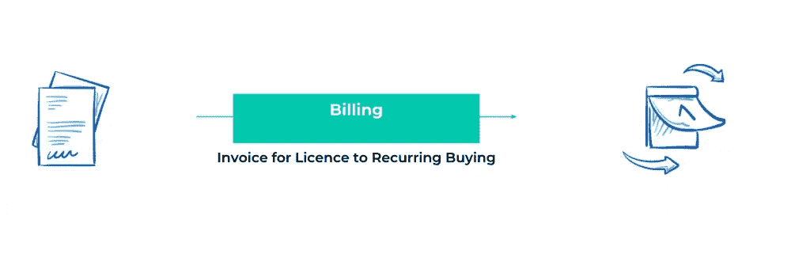

# 什么是 SaaS？软件即服务

> 原文：<https://medium.com/swlh/what-is-saas-software-as-a-service-241cdc91f776>

从本地软件产品或服务搬到 SaaS 的创始人似乎混淆了一些差异，这些差异使 SaaS 有别于传统的软件销售。

两者之间最基本的区别是，在传统的销售中，这是所有权的转移，而在 SaaS，这就像是租赁。但是由于软件是一种体验性商品，这种区别不容易内在化。

就我个人而言，我会将现代 SaaS 运动分为三个不同的部分，其中最重要的一部分我称之为 SaaS。

## 部署:产品是如何分发和部署的

如今，软件产品可以部署在云上、内部、移动或桌面上。从历史上看，内部部署更加困难，因为它们是在裸机上进行的。然而，如今有了容器，本地托管与云托管没有本质上的区别。例如，这允许有法规要求的 BFSI 客户在本地保存数据。初始部署可以是自助服务，也可以是个性化的入职部署。

## 营销和销售:软件是如何买卖的

对一些人来说，买方驱动的采购，即市场导向被认为是必要的，被称为 SaaS。然而，企业 SaaS 在许多情况下仍然是外向的，重销售，很少营销。SaaS 的垂直企业也是如此，那里的客户很少，复杂的解决方案销售有许多内部利益相关者，每年的销售金额超过 25 万美元。当客户组织中只有一个决策者和利益相关者时，买方驱动的模型工作得很好。

## 自助服务是成为 SaaS 的必要条件吗？

如果你销售低于 1000 美元的 ACV，那么自助服务是强制性的。$5K-10K ACV 为个性化客户的成功提供了足够的利润。高于$10K ACV 个性化客户的成功和加入是获得高保留率和追加销售的关键。10 万美元以上的 ACV 售前、集成、启动和客户成功都是 SaaS 成功的关键。

集客销售线索是 SaaS 的必备条件吗？如果你的 ACV 在 1000 美元以下，出境很贵，入境占主导地位。如果你的 ACV 是 10+K，那么出站就成了难题的关键部分。

## 定价模式:如何支付软件费用

订阅产品的一个关键方面是月度或年度循环定价模式，该模式随客户使用或价值而扩展。除此之外，可能还会有重复性的服务费用(支持、咨询、优化)，以及一次性费用(集成、入职、培训)。

## 你如何制造一个飞轮？关键是能够旋转&旋转，越来越快！

在我看来，成为一家 SaaS 企业的关键是提供一种软件产品，该软件产品具有与交付的客户价值成比例的周期性订阅计费。它可以是云上的多租户、移动应用、桌面下载或内部部署。这可能是一个营销主导的买方驱动的过程，年度合同价值(ACV)为 10 美元，或者是一个有多个决策者和数百万 ACV 的对外复杂销售。

另一方面，如果你的账单不是经常性的，那就不是 SaaS。如果你的账单有 20%是经常性的，那么你是在向 AMC 出售许可证。如果您的第一年账单是 60%的经常性订阅和 40%的一次性订阅，我希望您以 10 万美元以上的 ACV 销售给企业。

由于经常性账单和负收入流失，SaaS 企业每年开始时的收入都比结束时多。相比之下，传统的软件销售业务每个季度的收入为零(实际上是前一年的 15-20%)。

这种复合效应形成了一个飞轮——储存越来越多的能量，很难启动，但一旦超过 100 万美元，动力越来越大，越来越难停止。

今天最强的飞轮——sales force、Twilio、Shopify，不仅收入非常高，而且发展得更快！

## 下次你必须问这个问题——“是什么让它成为 SaaS？”

## 问有没有经常性的收入模式。

## 问问你是不是在造飞轮！

## 这篇文章发表在 [The Startup](https://medium.com/swlh) 上，这是 Medium 最大的创业刊物，拥有+434，678 名读者。

## 订阅接收[我们的头条新闻](https://growthsupply.com/the-startup-newsletter/)。

