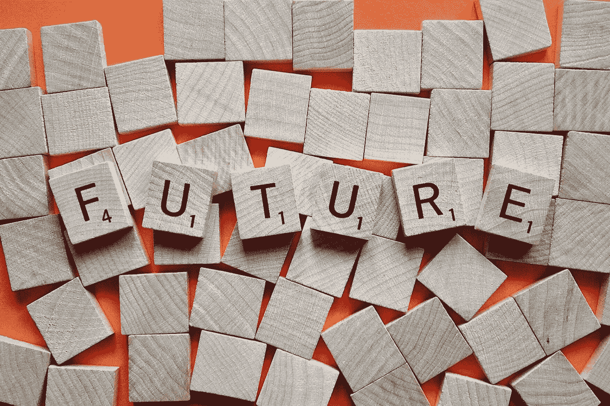

# 商业的未来是什么？

> 原文：<https://medium.com/swlh/what-is-the-future-of-business-8b14e4601793>

## **我们今天所看到的对未来的想法**

Image by [Wokandapix](https://pixabay.com/users/Wokandapix-614097/?utm_source=link-attribution&utm_medium=referral&utm_campaign=image&utm_content=2372183) from [Pixabay](https://pixabay.com/?utm_source=link-attribution&utm_medium=referral&utm_campaign=image&utm_content=2372183)

商业世界正在发生变化。你现在可能有也可能没有这种感觉。但是，这种转变确实正在发生。

在撰写本文时，首席执行官对[未来商业前景的信心正在下降。](https://chiefexecutive.net/ceo-confidence-plunges-on-tariff-fears-in-june/)