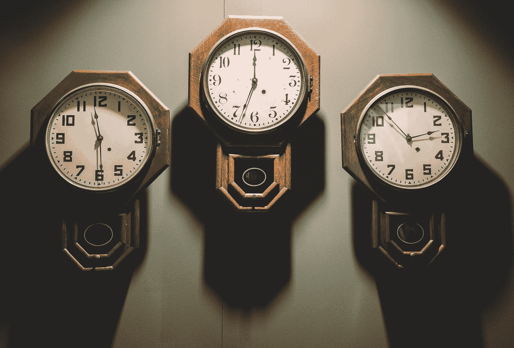

# 我的应用程序的最佳安全扫描时间是多少？

> 原文：<https://medium.com/swlh/what-is-the-optimal-security-scan-time-for-my-applications-1909544fcff0>

Photo by [Andrew Seaman](https://unsplash.com/@amseaman?utm_source=medium&utm_medium=referral) on [Unsplash](https://unsplash.com?utm_source=medium&utm_medium=referral)

随着左移的趋势，这意味着在软件开发生命周期的早期执行安全测试，最后一分钟的部署问题将成为过去。然而，在决定以何种频率扫描哪个项目时，该过程中使用的各种安全工具仍然会造成复杂性。考虑到有限的资源用于安全…