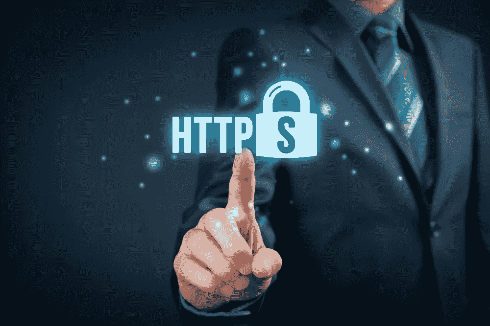

# “扩展验证”(EV) SSL 证书的价值是什么？

> 原文：<https://medium.com/swlh/what-is-the-value-of-an-extended-validation-ev-ssl-certificate-43f61edf53f3>

## 我归结为域名中的一个不同的字母

[汉斯·麦克默迪](https://medium.com/u/1d679de5005f?source=post_page-----43f61edf53f3--------------------------------)以回应我的文章[为什么让我们加密是一个真正……糟糕的主意】](/swlh/why-lets-encrypt-is-a-really-really-really-bad-idea-d69308887801)开始，以写[他自己的文章](/swlh/https-medium-com-swlh-lets-encrypt-securing-the-web-for-all-5b50842ecead)结束，我强烈推荐这篇文章。这篇文章写得非常好，因为它显然是面向非技术读者的。就是这种…