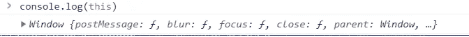
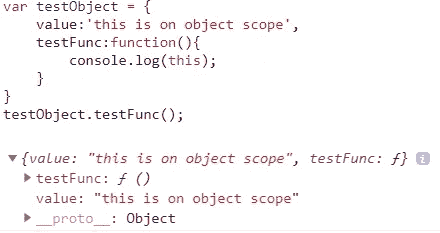
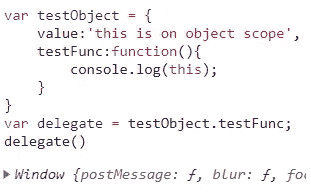
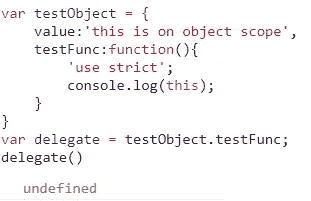
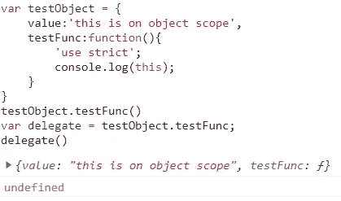
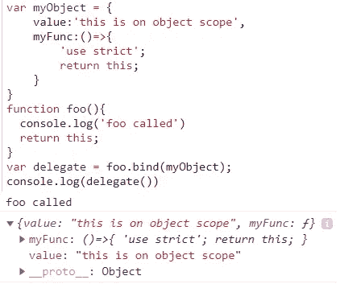
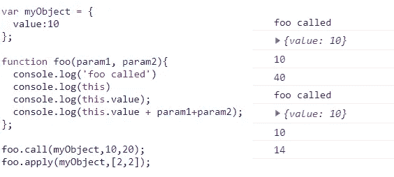

# JavaScript 中的“这”是什么

> 原文：<https://medium.com/swlh/what-is-this-in-javascript-56e38342a8b1>

JavaScript 和其他编程语言一样，也为我们提供了特殊的关键字“ **this** ”

人们可以把“**这个**关键字看作是一个快捷方式，它指的是调用函数的对象。因为**这个** 引用的是一个调用函数的对象，所以我们可以访问该对象的所有值和属性。对**和**的任何更改也将更新被引用的对象。

但是它在 JavaScript 中的表现与在其他语言中有所不同。**这个**的值取决于不同的因素，首先是调用函数的对象，其次是作用域是否处于严格/非严格模式(将在下面解释)。

让我们看看什么是“**这个**”:

this points to the window object by default

上面的例子给出了窗口对象。发生这种情况是因为这里的执行上下文是**全局的，**意味着它没有被任何函数/对象范围阻塞。

让我们看另一个例子:

object scope

正如我们在上面的例子中看到的，这个的值指向了*测试对象。*这是因为**这个**的值取决于调用它的对象，在本例中是 *testObject* 。

让我们在上面的例子中做一些改变，看看输出是否变化:

using functional expression

输出改变了，现在**这个**指向窗口/全局对象。这是因为调用对象的值从*测试对象*变成了全局对象。

让我们对上面的例子做更多的修改:

adding ‘use strict’

这是第二个依赖，当我们使用*[*使用严格*](/@abhimanyuchauhan_61309/use-strict-in-javascript-39c2a6e34b0d)*时，对于在全局范围内调用的函数或者对于没有被任何对象范围绑定的匿名函数，**这个**的值指向*未定义的*。**

**让我们更新上面的例子，从一个对象调用函数:**

****

**using ‘use strict’**

**我们可以看到， [*使用严格的*](/@abhimanyuchauhan_61309/use-strict-in-javascript-39c2a6e34b0d) 只对全局调用的函数有效。**

**如果我们想让**这个**的值按照我们的要求改变，或者更确切地说，如果我们想定义**这个**的值被传递到函数作用域，那该怎么办？**

**添加了新的方法来调用函数。我们得到了另外两个方法来调用一个名为*的函数，调用*和*应用*以及另一个名为*绑定*的方法来将一个值/对象绑定到该函数，该函数将依次被**和**引用。**

****注意****bind****方法只对函数表达式起作用，不声明。***

*   **如何将值/对象绑定到函数表达式:**

****

**binding value to **this** reference**

**我们可以看到**的值，这个**指向我的对象，它是由我们传递的。**

*   **使用*调用*和*应用*的函数调用**

****

**call and apply**

***调用*和*应用*的调用方式帮助我们将值/对象绑定到**这个**函数中。因为这是一个函数调用，它让我们传递参数。**

****注意第一个参数是由* ***这个*** *关键字所引用的。***

**但是如果两者行为相同，如何决定何时使用什么。这很简单，当有几个参数要传递给函数时，我们可以选择用*调用*方法。*当参数数量较多时，优先使用*。至于 apply，我们以数组格式传递参数，因此更容易修改和更新数据，这些数据将在函数参数中传递。**

**我希望这能帮助你更好地理解“这个”。**