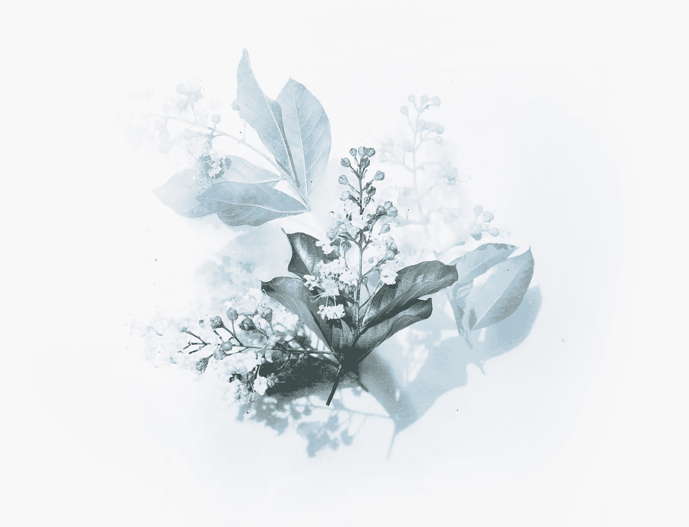

# 作为一名艺术家真正意味着什么

> 原文：<https://medium.com/swlh/what-it-really-means-to-be-an-artist-19cf6b37057c>

Photo by [Evie S.](https://unsplash.com/@evieshaffer?utm_source=unsplash&utm_medium=referral&utm_content=creditCopyText) on [Unsplash](http://unsplash.com)

## 成为一名艺术家意味着什么？艺人一定要被折磨吗？你如何定义好的和坏的艺术？